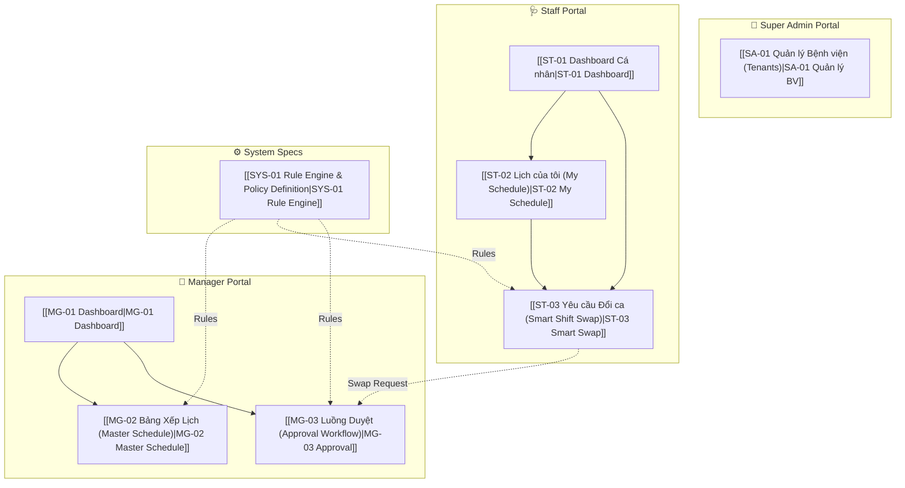

# 📋 Specs Index — Quản lý Lịch trực Bệnh viện

> [!abstract] Tổng quan dự án
> Hệ thống Quản lý Lịch trực Bệnh viện (Đồ án cuối môn OOP/Java).
> Kiến trúc: **Serverless API** (Java Quarkus + GraalVM + PostgreSQL), Frontend: **ReactJS/VueJS + TailwindCSS + FullCalendar**.
> Mô hình: **Multi-tenant SaaS-Ready**, triển khai trên AWS Lambda.

---

## 🏗️ Cấu trúc phân hệ

---

## 📁 Danh sách màn hình

### 🔐 Phân hệ Super Admin (Hidden Portal)

| ID | Màn hình | Mô tả | Priority | Status |
|----|----------|-------|----------|--------|
| SA-01 | [[SA-01 Quản lý Bệnh viện (Tenants)]] | Quản lý danh sách Bệnh viện (Tenants) - CRUD, Activate/Deactivate | P1 | `draft` |

### 👔 Phân hệ Manager (Trưởng khoa)

| ID | Màn hình | Mô tả | Priority | Status |
|----|----------|-------|----------|--------|
| MG-01 | [[MG-01 Dashboard]] | Dashboard tổng quan: Stats, Quick Approval, Alerts | P0 | `draft` |
| MG-02 | [[MG-02 Bảng Xếp Lịch (Master Schedule)]] | ==Nghiệp vụ cốt lõi 2==: Auto-Draft, Drag & Drop, Burnout Heatmap, Fairness Score | P0 | `draft` |
| MG-03 | [[MG-03 Luồng Duyệt (Approval Workflow)]] | Duyệt yêu cầu Đổi ca / Xin nghỉ, Impact Analysis | P0 | `draft` |

### 🩺 Phân hệ Staff (Y Bác sĩ)

| ID | Màn hình | Mô tả | Priority | Status |
|----|----------|-------|----------|--------|
| ST-01 | [[ST-01 Dashboard Cá nhân]] | Dashboard cá nhân: Next Shift, Stats, Quick Actions | P0 | `draft` |
| ST-02 | [[ST-02 Lịch của tôi (My Schedule)]] | Lịch tháng cá nhân (FullCalendar), xem chi tiết ca | P1 | `draft` |
| ST-03 | [[ST-03 Yêu cầu Đổi ca (Smart Shift Swap)]] | ==Nghiệp vụ cốt lõi 1==: Rule Engine, Top 3 Gợi ý, Hard/Soft Rules | P0 | `draft` |

### ⚙️ Phân hệ System (Cross-cutting Specs)

| ID | Spec | Mô tả | Priority | Status |
|----|------|-------|----------|--------|
| SYS-01 | [[SYS-01 Rule Engine & Policy Definition]] | Định nghĩa toàn bộ Rule Engine, Hard/Soft/Policy Rules, Leave Policy, Burnout Prevention, Fairness, Compliance | P0 | `draft` |

---

## ⭐ Nghiệp vụ cốt lõi (2 tính năng trọng tâm)

> [!important] 2 tính năng dùng để trình bày trước lớp trong 5 phút

### 1. Smart Shift Swap → [[ST-03 Yêu cầu Đổi ca (Smart Shift Swap)]]
- **Hard Rules** (Loại trừ): Cùng chuyên khoa, khoảng cách ≥ 12h, không đang nghỉ phép
- **Soft Rules** (Gợi ý): Ưu tiên người ít giờ trực nhất → Top 3 Recommendations
- **UI**: Scanning animation → Recommendation cards → Disabled + Error Badge nếu vi phạm

### 2. Auto-Draft & Burnout Heatmap → [[MG-02 Bảng Xếp Lịch (Master Schedule)]]
- **Auto-Draft**: Sinh bản nháp ~80% dựa trên tham số Manager chọn
- **Burnout Heatmap**: Vàng (2 ca đêm/tuần), Đỏ (vi phạm 12h nghỉ)
- **Fairness Score**: `1 - (stddev / mean)` real-time khi Drag & Drop

---

## 🗄️ Core Entities

| Entity | Mô tả | Spec liên quan |
|--------|-------|----------------|
| `Tenant` | Bệnh viện - `id`, `name`, `code` | [[SA-01 Quản lý Bệnh viện (Tenants)]] |
| `User` | Nhân sự - `id`, `tenant_id`, `role`, `specialty`, `level` | Tất cả màn hình |
| `Shift_Dictionary` | Danh mục ca trực - `id`, `tenant_id`, `name`, `start_time`, `end_time` | [[MG-02 Bảng Xếp Lịch (Master Schedule)]], [[ST-02 Lịch của tôi (My Schedule)]] |
| `Schedule` | Bảng phân công - `id`, `tenant_id`, `user_id`, `shift_id`, `date`, `status` [DRAFT, PUBLISHED] | [[MG-02 Bảng Xếp Lịch (Master Schedule)]], [[ST-02 Lịch của tôi (My Schedule)]] |
| `Swap_Request` | Giao dịch đổi ca - `id`, `tenant_id`, `source_schedule_id`, `requester_id`, `target_user_id`, `status` | [[ST-03 Yêu cầu Đổi ca (Smart Shift Swap)]], [[MG-03 Luồng Duyệt (Approval Workflow)]] |
| `Leave_Request` | Yêu cầu nghỉ phép - `id`, `tenant_id`, `user_id`, `type`, `start_date`, `end_date`, `status` | [[SYS-01 Rule Engine & Policy Definition]] |
| `Rule_Config` | Cấu hình rule theo tenant - `id`, `tenant_id`, `rule_id`, `param_key`, `param_value` | [[SYS-01 Rule Engine & Policy Definition]] |
| `Blackout_Period` | Giai đoạn hạn chế nghỉ - `id`, `tenant_id`, `type`, `start_date`, `end_date`, `reason` | [[SYS-01 Rule Engine & Policy Definition]] |

---

## 📐 Template

Tất cả specs tuân theo template chuẩn:
→ [[Screen Spec Template]]

**Các section trong mỗi spec:**
1. Tổng quan (Overview)
2. Actors & Permissions
3. UI Layout (+ Responsive Behavior)
4. UI Components & States (Loading, Default, Empty, Error, Disabled)
5. User Flow (Mermaid diagram)
6. Business Rules (Hard Rules + Soft Rules)
7. API Endpoints (+ Error Responses)
8. Data Model liên quan
9. Edge Cases & Error Handling
10. Liên kết màn hình (Navigation)
11. Checklist triển khai

---

> [!todo] Tiến độ tổng thể
> - [x] Tạo template specs
> - [x] SA-01 Quản lý Bệnh viện
> - [x] MG-01 Dashboard
> - [x] MG-02 Bảng Xếp Lịch (Master Schedule)
> - [x] MG-03 Luồng Duyệt (Approval Workflow)
> - [x] ST-01 Dashboard Cá nhân
> - [x] ST-02 Lịch của tôi (My Schedule)
> - [x] ST-03 Yêu cầu Đổi ca (Smart Shift Swap)
> - [x] SYS-01 Rule Engine & Policy Definition
> - [ ] Review & chốt specs với stakeholder
> - [ ] Thiết kế Figma dựa trên specs
> - [ ] Triển khai Backend
> - [ ] Triển khai Frontend
