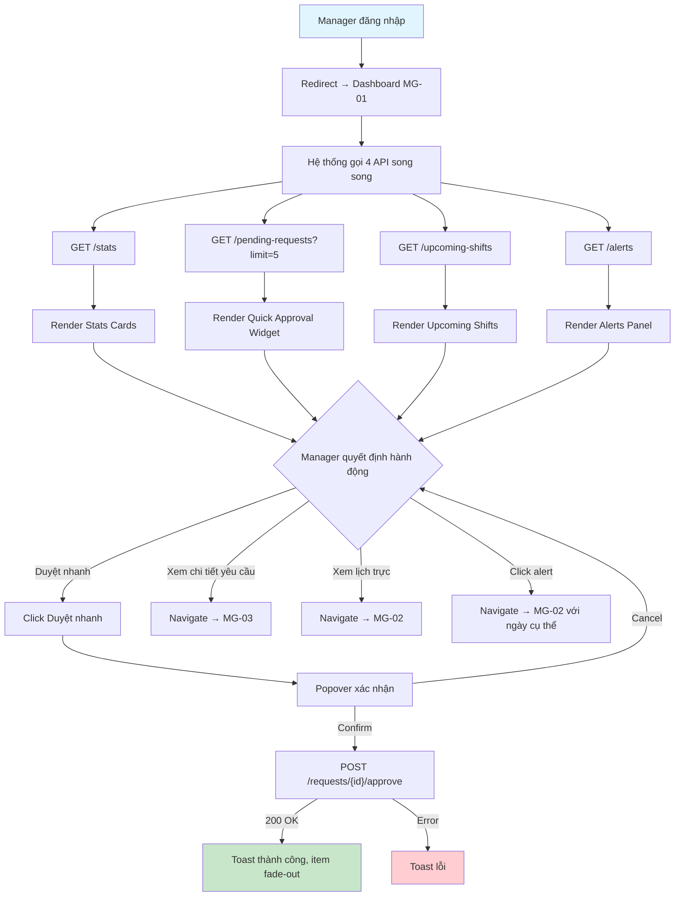
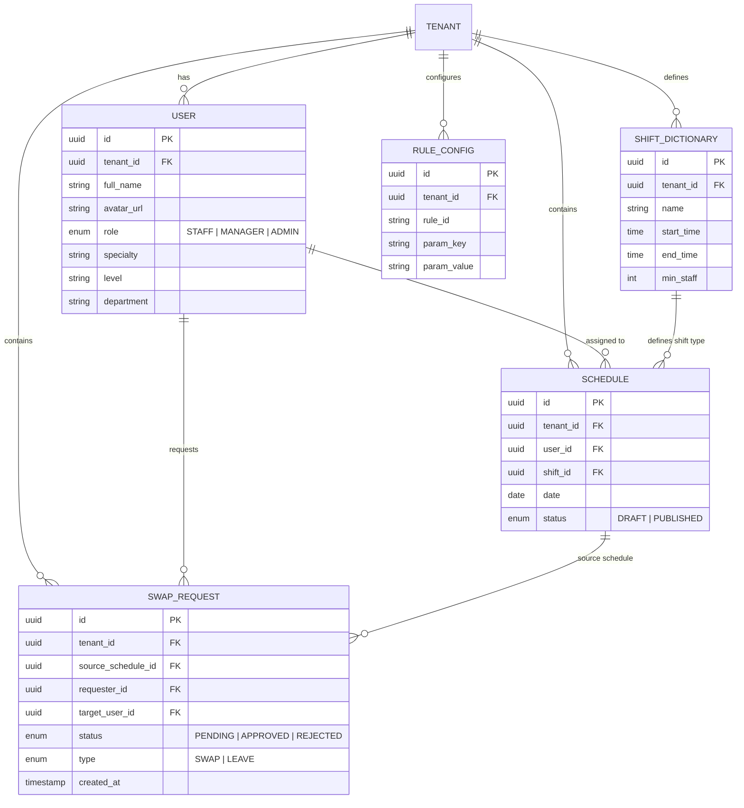

# MG-01: Dashboard — Tổng quan Trưởng khoa

## 1. Overview

> [!NOTE]
> Dashboard là màn hình đầu tiên Manager nhìn thấy sau khi đăng nhập. Cung cấp cái nhìn tổng quan nhanh về tình trạng nhân sự, lịch trực, các yêu cầu chờ duyệt và cảnh báo an toàn y tế.

**Mục tiêu chính:**
- Hiển thị **thống kê tổng quan** tuần hiện tại (tổng ca, tỷ lệ vắng, Fairness Score)
- Cho phép **duyệt nhanh** yêu cầu Đổi ca / Xin nghỉ mà không cần rời Dashboard
- Hiển thị **preview ca trực sắp tới** trong ngày/ngày mai
- Đưa ra **cảnh báo proactive** về thiếu nhân sự, burnout, vi phạm an toàn

> [!info] Rule Engine Reference
> Dashboard hiển thị alerts dựa trên Rule Engine. Chi tiết tại [[SYS-01 Rule Engine & Policy Definition]].
> - Burnout alerts: [[SYS-01 Rule Engine & Policy Definition#6. Burnout Prevention Rules (Phòng chống kiệt sức)|Section 6]]
> - Fairness Score: [[SYS-01 Rule Engine & Policy Definition#7. Fairness Rules (Quy tắc công bằng)|Section 7]]
> - Approval Rules: [[SYS-01 Rule Engine & Policy Definition#4. Approval Rules (Quy tắc phê duyệt)|Section 4]]

---

## 2. Actors

| Actor | Role | Hành động trên màn hình |
|-------|------|------------------------|
| **Manager** (Trưởng khoa) | Primary | Xem stats, duyệt nhanh yêu cầu, đọc cảnh báo, navigate tới các màn hình chi tiết |
| **Manager** (Trưởng phòng Nhân sự) | Primary | Tương tự Trưởng khoa nhưng scope toàn bệnh viện (multi-department) |

---

## 3. UI Layout

```
┌─────────────────────────────────────────────────────────────────┐
│  Header: "Dashboard Trưởng khoa" + Tenant Name + User Avatar   │
├─────────────────────────────────────────────────────────────────┤
│                                                                 │
│  ┌──────────────┐  ┌──────────────┐  ┌────────────────────┐    │
│  │  📊 Tổng ca  │  │  📉 Vắng mặt │  │ ⚖️ Fairness Score │    │
│  │  tuần này    │  │  tuần này    │  │  [████████░░] 82%  │    │
│  │     42       │  │    4.8%      │  │                    │    │
│  └──────────────┘  └──────────────┘  └────────────────────┘    │
│                                                                 │
│  ┌─────────────────────────────────┐  ┌───────────────────────┐│
│  │  📋 Yêu cầu chờ duyệt (5)     │  │  🔔 Cảnh báo         ││
│  │                                 │  │                       ││
│  │  👤 Nguyễn A — Swap — 02/06    │  │  ⚠️ Ca đêm 03/06:    ││
│  │       [Duyệt nhanh] [Chi tiết] │  │     thiếu 1 bác sĩ   ││
│  │  👤 Trần B — Leave — 05/06     │  │  🔴 BS Lê C: 3 ca    ││
│  │       [Duyệt nhanh] [Chi tiết] │  │     đêm/tuần (burnout)││
│  │  ...                            │  │  ⚠️ BS Phạm D: nghỉ  ││
│  │  🔗 Xem tất cả →               │  │     < 12h giữa 2 ca  ││
│  ├─────────────────────────────────┤  │                       ││
│  │  📅 Ca trực sắp tới            │  │                       ││
│  │  ┌──────┬────────┬──────────┐  │  │                       ││
│  │  │ Ca   │ Giờ    │ Bác sĩ  │  │  │                       ││
│  │  │ Sáng │ 07-14h │ Nguyễn A│  │  │                       ││
│  │  │ Chiều│ 14-21h │ Trần B  │  │  │                       ││
│  │  │ Đêm  │ 21-07h │ Lê C    │  │  │                       ││
│  │  └──────┴────────┴──────────┘  │  │                       ││
│  └─────────────────────────────────┘  └───────────────────────┘│
│                                                                 │
└─────────────────────────────────────────────────────────────────┘
```

---

## 4. Components & States

### 4.1. Stats Cards Row

**Mô tả:** Hàng 3 thẻ thống kê tổng quan cho tuần hiện tại.

| Card | Nội dung | Format hiển thị |
|------|----------|-----------------|
| **Tổng số ca tuần này** | Tổng số record `Schedule` có `date` trong tuần hiện tại, `status = PUBLISHED` | Số nguyên lớn (e.g. `42`) |
| **Tỷ lệ vắng mặt** | `(số ca vắng / tổng ca) × 100` | Phần trăm 1 chữ số thập phân (e.g. `4.8%`) |
| **Fairness Score** | `(1 - stddev(total_hours) / mean(total_hours)) × 100` | Progress bar + số % (e.g. `82%`) |

**UI States:**

| State | Điều kiện | Hiển thị |
|-------|-----------|----------|
| **Loading** | Đang gọi API `GET /stats` | Skeleton shimmer trên cả 3 cards, kích thước giữ nguyên layout |
| **Default** | API trả về thành công, có dữ liệu | Hiển thị số liệu + icon + màu sắc theo ngưỡng. Fairness Score: xanh lá ≥ 80%, vàng 60–79%, đỏ < 60% |
| **Empty** | API trả về nhưng không có `Schedule` nào trong tuần (khoa mới tạo) | Hiển thị `0` cho tổng ca, `0%` cho vắng mặt, `N/A` cho Fairness Score kèm tooltip "Chưa có lịch trực" |
| **Error** | API call failed (network error, 500) | Card hiển thị icon ⚠️ + text "Không tải được dữ liệu" + nút [Thử lại] |
| **Disabled** | Không áp dụng (cards luôn hiển thị) | — |

---

### 4.2. Quick Approval Widget

**Mô tả:** Danh sách rút gọn tối đa 5 yêu cầu Đổi ca / Xin nghỉ đang chờ Manager duyệt.

| Trường hiển thị | Nguồn dữ liệu | Format |
|-----------------|----------------|--------|
| Avatar + Tên | `User.avatar_url`, `User.full_name` (join từ `Swap_Request.requester_id`) | Avatar tròn 32px + tên |
| Loại yêu cầu | `request_type` | Badge: `Swap` (xanh dương), `Leave` (cam) |
| Ngày | `Schedule.date` (ca gốc) | `DD/MM/YYYY` |
| Nút [Duyệt nhanh] | — | Button primary nhỏ, trigger approve trực tiếp |
| Nút [Xem chi tiết] | — | Button ghost, navigate tới [[MG-03 Luồng Duyệt (Approval Workflow)]] với request_id |

**Hành vi nút [Duyệt nhanh]:**
1. Click → Hiện confirmation popover: "Duyệt yêu cầu đổi ca của {tên}?"
2. Confirm → Call `POST /api/v1/manager/requests/{id}/approve`
3. Thành công → Item biến mất khỏi list với animation fade-out, toast "Đã duyệt"
4. Thất bại → Toast error, item giữ nguyên

**Link "Xem tất cả":** Navigate tới [[MG-03 Luồng Duyệt (Approval Workflow)]] với filter `status=PENDING`

**UI States:**

| State | Điều kiện | Hiển thị |
|-------|-----------|----------|
| **Loading** | Đang gọi API `GET /pending-requests` | 3 skeleton rows (avatar circle + 2 text lines + 2 button placeholders) |
| **Default** | Có 1–5 yêu cầu pending | Danh sách items + link "Xem tất cả (N)" với N = tổng số pending |
| **Empty** | Không có yêu cầu pending nào | Illustration nhỏ + text "Không có yêu cầu chờ duyệt 🎉" |
| **Error** | API call failed | Text "Không tải được danh sách" + nút [Thử lại] |
| **Disabled** | Manager chưa được gán quyền approve (edge case multi-role) | Widget ẩn hoàn toàn hoặc hiện text "Bạn không có quyền duyệt yêu cầu" |

---

### 4.3. Upcoming Shifts Preview

**Mô tả:** Bảng nhỏ hiển thị 5 ca trực sắp tới trong ngày hôm nay hoặc ngày mai.

| Column | Nguồn dữ liệu | Format |
|--------|----------------|--------|
| Tên ca | `Shift_Dictionary.name` | Text (e.g. "Ca Sáng") |
| Giờ | `Shift_Dictionary.start_time` – `Shift_Dictionary.end_time` | `HH:mm - HH:mm` |
| Bác sĩ | `User.full_name` (join từ `Schedule.user_id`) | Avatar 24px + tên |
| Trạng thái | Logic: ca đang diễn ra / sắp tới / kết thúc | Badge: 🟢 Đang diễn ra, 🔵 Sắp tới, ⚪ Kết thúc |

**UI States:**

| State | Điều kiện | Hiển thị |
|-------|-----------|----------|
| **Loading** | Đang gọi API `GET /upcoming-shifts` | Table skeleton (5 rows × 4 columns) |
| **Default** | Có ít nhất 1 ca trong ngày/ngày mai | Bảng với tối đa 5 rows, sorted theo `start_time` ASC |
| **Empty** | Không có ca nào hôm nay/ngày mai (e.g. ngày lễ) | Text "Không có ca trực hôm nay/ngày mai" + icon 📅 |
| **Error** | API call failed | Text "Không tải được lịch" + nút [Thử lại] |
| **Disabled** | Không áp dụng | — |

---

### 4.4. Alerts Panel

**Mô tả:** Panel cảnh báo proactive về các vấn đề nhân sự và an toàn y tế.

| Loại cảnh báo | Điều kiện trigger | Mức độ | Màu sắc | Rule Ref |
|---------------|-------------------|--------|---------|----------|
| Thiếu nhân sự | Ca sắp tới < `min_staff` (HR-SCH-05) | ⚠️ Warning | Vàng cam | [[SYS-01 Rule Engine & Policy Definition\|SYS-01]] |
| Burnout | Bác sĩ trực ≥ 3 ca đêm/tuần (HR-SCH-02) | 🔴 Critical | Đỏ | [[SYS-01 Rule Engine & Policy Definition\|SYS-01]] |
| Vi phạm giờ nghỉ | Khoảng cách giữa 2 ca < 12h (HR-SCH-01) | 🔴 Critical | Đỏ | [[SYS-01 Rule Engine & Policy Definition\|SYS-01]] |
| Ca chưa phân công | Ô lịch trong 48h tới chưa có bác sĩ | ⚠️ Warning | Vàng cam | — |

Mỗi alert item hiển thị:
- Icon mức độ (⚠️ / 🔴)
- Mô tả ngắn gọn
- Link nhanh → navigate tới [[MG-02 Bảng Xếp Lịch (Master Schedule)]] với ngày tương ứng

**UI States:**

| State | Điều kiện | Hiển thị |
|-------|-----------|----------|
| **Loading** | Đang gọi API `GET /alerts` | Skeleton (3 lines shimmer) |
| **Default** | Có 1+ cảnh báo | Danh sách alerts, sorted: Critical trước Warning. Badge đỏ trên header "Cảnh báo (N)" |
| **Empty** | Không có cảnh báo nào | Text "Tất cả đều ổn! ✅" + màu nền xanh nhạt |
| **Error** | API call failed | Text "Không kiểm tra được cảnh báo" + nút [Thử lại] |
| **Disabled** | Không áp dụng | — |

---

## 5. User Flow



---

## 6. Business Rules

| Rule ID | Mô tả | Loại | Hành vi |
|---------|--------|------|---------|
| HR-DB-01 | **Fairness Score** = `(1 - stddev(total_hours) / mean(total_hours)) × 100%` | Soft | Hiển thị dạng progress bar. 100% = hoàn toàn công bằng. Không block hành động nào |
| HR-DB-02 | Stats tính trên scope `tenant_id` + department của Manager | Hard | API filter theo `tenant_id` từ JWT token |
| HR-DB-03 | Quick Approval chỉ hiện yêu cầu thuộc khoa của Manager | Hard | Backend filter `Swap_Request` WHERE `requester_id` IN users cùng department |
| HR-DB-04 | Alerts refresh tự động mỗi **5 phút** | Soft | Polling hoặc WebSocket subscription |
| HR-DB-05 | Duyệt nhanh từ Dashboard **không yêu cầu** xem Impact Analysis (khác với duyệt từ [[MG-03 Luồng Duyệt (Approval Workflow)]]) | Soft | Đây là trade-off UX: tiện nhưng rủi ro. Chỉ áp dụng cho yêu cầu không vi phạm Hard Rules |

> [!info] Cross-reference
> Fairness Score formula và Burnout thresholds được định nghĩa chi tiết tại [[SYS-01 Rule Engine & Policy Definition]].
> Tham số cấu hình (thay đổi ngưỡng cảnh báo) qua API: `GET/PUT /api/v1/rules/config`

> [!WARNING]
> **HR-DB-05** cho phép duyệt nhanh từ Dashboard mà không cần xem Impact Analysis. Tuy nhiên, nếu yêu cầu vi phạm Hard Rules (phát hiện bởi backend), nút [Duyệt nhanh] sẽ bị **disable** và hiện tooltip "Yêu cầu này cần xem chi tiết trước khi duyệt".

---

## 7. API Endpoints

### 7.1. GET `/api/v1/manager/dashboard/stats`

**Mô tả:** Lấy thống kê tổng quan tuần hiện tại.

**Headers:**
```
Authorization: Bearer {jwt_token}
X-Tenant-Id: {tenant_id}
```

**Response 200:**
```json
{
  "total_shifts_this_week": 42,
  "absence_rate": 4.8,
  "fairness_score": 82.5,
  "fairness_details": {
    "mean_hours": 38.2,
    "stddev_hours": 6.7,
    "min_hours": 28,
    "max_hours": 48,
    "min_user": { "id": "uuid", "name": "Nguyễn Văn A" },
    "max_user": { "id": "uuid", "name": "Trần Thị B" }
  },
  "week_range": {
    "start": "2026-05-25",
    "end": "2026-05-31"
  }
}
```

**Response 401:** `{ "error": "UNAUTHORIZED", "message": "Token expired" }`

**Response 403:** `{ "error": "FORBIDDEN", "message": "Requires MANAGER role" }`

---

### 7.2. GET `/api/v1/manager/dashboard/pending-requests?limit=5`

**Mô tả:** Lấy danh sách yêu cầu chờ duyệt (tối đa `limit` items).

**Query Params:**

| Param | Type | Default | Mô tả |
|-------|------|---------|-------|
| `limit` | integer | 5 | Số lượng items tối đa |

**Response 200:**
```json
{
  "items": [
    {
      "id": "uuid-request-1",
      "type": "SWAP",
      "requester": {
        "id": "uuid-user-1",
        "full_name": "Nguyễn Văn A",
        "avatar_url": "/avatars/nguyen-a.jpg"
      },
      "source_schedule": {
        "id": "uuid-schedule-1",
        "date": "2026-06-02",
        "shift_name": "Ca Đêm",
        "start_time": "21:00",
        "end_time": "07:00"
      },
      "target_user": {
        "id": "uuid-user-2",
        "full_name": "Trần Thị B"
      },
      "target_schedule": {
        "id": "uuid-schedule-2",
        "date": "2026-06-03",
        "shift_name": "Ca Sáng"
      },
      "created_at": "2026-05-27T10:30:00Z",
      "has_hard_rule_violation": false
    }
  ],
  "total_pending": 12
}
```

---

### 7.3. GET `/api/v1/manager/dashboard/upcoming-shifts`

**Mô tả:** Lấy 5 ca trực sắp tới trong ngày hôm nay và ngày mai.

**Response 200:**
```json
{
  "shifts": [
    {
      "schedule_id": "uuid",
      "shift_name": "Ca Sáng",
      "start_time": "2026-05-28T07:00:00",
      "end_time": "2026-05-28T14:00:00",
      "assigned_user": {
        "id": "uuid",
        "full_name": "Nguyễn Văn A",
        "avatar_url": "/avatars/nguyen-a.jpg",
        "specialty": "Nội khoa"
      },
      "status": "UPCOMING"
    }
  ]
}
```

**Enum `status`:** `ONGOING` | `UPCOMING` | `COMPLETED`

---

### 7.4. GET `/api/v1/manager/dashboard/alerts`

**Mô tả:** Lấy danh sách cảnh báo active.

**Response 200:**
```json
{
  "alerts": [
    {
      "id": "alert-uuid-1",
      "type": "UNDERSTAFFED",
      "severity": "WARNING",
      "message": "Ca Đêm ngày 03/06: thiếu 1 bác sĩ Ngoại khoa",
      "related_date": "2026-06-03",
      "related_shift_id": "uuid-shift",
      "created_at": "2026-05-28T08:00:00Z"
    },
    {
      "id": "alert-uuid-2",
      "type": "BURNOUT",
      "severity": "CRITICAL",
      "message": "BS Lê Văn C: đã trực 3 ca đêm trong tuần này",
      "related_user_id": "uuid-user",
      "created_at": "2026-05-28T08:00:00Z"
    }
  ],
  "total": 4
}
```

**Enum `type`:** `UNDERSTAFFED` | `BURNOUT` | `REST_VIOLATION` | `UNASSIGNED`

**Enum `severity`:** `WARNING` | `CRITICAL`

---

## 8. Data Model



---

## 9. Edge Cases

| # | Tình huống | Xử lý |
|---|-----------|-------|
| 1 | **Tuần đầu tiên** — chưa có lịch trực nào | Stats hiện `0`, Fairness = `N/A`, Upcoming = Empty state |
| 2 | **Manager quản lý nhiều khoa** (Trưởng phòng Nhân sự) | API aggregate qua nhiều departments, Stats Cards hiện tổng hợp |
| 3 | **Duyệt nhanh yêu cầu có Hard Rule violation** | Backend trả `has_hard_rule_violation: true` → nút [Duyệt nhanh] disabled, tooltip hướng dẫn xem chi tiết |
| 4 | **Quá nhiều alerts** (> 20) | Panel hiện 10 alerts đầu (sorted by severity DESC), link "Xem thêm N cảnh báo" |
| 5 | **Network offline** khi đang ở Dashboard | Tất cả components chuyển Error state, banner "Mất kết nối mạng" ở top |
| 6 | **2 Manager cùng duyệt 1 yêu cầu** | Người duyệt sau nhận 409 Conflict → Toast "Yêu cầu đã được xử lý bởi người khác" |
| 7 | **Yêu cầu pending đã hết hạn** (ngày ca đã qua) | Backend auto-mark `EXPIRED`, không hiện trong pending list. Nếu vừa hết hạn → toast thông báo |

---

## 10. Navigation Links

| Điểm đến | Trigger | Điều kiện |
|----------|---------|-----------|
| → [[MG-02 Bảng Xếp Lịch (Master Schedule)]] | Click "Xem lịch trực" trên sidebar hoặc click alert item | Luôn khả dụng |
| → [[MG-03 Luồng Duyệt (Approval Workflow)]] | Click "Xem tất cả" trong Quick Approval Widget hoặc click [Xem chi tiết] trên item | Luôn khả dụng |
| → [[MG-02 Bảng Xếp Lịch (Master Schedule)]] (ngày cụ thể) | Click vào alert item có `related_date` | Navigate kèm query param `?date=YYYY-MM-DD` |

---

> [!TIP]
> **Performance:** 4 API calls được gọi **song song** (Promise.all / parallel fetch) khi mount Dashboard. Mỗi component render độc lập khi API của nó trả về — không chờ tất cả hoàn thành mới render.
