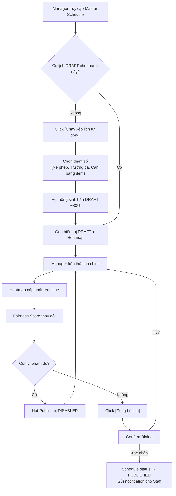
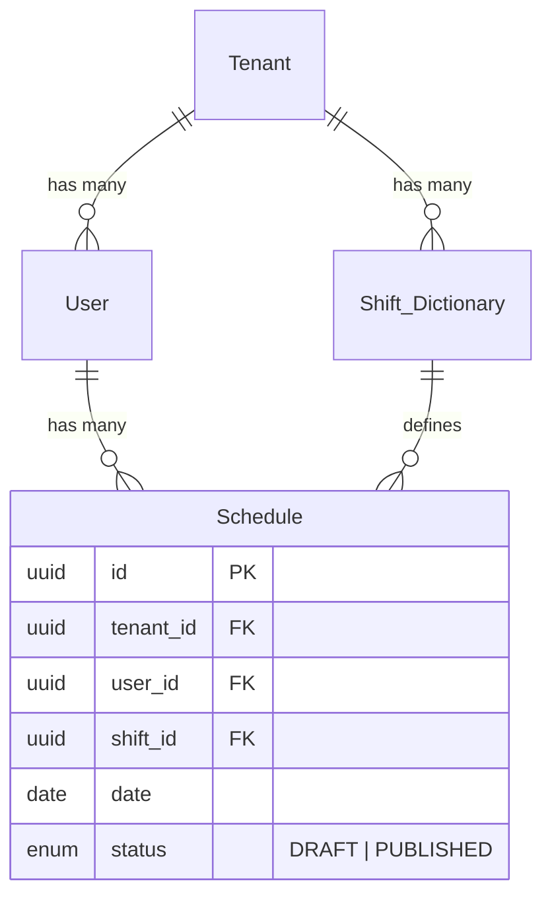

# MG-02 Bảng Xếp Lịch (Master Schedule)

> [!abstract] Tổng quan
> Bảng lưới tổng thể phân công lịch trực cho toàn khoa. Đây là **màn hình phức tạp nhất** trong hệ thống, chứa trực tiếp ==Nghiệp vụ cốt lõi 2: Auto-Draft & Burnout Heatmap==. Manager sử dụng màn hình này để tạo bản nháp tự động (~80%), tinh chỉnh bằng Drag & Drop, giám sát an toàn lao động qua Heatmap, và công bố lịch chính thức.

> [!info] Rule Engine Reference
> Tất cả rules trong màn hình này được định nghĩa chi tiết tại [[SYS-01 Rule Engine & Policy Definition]].
> - Scheduling Rules: [[SYS-01 Rule Engine & Policy Definition#2. Scheduling Rules (Quy tắc xếp lịch)|Section 2]]
> - Burnout Prevention: [[SYS-01 Rule Engine & Policy Definition#6. Burnout Prevention Rules (Phòng chống kiệt sức)|Section 6]]
> - Fairness Rules: [[SYS-01 Rule Engine & Policy Definition#7. Fairness Rules (Quy tắc công bằng)|Section 7]]
> - Tenant Configuration: [[SYS-01 Rule Engine & Policy Definition#9. Tenant-level Rule Configuration|Section 9]]

---

## 1. Actors & Permissions

| Actor | Quyền truy cập | Ghi chú |
|-------|----------------|---------|
| Manager | Full Read/Write | Tạo Draft, kéo thả, Publish, xem Heatmap & Fairness Score |
| Staff | Read Only (chỉ lịch PUBLISHED) | Xem qua [[ST-02 Lịch của tôi (My Schedule)]] |
| Super Admin | Không truy cập | — |

---

## 2. UI Layout

### 2.1 Cấu trúc bố cục

```
┌──────────────────────────────────────────────────────────┐
│  Header: Breadcrumb + Month/Week Selector + Filter Bar   │
├──────────────────────────────────────────────────────────┤
│  Toolbar: [Chạy xếp lịch tự động] [Công bố lịch]        │
│           Fairness Score Bar (real-time)                  │
├──────────────────────────────────────────────────────────┤
│          │ 01  │ 02  │ 03  │ ... │ 30  │ 31  │          │
│ ─────────┼─────┼─────┼─────┼─────┼─────┼─────┤          │
│ BS. Nguyễn│ S   │     │ Đ   │     │ C   │     │  ← Drag  │
│ BS. Trần  │     │ Đ   │     │ S   │     │ Đ   │  & Drop  │
│ BS. Lê    │ C   │ S   │     │ Đ   │     │     │          │
│ ...       │     │     │     │     │     │     │          │
├──────────────────────────────────────────────────────────┤
│  Legend: ■ Ca sáng  ■ Ca chiều  ■ Ca đêm  ⚠ Cảnh báo   │
└──────────────────────────────────────────────────────────┘
```

> [!info] Ký hiệu Heatmap
> - **Ô bình thường:** màu nền theo loại ca (sáng/chiều/đêm)
> - **Ô vàng:** cảnh báo burnout (2+ ca đêm/tuần)
> - **Ô đỏ:** vi phạm an toàn (khoảng cách giữa 2 ca < 12h)

### 2.2 Responsive Behavior

| Breakpoint | Thay đổi |
|------------|----------|
| Desktop (≥1280px) | Full grid hiển thị 31 cột ngày |
| Laptop (1024-1279px) | Sticky column tên BS, scroll ngang |
| Tablet (768-1023px) | Chuyển sang Week view mặc định |
| Mobile (<768px) | Chuyển sang List view, disable Drag & Drop |

---

## 3. UI Components & States

### 3.1 Schedule Grid

**Mô tả:** Bảng lưới chính — Trục Y: danh sách bác sĩ (avatar, tên, specialty), Trục X: ngày trong tháng. Mỗi ô = 1 assignment (tên ca + giờ + màu). Hỗ trợ **Drag & Drop** để di chuyển ca giữa các ô.

**Props / Dữ liệu đầu vào:**

| Prop | Type | Required | Mô tả |
|------|------|----------|-------|
| `month` | `string (YYYY-MM)` | yes | Tháng hiển thị |
| `staffList` | `User[]` | yes | Danh sách bác sĩ trong khoa |
| `schedules` | `Schedule[]` | yes | Dữ liệu phân công |
| `shiftDictionary` | `Shift_Dictionary[]` | yes | Danh mục ca trực |
| `heatmapData` | `HeatmapCell[]` | yes | Dữ liệu cảnh báo cho từng ô |

**UI States:**

| State | Điều kiện | Hiển thị | Hành vi |
|-------|-----------|----------|---------|
| 🔄 Loading | Đang fetch schedules | Skeleton grid (shimmer trên từng ô) | Disable Drag & Drop |
| ✅ Default (DRAFT) | Lịch đang ở trạng thái DRAFT | Grid bình thường + Heatmap overlay + Drag enabled | Full interaction |
| ✅ Default (PUBLISHED) | Lịch đã PUBLISHED | Grid bình thường, border đặc biệt "Published" | Drag disabled (read-only) |
| 📭 Empty | Chưa có lịch cho tháng này | Empty grid + CTA "Tạo lịch mới" hoặc "Chạy tự động" | Chỉ cho phép Auto-Generate |
| ❌ Error | API lỗi khi load/save | Error banner + Retry | Giữ nguyên data cũ nếu có |
| 🚫 Disabled | Staff truy cập (xem qua phân hệ Staff) | Greyed out Drag handles | Chỉ xem, không kéo thả |

### 3.2 Auto-Schedule Button & Panel

**Mô tả:** Nút **[Chạy xếp lịch tự động]** mở panel tham số. Manager chọn các ràng buộc, hệ thống sinh bản DRAFT tự động (~80% hoàn thiện).

**Tham số đầu vào:**

| Tham số | Type | Default | Mô tả |
|---------|------|---------|-------|
| `avoid_leave_days` | `boolean` | `true` | Né ngày nghỉ phép đã duyệt |
| `ensure_senior_per_shift` | `boolean` | `true` | Đảm bảo mỗi ca có ít nhất 1 trưởng ca (level: senior) |
| `balance_night_shifts` | `boolean` | `true` | Cân bằng số ca đêm giữa các bác sĩ |
| `month` | `string (YYYY-MM)` | current+1 | Tháng cần tạo lịch |

**UI States:**

| State | Điều kiện | Hiển thị | Hành vi |
|-------|-----------|----------|---------|
| 🔄 Loading | Đang chạy algorithm | Progress bar + "Đang xếp lịch..." (có thể mất 5-15s) | Disable nút, hiện Cancel |
| ✅ Default | Panel mở, chờ input | Checkboxes + nút [Tạo bản nháp] | Cho phép cấu hình |
| 📭 Empty | Không có bác sĩ nào trong khoa | Thông báo "Cần thêm nhân sự trước khi xếp lịch" | Disable nút tạo |
| ❌ Error | Algorithm thất bại | Error message chi tiết (VD: "Không đủ nhân sự cho ca đêm ngày 15") | Retry + chi tiết lỗi |
| 🚫 Disabled | Đã có lịch PUBLISHED cho tháng này | Nút greyed out + tooltip "Tháng này đã công bố lịch" | Gợi ý tạo version mới |

### 3.3 Burnout Heatmap Overlay

**Mô tả:** Layer overlay màu sắc trên Schedule Grid, cập nhật **real-time** khi Manager kéo thả ca trực.

**Logic tính toán:**

| Loại cảnh báo | Điều kiện | Màu sắc | Ý nghĩa |
|---------------|-----------|---------|---------|
| ⚠️ Warning (Vàng) | Bác sĩ trực ≥ 2 ca đêm trong cùng 1 tuần | `#FFC107` (Amber) | Cảnh báo burnout, Manager ĐƯỢC phép publish |
| 🔴 Violation (Đỏ) | Khoảng cách giữa 2 ca liên tiếp < 12 tiếng | `#F44336` (Red) | Vi phạm an toàn, Manager KHÔNG ĐƯỢC publish |

**UI States:**

| State | Điều kiện | Hiển thị | Hành vi |
|-------|-----------|----------|---------|
| 🔄 Loading | Đang tính toán lại sau drag | Pulse animation trên ô vừa thay đổi | Chờ recalc (< 200ms) |
| ✅ Default | Không có vi phạm | Ô lịch màu bình thường | — |
| ⚠️ Warning | Có cảnh báo vàng | Ô chuyển nền vàng + icon ⚠️ + tooltip chi tiết | Cho phép publish |
| 🔴 Violation | Có vi phạm đỏ | Ô chuyển nền đỏ + icon 🚫 + tooltip chi tiết | Block publish |

### 3.4 Fairness Score Bar

**Mô tả:** Thanh tiến trình hiển thị real-time mức độ công bằng trong phân công ca trực.

**Công thức:**

$$
\text{Fairness Score} = \left(1 - \frac{\sigma(\text{total\_hours})}{\mu(\text{total\_hours})}\right) \times 100\%
$$

Trong đó:
- $\sigma$ = Độ lệch chuẩn tổng giờ trực giữa các bác sĩ
- $\mu$ = Trung bình tổng giờ trực

**UI States:**

| State | Điều kiện | Hiển thị | Hành vi |
|-------|-----------|----------|---------|
| 🔄 Loading | Đang recalc sau drag | Shimmer trên progress bar | — |
| ✅ Excellent (≥90%) | Phân công rất đều | Bar xanh lá + "Xuất sắc" | — |
| ⚠️ Fair (70-89%) | Phân công tương đối đều | Bar vàng + "Chấp nhận được" | — |
| 🔴 Poor (<70%) | Phân công lệch nhiều | Bar đỏ + "Cần cải thiện" + danh sách người bị lệch | Gợi ý cân bằng |
| 📭 Empty | Chưa có dữ liệu lịch | "N/A" | — |

### 3.5 Month/Week Selector

**Mô tả:** Chuyển đổi khoảng thời gian hiển thị trên grid.

**UI States:**

| State | Điều kiện | Hiển thị | Hành vi |
|-------|-----------|----------|---------|
| ✅ Default | Hiện tháng hiện tại | Dropdown/DatePicker + nút ◀ ▶ | Chuyển tháng |
| 🚫 Disabled | Tháng quá khứ (> 3 tháng trước) | Greyed out | Không cho chọn |

### 3.6 Filter Bar

**Mô tả:** Filter danh sách bác sĩ trên trục Y theo tiêu chí.

| Filter | Type | Options |
|--------|------|---------|
| Chuyên khoa | Dropdown | Danh sách `specialty` từ User table |
| Cấp bậc | Dropdown | `junior`, `senior`, `head` |
| Trạng thái lịch | Toggle | DRAFT / PUBLISHED |

**UI States:**

| State | Điều kiện | Hiển thị | Hành vi |
|-------|-----------|----------|---------|
| ✅ Default | Filter bình thường | Dropdowns + Clear All | Filter trục Y real-time |
| 📭 Empty Results | Filter không khớp ai | "Không có bác sĩ nào khớp bộ lọc" | — |

### 3.7 Publish Button

**Mô tả:** Nút **[Công bố lịch]** — chuyển trạng thái Schedule từ `DRAFT` → `PUBLISHED`, gửi notification cho tất cả Staff trong khoa.

**UI States:**

| State | Điều kiện | Hiển thị | Hành vi |
|-------|-----------|----------|---------|
| ✅ Default | Lịch DRAFT, không có violation đỏ | Nút xanh [Công bố lịch] | Click → Confirm Dialog |
| ⚠️ Warning | Lịch DRAFT, có cảnh báo vàng | Nút xanh + badge vàng "2 cảnh báo" | Click → Confirm kèm danh sách cảnh báo |
| 🚫 Disabled (Violation) | Còn vi phạm đỏ trên grid | Nút greyed out + tooltip "Cần giải quyết X vi phạm" | Không cho publish |
| 🚫 Disabled (No Draft) | Chưa có lịch DRAFT | Nút greyed out | — |
| 🔄 Loading | Đang publish | Spinner + "Đang công bố..." | Disable tất cả interaction |
| ✅ Success | Publish thành công | Toast "Lịch tháng X đã được công bố" | Grid chuyển sang PUBLISHED view |

### 3.8 Rule Configuration Panel

**Mô tả:** Panel cấu hình tham số rules cho tenant. Manager truy cập qua nút **[⚙️ Cấu hình quy tắc]** trên toolbar. Cho phép điều chỉnh ngưỡng cảnh báo và tham số xếp lịch tự động mà không cần sửa code.

> [!info] Chi tiết tham số
> Xem danh sách đầy đủ tại [[SYS-01 Rule Engine & Policy Definition#9.1 Configurable Parameters]]

**Configurable Parameters:**

| Tham số | Default | Range | Ảnh hưởng |
|---------|---------|-------|-----------|
| Nghỉ tối thiểu giữa 2 ca | 12h | 8-24h | Heatmap đỏ (HR-SCH-01) |
| Max ca đêm liên tiếp | 3 | 2-5 | Block assign (HR-SCH-02) |
| Max giờ trực/tuần | 48h | 40-60h | Heatmap vàng (SR-SCH-02) |
| Ngưỡng cảnh báo burnout | 2 ca đêm/tuần | 1-4 | Heatmap vàng (SR-SCH-01) |
| Fairness Score target | 85% | 70-100% | Fairness bar color (PR-FAR-01) |
| Soft Rule weights | Fairness: 0.7, Night: 0.3 | 0.0-1.0 | Swap scoring algorithm |

**UI States:**

| State | Điều kiện | Hiển thị | Hành vi |
|-------|-----------|----------|---------|
| ✅ Default | Panel mở | Form fields với giá trị hiện tại + nút [Lưu] | Edit + Save |
| 🔄 Loading | Đang load config | Skeleton form | — |
| ✅ Success | Lưu thành công | Toast "Đã cập nhật cấu hình" + Heatmap recalculate | Real-time update |
| ❌ Error | Giá trị ngoài range | Inline validation "Giá trị phải trong khoảng X-Y" | Block save |
| 🚫 Disabled | Staff truy cập | Panel ẩn hoàn toàn | Chỉ Manager thấy |

---

## 4. User Flow



### 4.1 Luồng chính (Happy Path)

1. Manager truy cập Master Schedule, chọn tháng cần xếp lịch
2. Click **[Chạy xếp lịch tự động]** → chọn tham số → hệ thống sinh bản DRAFT
3. Grid hiển thị bản DRAFT với Heatmap overlay và Fairness Score
4. Manager kéo thả ca trực để tinh chỉnh 20% còn lại
5. Heatmap và Fairness Score cập nhật real-time sau mỗi lần kéo thả
6. Khi hài lòng (không còn cảnh báo đỏ), click **[Công bố lịch]**
7. Xác nhận → Lịch chuyển PUBLISHED, notification gửi cho toàn khoa

### 4.2 Luồng phụ (Alternative Flows)

- **Tạo lịch thủ công:** Manager không dùng Auto-Generate, kéo thả từ đầu trên grid trống
- **Chỉnh sửa lịch đã Published:** Tạo version mới (DRAFT) từ lịch PUBLISHED, chỉnh sửa rồi re-publish
- **Quay lại bản Draft trước:** Undo/Redo stack cho các thao tác Drag & Drop

---

## 5. Business Rules

> [!warning] Hard Rules (Bắt buộc) — Nghiệp vụ cốt lõi 2 → Chi tiết tại [[SYS-01 Rule Engine & Policy Definition]]

| ID | Rule | Điều kiện | Hành vi khi vi phạm |
|----|------|-----------|---------------------|
| HR-MS-01 | Cảnh báo burnout ca đêm | Bác sĩ được gán ≥ 2 ca đêm trong cùng 1 tuần | Ô lịch chuyển ==MÀU VÀNG==, icon ⚠️. **Cho phép publish** nhưng hiện cảnh báo |
| HR-MS-02 | Vi phạm giờ nghỉ tối thiểu | Khoảng cách giữa 2 ca liên tiếp < 12 tiếng | Ô lịch chuyển ==MÀU ĐỎ==, icon 🚫. **KHÔNG cho phép publish** |
| HR-MS-03 | Block publish khi có violation | Còn ít nhất 1 ô đỏ (HR-MS-02) trên grid | Nút [Công bố lịch] bị disable |
| HR-MS-04 | Đảm bảo chuyên môn mỗi ca | Mỗi ca trực phải có ≥ 1 bác sĩ đủ chuyên môn phù hợp | Auto-Draft phải đảm bảo; kéo thả hiện warning nếu ca còn thiếu |
| HR-MS-05 | Bảo vệ nghỉ phép | Bác sĩ có đơn nghỉ phép đã APPROVED cho ngày đó | Không thể gán ca (ô bị lock), hiện tooltip "Đang nghỉ phép" |

> [!tip] Soft Rules (Gợi ý)

| ID | Rule | Logic tính điểm | Hiển thị UI |
|----|------|-----------------|-------------|
| SR-MS-01 | Cân bằng ca đêm | Phân phối đều ca đêm giữa các bác sĩ | Fairness Score tính chung |
| SR-MS-02 | Cân bằng tổng giờ | Minimize stddev tổng giờ trực | Fairness Score bar thay đổi real-time |

> [!info] Rule Configuration
> Tất cả tham số rules (12h nghỉ, max ca đêm, fairness target...) có thể được cấu hình per-tenant.
> Xem [[SYS-01 Rule Engine & Policy Definition#9. Tenant-level Rule Configuration]] để biết chi tiết.
> API cấu hình: `GET/PUT /api/v1/rules/config` — xem [[SYS-01 Rule Engine & Policy Definition#11. API Endpoints — Rule Engine]]

---

## 6. API Endpoints

| Method | Endpoint | Request Body | Response | Mô tả |
|--------|----------|-------------|----------|-------|
| GET | `/api/v1/manager/schedules` | query: `month`, `status` | `{schedules: Schedule[], meta: Pagination}` | Lấy lịch theo tháng/trạng thái |
| POST | `/api/v1/manager/schedules/auto-generate` | `{month, params: {avoid_leave, ensure_senior, balance_night}}` | `{schedules: Schedule[], warnings: string[]}` | Sinh bản DRAFT tự động |
| PUT | `/api/v1/manager/schedules/{id}` | `{user_id, shift_id, date}` | `{schedule: Schedule, heatmap: HeatmapCell[], fairness_score: number}` | Cập nhật 1 ca sau drag-drop, trả về heatmap & fairness mới |
| POST | `/api/v1/manager/schedules/publish` | `{month}` | `{published_count: number, notification_count: number}` | Publish lịch DRAFT → PUBLISHED |
| GET | `/api/v1/manager/schedules/fairness-score` | query: `month` | `{score: number, details: {user_id, total_hours}[]}` | Lấy Fairness Score |
| GET | `/api/v1/manager/schedules/heatmap` | query: `month` | `{cells: HeatmapCell[]}` | Lấy dữ liệu Heatmap |
| GET | `/api/v1/manager/staff` | query: `specialty`, `level` | `{staff: User[]}` | Danh sách bác sĩ cho trục Y |
| GET | `/api/v1/rules/config` | — | `{configs: RuleConfig[]}` | Lấy cấu hình rules hiện tại → [[SYS-01 Rule Engine & Policy Definition]] |
| PUT | `/api/v1/rules/config/{rule_id}` | `{param_key, param_value}` | `{config: RuleConfig}` | Cập nhật tham số rule (Manager only) |
| POST | `/api/v1/schedule/validate` | `{month}` | `{valid: boolean, hard_violations: [], soft_warnings: []}` | Validate toàn bộ schedule trước publish |
| GET | `/api/v1/burnout/heatmap` | query: `month` | `{users: [{id, level, metrics}]}` | Lấy burnout data cho heatmap overlay |

### 6.1 Error Responses

| HTTP Code | Error Code | Mô tả | UI Handling |
|-----------|-----------|-------|-------------|
| 400 | `VALIDATION_ERROR` | Tham số không hợp lệ | Hiện inline error |
| 400 | `SCHEDULE_CONFLICT` | Ca trực xung đột | Highlight ô conflict + toast |
| 403 | `FORBIDDEN` | Không có quyền Manager | Redirect tới Staff portal |
| 404 | `MONTH_NOT_FOUND` | Chưa có lịch cho tháng này | Empty state + CTA |
| 409 | `CONCURRENT_EDIT` | 2 Manager cùng edit | Toast "Dữ liệu đã thay đổi" + refresh |
| 409 | `PUBLISH_BLOCKED` | Còn vi phạm đỏ | Disable publish + list violations |
| 422 | `INSUFFICIENT_STAFF` | Không đủ nhân sự cho auto-generate | Error detail + gợi ý |

---

## 7. Data Model liên quan

| Entity | Các trường sử dụng | Mối quan hệ |
|--------|-------------------|-------------|
| [[Schedule]] | `id`, `tenant_id`, `user_id`, `shift_id`, `date`, `status` | belongs_to User, belongs_to Shift_Dictionary |
| [[User]] | `id`, `name`, `specialty`, `level`, `tenant_id` | has_many Schedule |
| [[Shift_Dictionary]] | `id`, `name`, `start_time`, `end_time`, `tenant_id` | has_many Schedule |
| [[Tenant]] | `id` (implicit via tenant_id) | has_many User, has_many Schedule |
| [[Rule_Config]] | `id`, `tenant_id`, `rule_id`, `param_key`, `param_value` | belongs_to Tenant. Xem [[SYS-01 Rule Engine & Policy Definition#9.2 Data Model]] |



---

## 8. Edge Cases & Error Handling

| # | Tình huống | Hành vi mong đợi | Ghi chú |
|---|-----------|-------------------|---------|
| 1 | Auto-generate không tìm đủ BS cho 1 ca | Trả về Draft thiếu, highlight ô đỏ + message "Thiếu N bác sĩ cho ca X ngày Y" | Manager phải fill thủ công |
| 2 | Kéo thả 2+ BS vào cùng 1 ô | Cho phép stacking (nhiều BS cùng ca) | Hiện danh sách stacked |
| 3 | Publish khi còn ô DRAFT chưa assign | Cảnh báo "X ô chưa được phân công" + cho phép publish partial | Manager chấp nhận risk |
| 4 | Manager chỉnh lịch đã PUBLISHED | Tạo version mới (DRAFT), chỉnh sửa, re-publish → gửi notification "Lịch cập nhật" | Giữ version history |
| 5 | 2 Manager cùng edit 1 lịch | Last-write-wins + toast "Dữ liệu đã bị thay đổi bởi người khác" + auto-refresh | Optimistic locking |
| 6 | Drag & Drop trên mobile | Disable Drag & Drop, chuyển sang List view + nút Edit inline | Responsive fallback |
| 7 | Tháng không có BS nào (khoa mới) | Empty state: "Chưa có nhân sự. Liên hệ Admin để thêm bác sĩ" | — |
| 8 | Auto-generate cho tháng đã có lịch DRAFT | Confirm: "Bạn muốn ghi đè bản nháp hiện tại?" | Destructive action |

---

## 9. Liên kết màn hình

- **Navigated from:** [[MG-01 Dashboard]] (sidebar + Dashboard link)
- **Navigates to:** [[MG-03 Luồng Duyệt (Approval Workflow)]] (qua notification badge)
- **Related Staff view:** [[ST-02 Lịch của tôi (My Schedule)]] (Staff xem lịch PUBLISHED)
- **Rule definitions:** [[SYS-01 Rule Engine & Policy Definition]] (tất cả HR-SCH-xx, SR-SCH-xx rules)

---

> [!todo] Checklist triển khai
> - [ ] Schedule Grid component (FullCalendar / custom grid)
> - [ ] Drag & Drop handler + real-time heatmap recalc
> - [ ] Auto-Generate API + algorithm
> - [ ] Burnout Heatmap overlay (vàng/đỏ)
> - [ ] Fairness Score calculation + progress bar
> - [ ] Publish workflow + notification dispatch
> - [ ] Concurrent edit handling (optimistic locking)
> - [ ] Responsive: Week view (tablet), List view (mobile)
> - [ ] Edge cases đã cover
> - [ ] Performance test: grid 50 BS × 31 ngày
> - [ ] Rule Configuration Panel + API integration
> - [ ] Rule Engine integration: validate trước publish → [[SYS-01 Rule Engine & Policy Definition]]
