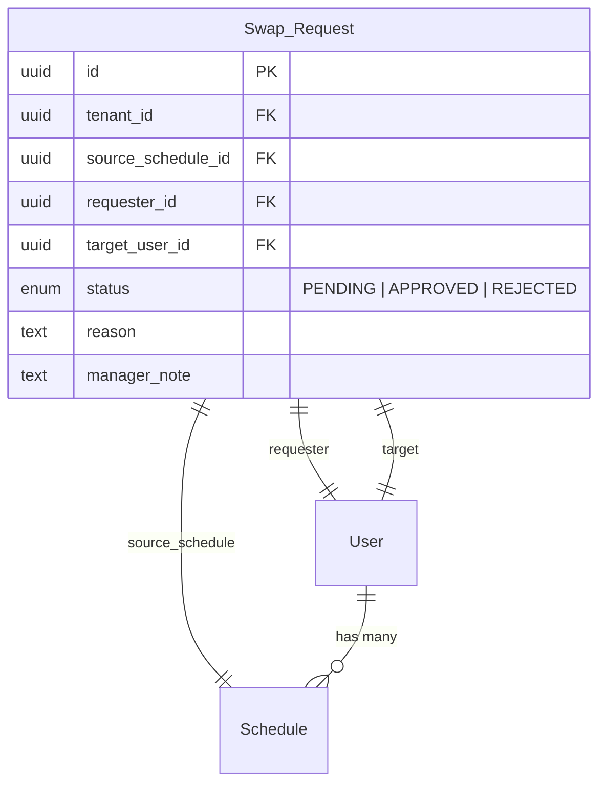

# MG-03 Luồng Duyệt (Approval Workflow)

> [!abstract] Tổng quan
> Màn hình quản lý và duyệt các yêu cầu **Đổi ca (Swap)** và **Xin nghỉ phép (Leave)** từ Staff. Manager xem danh sách yêu cầu, phân tích tác động trước/sau (Impact Analysis), rồi quyết định Duyệt hoặc Từ chối. Hỗ trợ thao tác batch để duyệt hàng loạt.

> [!info] Rule Engine Reference
> Impact Analysis sử dụng Rule Engine để đánh giá tác động. Chi tiết tại [[SYS-01 Rule Engine & Policy Definition]].
> - Approval Rules: [[SYS-01 Rule Engine & Policy Definition#4. Approval Rules (Quy tắc phê duyệt)|Section 4]]
> - Swap Rules (kiểm tra trong Impact Analysis): [[SYS-01 Rule Engine & Policy Definition#3. Swap Rules (Quy tắc đổi ca)|Section 3]]
> - Leave Rules: [[SYS-01 Rule Engine & Policy Definition#5. Leave/Absence Rules (Quy tắc nghỉ phép)|Section 5]]

---

## 1. Actors & Permissions

| Actor | Quyền truy cập | Ghi chú |
|-------|----------------|---------|
| Manager | Full Read/Write | Xem, duyệt, từ chối yêu cầu; batch actions |
| Staff | Read (chỉ yêu cầu của mình) | Xem qua Dashboard cá nhân |
| Super Admin | Không truy cập | — |

---

## 2. UI Layout

### 2.1 Cấu trúc bố cục

```
┌──────────────────────────────────────────────────────┐
│  Header: Breadcrumb + Badge "X yêu cầu chờ duyệt"  │
├──────────────────────────────────────────────────────┤
│  Status Filter Tabs: [Tất cả|Chờ duyệt|Duyệt|TC]   │
├──────────────────────────────────────────────────────┤
│  Batch Action Bar (hiện khi chọn ≥1 item)            │
├──────────────────────────────────────────────────────┤
│  ┌─────────────────────────────────────────────────┐ │
│  │ Request Item 1: Avatar, Tên, Loại, Ngày, Status│ │
│  ├─────────────────────────────────────────────────┤ │
│  │ Request Item 2: ...                             │ │
│  ├─────────────────────────────────────────────────┤ │
│  │ Request Item 3: ...                             │ │
│  └─────────────────────────────────────────────────┘ │
│  Pagination                                          │
└──────────────────────────────────────────────────────┘

        ┌── Impact Analysis Drawer ──┐
        │  Thông tin yêu cầu          │
        │  So sánh TRƯỚC / SAU        │
        │  Cảnh báo vi phạm rules     │
        │  [Duyệt] [Từ chối]          │
        └─────────────────────────────┘
```

### 2.2 Responsive Behavior

| Breakpoint | Thay đổi |
|------------|----------|
| Desktop (≥1024px) | Drawer mở bên phải (40% width) |
| Tablet (768-1023px) | Drawer mở full-width overlay |
| Mobile (<768px) | Drawer thành full-screen modal |

---

## 3. UI Components & States

### 3.1 Request List

**Mô tả:** Danh sách các yêu cầu Swap/Leave, phân trang. Mỗi item hiển thị thông tin tóm tắt và trạng thái luồng.

**Columns:**

| Column | Mô tả |
|--------|-------|
| Checkbox | Chọn cho batch action |
| Người yêu cầu | Avatar + Tên + Specialty |
| Loại | Badge: `Swap` (xanh dương) / `Leave` (tím) |
| Ca gốc | Tên ca + Ngày |
| Ca mới / Người nhận | Tên BS đích + ca mới (nếu Swap) |
| Trạng thái luồng | VD: "BS. B đã đồng ý, chờ Manager duyệt" |
| Ngày tạo | Relative time (VD: "2 giờ trước") |
| Actions | [Xem chi tiết] |

**UI States:**

| State | Điều kiện | Hiển thị | Hành vi |
|-------|-----------|----------|---------|
| 🔄 Loading | Đang fetch danh sách | Skeleton list (5 items shimmer) | — |
| ✅ Default | Có yêu cầu | Danh sách paginated | Click → mở Drawer |
| 📭 Empty | Không có yêu cầu nào (theo filter) | Illustration + "Không có yêu cầu [trạng thái]" | — |
| ❌ Error | API lỗi | Error banner + Retry | — |
| 🚫 Disabled | — | — | — |

### 3.2 Status Filter Tabs

**Mô tả:** Tabs lọc yêu cầu theo trạng thái.

| Tab | Filter value | Badge count |
|-----|-------------|-------------|
| Tất cả | `*` | Tổng số |
| Chờ duyệt | `PENDING` | Số pending (đỏ nếu > 0) |
| Đã duyệt | `APPROVED` | Số approved |
| Đã từ chối | `REJECTED` | Số rejected |

**UI States:**

| State | Điều kiện | Hiển thị | Hành vi |
|-------|-----------|----------|---------|
| ✅ Default | Tab active | Tab highlighted + badge count | Filter list |
| 🔄 Loading | Đang chuyển tab | Spinner nhỏ trên badge | — |

### 3.3 Impact Analysis Drawer

**Mô tả:** Drawer/Panel mở khi click vào 1 yêu cầu. Phân tích tác động **TRƯỚC & SAU** khi đổi ca. Đây là component quan trọng nhất để Manager ra quyết định.

**Nội dung Drawer:**

| Section | Mô tả |
|---------|-------|
| **Header** | Loại yêu cầu + Tên người gửi + Ngày tạo |
| **Thông tin ca gốc** | Ca trực hiện tại: ngày, giờ, tên ca |
| **Thông tin ca mới** | Ca trực đề xuất hoán đổi (nếu Swap) |
| **So sánh TRƯỚC/SAU** | Bảng 2 cột: Tổng giờ trực tháng (Requester), Tổng giờ trực tháng (Target) — trước và sau swap |
| **Cảnh báo vi phạm** | Badges đỏ/vàng nếu swap gây vi phạm Hard Rules |
| **Timeline visual** | Mini timeline hiển thị ca trước/sau swap trên trục thời gian |
| **Lý do** | Lý do người yêu cầu đã nhập |
| **Action buttons** | [Duyệt] [Từ chối] + textarea lý do (bắt buộc khi từ chối) |
| **Rule Violations** | Danh sách Hard/Soft Rules vi phạm từ [[SYS-01 Rule Engine & Policy Definition]]. API: `POST /api/v1/rules/evaluate` |
| **Burnout Assessment** | Đánh giá burnout risk cho cả requester + target. Levels: 🟢 NORMAL / 🟡 WARNING / 🔴 CRITICAL |
| **Fairness Impact** | Fairness Score trước/sau swap: `(1 - σ/μ) × 100%`. Xem [[SYS-01 Rule Engine & Policy Definition#7.1 Fairness Score Formula]] |

**UI States:**

| State | Điều kiện | Hiển thị | Hành vi |
|-------|-----------|----------|---------|
| 🔄 Loading | Đang fetch impact analysis | Skeleton + spinner | Disable actions |
| ✅ Default (Safe) | Không vi phạm rule | So sánh bình thường, nút [Duyệt] enabled | Cho phép duyệt |
| ⚠️ Warning | Swap gây cảnh báo vàng (burnout) | Badge vàng + warning callout | Nút [Duyệt] enabled nhưng hiện cảnh báo |
| 🔴 Violation | Swap vi phạm Hard Rules | Badge đỏ + nút [Duyệt] **DISABLED** | Chỉ cho phép Từ chối |
| ❌ Error | API lỗi khi load analysis | Error + Retry | Disable actions |
| ⏰ Expired | Ngày ca trực đã qua | Banner "Yêu cầu đã hết hạn" + auto-mark expired | Chỉ hiển thị, không action |

### 3.4 Batch Action Bar

**Mô tả:** Thanh thao tác hàng loạt, xuất hiện khi chọn ≥1 yêu cầu qua checkbox.

**UI States:**

| State | Điều kiện | Hiển thị | Hành vi |
|-------|-----------|----------|---------|
| 🔄 Loading | Đang xử lý batch | Progress bar "Đang xử lý X/Y..." | Disable tất cả |
| ✅ Default | Đã chọn ≥1 item | "Đã chọn X yêu cầu" + [Duyệt tất cả] [Từ chối tất cả] | Sticky bar |
| ❌ Error (Partial) | 1 trong batch vi phạm rule | Dừng batch, highlight item lỗi + toast "Y/C #Z vi phạm rule" | Cho phép skip hoặc cancel |
| 🚫 Hidden | Chưa chọn item nào | Bar ẩn | — |

---

## 4. User Flow

```mermaid
flowchart TD
    A["Manager truy cập Approval"] --> B["Xem danh sách Pending"]
    B --> C{"Chọn 1 yêu cầu?"}
    C -->|Click item| D["Mở Impact Analysis Drawer"]
    D --> E["Xem so sánh TRƯỚC/SAU"]
    E --> F{"Vi phạm Hard Rules?"}
    F -->|Có| G["Nút Duyệt DISABLED<br/>Chỉ cho phép Từ chối"]
    F -->|Không| H{"Quyết định?"}
    H -->|Duyệt| I["Click [Duyệt] + ghi note"]
    H -->|Từ chối| J["Click [Từ chối] + nhập lý do (bắt buộc)"]
    I --> K["Hệ thống cập nhật 2 Schedule records<br/>Gửi notification cho Requester + Target"]
    J --> L["Gửi notification cho Requester<br/>Kèm lý do từ chối"]
    G --> J
    C -->|Chọn nhiều (checkbox)| M["Batch Action Bar hiện"]
    M --> N["Click [Duyệt tất cả]"]
    N --> O{"Tất cả hợp lệ?"}
    O -->|Có| P["Xử lý batch + notification"]
    O -->|Không| Q["Dừng, highlight item vi phạm"]
```

### 4.1 Luồng chính (Happy Path)

1. Manager vào Approval, mặc định tab "Chờ duyệt"
2. Click vào 1 yêu cầu → Drawer mở, hiện Impact Analysis
3. Xem bảng so sánh giờ làm trước/sau, kiểm tra vi phạm
4. Quyết định **Duyệt** (ghi note optional) hoặc **Từ chối** (nhập lý do bắt buộc)
5. Hệ thống cập nhật Schedule + gửi notification

### 4.2 Luồng phụ (Alternative Flows)

- **Batch approve:** Chọn nhiều checkbox → Duyệt tất cả (nếu tất cả hợp lệ)
- **Quick approve từ Dashboard:** Duyệt nhanh từ widget trên [[MG-01 Dashboard]] (không mở Impact Analysis chi tiết)
- **Yêu cầu hết hạn:** System auto-marks expired, Manager chỉ cần archive

---

## 5. Business Rules

> [!warning] Hard Rules (Bắt buộc) → Chi tiết tại [[SYS-01 Rule Engine & Policy Definition#4. Approval Rules (Quy tắc phê duyệt)]]

| ID | Rule | Điều kiện | Hành vi khi vi phạm |
|----|------|-----------|---------------------|
| HR-AP-01 | Bắt buộc xem Impact Analysis | Manager chưa mở Drawer cho yêu cầu này | Nút [Duyệt] chỉ enable sau khi đã mở Drawer và view impact data |
| HR-AP-02 | Block duyệt nếu vi phạm Hard Rules | Impact Analysis phát hiện vi phạm HR-SW-01/02/03 | Nút [Duyệt] bị disable + badge đỏ "Vi phạm: [lý do]" |
| HR-AP-03 | Auto-update Schedule khi approve swap | Manager approve swap request | Hệ thống tự động hoán đổi 2 records trong Schedule table (requester ↔ target) |
| HR-AP-04 | Thông báo đầy đủ | Có quyết định (approve/reject) | Notification gửi cho cả `requester_id` và `target_user_id` |

> [!tip] Soft Rules (Gợi ý)

| ID | Rule | Logic | Hiển thị UI |
|----|------|-------|-------------|
| SR-AP-01 | Ưu tiên yêu cầu gấp | Yêu cầu cho ca trong < 24h | Badge đỏ "Gấp" + sort lên đầu |
| SR-AP-02 | Highlight cải thiện fairness | Swap giúp Fairness Score tăng | Badge xanh "Cải thiện công bằng" trong Drawer |

> [!info] Rule Engine Integration
> Impact Analysis gọi API `POST /api/v1/rules/evaluate` từ [[SYS-01 Rule Engine & Policy Definition]] để:
> 1. Kiểm tra Hard Rules (HR-SWP-01/02/03) → block approve nếu vi phạm
> 2. Tính Burnout Risk level cho cả 2 bên
> 3. Tính Fairness Score impact (before → after)
> 4. Kiểm tra Leave/Absence conflicts
>
> Kết quả trả về dạng: `{valid: boolean, hard_violations: [], soft_warnings: [], burnout_level, fairness_impact}`

---

## 6. API Endpoints

| Method | Endpoint | Request Body | Response | Mô tả |
|--------|----------|-------------|----------|-------|
| GET | `/api/v1/manager/requests` | query: `status`, `page`, `size` | `{requests: SwapRequest[], meta: Pagination}` | Danh sách yêu cầu |
| GET | `/api/v1/manager/requests/{id}/impact-analysis` | — | `{before: {requester_hours, target_hours}, after: {requester_hours, target_hours}, violations: Violation[], timeline: TimelineEvent[]}` | Phân tích tác động |
| POST | `/api/v1/manager/requests/{id}/approve` | `{note?: string}` | `{request: SwapRequest, updated_schedules: Schedule[]}` | Duyệt yêu cầu |
| POST | `/api/v1/manager/requests/{id}/reject` | `{reason: string}` | `{request: SwapRequest}` | Từ chối yêu cầu |
| POST | `/api/v1/manager/requests/batch-approve` | `{ids: string[], note?: string}` | `{approved: number, failed: {id, reason}[]}` | Duyệt hàng loạt |
| POST | `/api/v1/manager/requests/batch-reject` | `{ids: string[], reason: string}` | `{rejected: number}` | Từ chối hàng loạt |

### 6.1 Error Responses

| HTTP Code | Error Code | Mô tả | UI Handling |
|-----------|-----------|-------|-------------|
| 400 | `REASON_REQUIRED` | Từ chối mà không nhập lý do | Focus vào textarea + error border |
| 400 | `RULE_VIOLATION` | Duyệt yêu cầu vi phạm Hard Rules | Toast + disable nút Duyệt |
| 404 | `REQUEST_NOT_FOUND` | Yêu cầu không tồn tại | Toast + remove từ list |
| 409 | `REQUEST_EXPIRED` | Ca trực đã qua | Toast "Yêu cầu đã hết hạn" + auto-mark |
| 409 | `SCHEDULE_CHANGED` | Ca gốc đã bị thay đổi | Banner cảnh báo "Ca gốc đã thay đổi" + refresh data |
| 422 | `BATCH_PARTIAL_FAIL` | 1+ items trong batch lỗi | Hiện danh sách items lỗi + cho phép retry phần còn lại |

---

## 7. Data Model liên quan

| Entity | Các trường sử dụng | Mối quan hệ |
|--------|-------------------|-------------|
| [[Swap_Request]] | `id`, `tenant_id`, `source_schedule_id`, `requester_id`, `target_user_id`, `status`, `reason`, `manager_note` | belongs_to Schedule, belongs_to User (requester), belongs_to User (target) |
| [[Schedule]] | `id`, `user_id`, `shift_id`, `date`, `status` | Được update khi approve |
| [[User]] | `id`, `name`, `specialty`, `level` | Requester & Target |
| [[Rule_Config]] | `rule_id`, `param_key`, `param_value` | Tham số rules per-tenant. Xem [[SYS-01 Rule Engine & Policy Definition]] |



---

## 8. Edge Cases & Error Handling

| # | Tình huống | Hành vi mong đợi | Ghi chú |
|---|-----------|-------------------|---------|
| 1 | Target user đã bị thay đổi ca (do auto-generate mới) | Banner cảnh báo "Ca gốc đã thay đổi" + refresh Impact Analysis | Có thể dẫn tới conflict mới |
| 2 | Manager từ chối nhưng không nhập lý do | Textarea border đỏ + "Vui lòng nhập lý do từ chối" | Bắt buộc |
| 3 | Yêu cầu đã quá hạn (ngày ca trực đã qua) | Auto-mark `EXPIRED`, không cho duyệt, chỉ hiển thị | Cron job chạy hàng ngày |
| 4 | Batch approve mà 1 item vi phạm rule | Dừng tại item lỗi, highlight, cho phép skip hoặc cancel batch | Không partial commit |
| 5 | Manager duyệt nhanh từ Dashboard (không xem Impact Analysis) | Quick approve bypass HR-AP-01 cho yêu cầu Leave; Swap vẫn bắt buộc xem IA | Leave đơn giản hơn |
| 6 | 2 Manager cùng duyệt 1 yêu cầu | First-write-wins, người sau nhận lỗi 409 | Optimistic locking |
| 7 | Yêu cầu Swap khi lịch tháng đó đang là DRAFT | Cho phép duyệt, update DRAFT schedule | Swap trên Draft có ý nghĩa |

---

## 9. Liên kết màn hình

- **Navigated from:** [[MG-01 Dashboard]] (Quick Approval Widget), [[MG-02 Bảng Xếp Lịch (Master Schedule)]]
- **Source of requests:** [[ST-03 Yêu cầu Đổi ca (Smart Shift Swap)]] (Staff tạo yêu cầu)
- **Impact on:** [[ST-02 Lịch của tôi (My Schedule)]] (Lịch Staff cập nhật sau approve)
- **Rule definitions:** [[SYS-01 Rule Engine & Policy Definition]] (HR-APR-xx rules + Impact Analysis specs)

---

> [!todo] Checklist triển khai
> - [ ] Request List component + pagination
> - [ ] Status Filter Tabs + badge count
> - [ ] Impact Analysis Drawer (before/after comparison)
> - [ ] Timeline visual component
> - [ ] Batch Action Bar + partial failure handling
> - [ ] API: impact-analysis endpoint
> - [ ] API: approve/reject + Schedule auto-update
> - [ ] Notification dispatch (requester + target)
> - [ ] Auto-expire cron job
> - [ ] Edge cases đã cover
> - [ ] Rule Engine integration cho Impact Analysis → [[SYS-01 Rule Engine & Policy Definition]]
