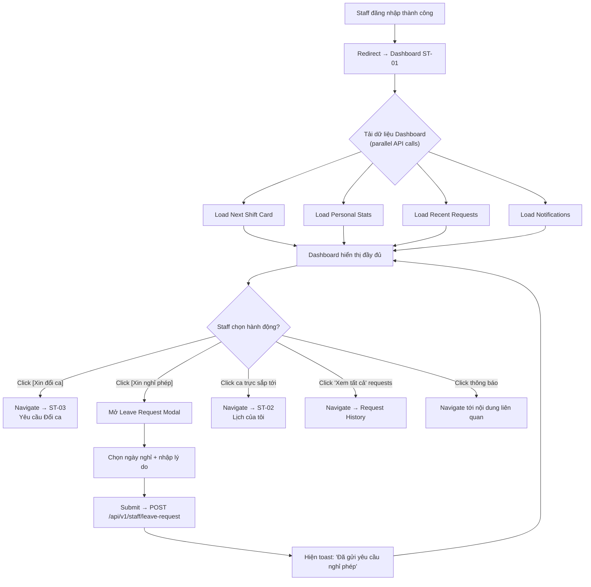
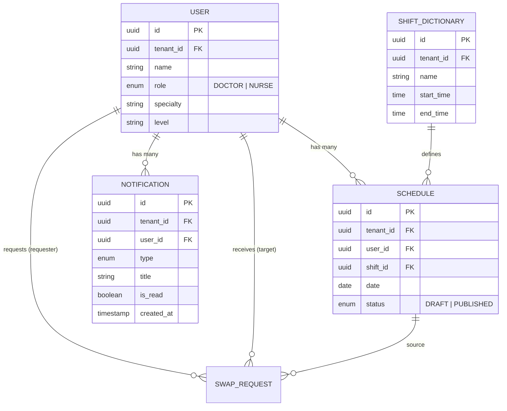

# ST-01: Dashboard Cá nhân

## 1. Overview

Dashboard cá nhân dành cho Y Bác sĩ / Điều dưỡng. Đây là màn hình đầu tiên sau khi Staff đăng nhập, cung cấp cái nhìn tổng quan nhanh về:

- Ca trực sắp tới gần nhất (Next Shift)
- Thống kê giờ trực và ngày phép cá nhân trong tháng
- Hành động nhanh: Xin đổi ca, Xin nghỉ phép
- Các yêu cầu gần đây đã gửi
- Thông báo quan trọng (lịch mới, kết quả duyệt, nhắc ca trực)

> [!NOTE]
> Dashboard chỉ hiển thị dữ liệu của chính Staff đang đăng nhập. Không hiển thị thông tin của đồng nghiệp khác (trừ so sánh trung bình khoa ở dạng tổng hợp).

> [!info] Rule Engine Reference
> Dashboard hiển thị cảnh báo burnout và fairness dựa trên [[SYS-01 Rule Engine & Policy Definition]].
> - Burnout metrics: [[SYS-01 Rule Engine & Policy Definition#6. Burnout Prevention Rules (Phòng chống kiệt sức)|Section 6]]
> - Fairness deviation alert (SR-DB-01): [[SYS-01 Rule Engine & Policy Definition#7.3 Policy Rules — Fairness|PR-FAR-04]]

---

## 2. Actors

| Actor | Vai trò | Quyền trên màn hình |
|-------|---------|---------------------|
| **Staff** (Y Bác sĩ / Điều dưỡng) | Người dùng chính | Xem dashboard, click Quick Actions, xem thông báo |

---

## 3. UI Layout

```
┌──────────────────────────────────────────────────────────────┐
│  HEADER: "Xin chào, Dr. [Tên]"          [🔔 Notifications]  │
├──────────────────────────────────────────────────────────────┤
│                                                              │
│  ┌────────────────────────────────────────────────────────┐  │
│  │              🕐 NEXT SHIFT CARD                        │  │
│  │  Ca: Ca Sáng  |  Ngày: 29/05/2026                     │  │
│  │  Giờ: 06:00 - 14:00  |  ⏱ Countdown: còn 16 giờ 51p  │  │
│  └────────────────────────────────────────────────────────┘  │
│                                                              │
│  ┌──────────────────────┐  ┌──────────────────────────────┐  │
│  │  📊 Tổng giờ trực    │  │  🏖 Ngày phép còn lại        │  │
│  │  120h / TB khoa 110h │  │  8 / 12 ngày                 │  │
│  │  ⚠ +9% so với TB     │  │                              │  │
│  └──────────────────────┘  └──────────────────────────────┘  │
│                                                              │
│  ┌────────────────────┐  ┌─────────────────────────────┐    │
│  │  🔄 XIN ĐỔI CA     │  │  📝 XIN NGHỈ PHÉP           │    │
│  │  (Quick Action)     │  │  (Quick Action)              │    │
│  └────────────────────┘  └─────────────────────────────┘    │
│                                                              │
│  ┌────────────────────────────────────────────────────────┐  │
│  │  📋 YÊU CẦU GẦN ĐÂY                    [Xem tất cả]  │  │
│  │  1. Swap  | PENDING   | 25/05/2026                    │  │
│  │  2. Leave | APPROVED  | 20/05/2026                    │  │
│  │  3. Swap  | REJECTED  | 15/05/2026                    │  │
│  └────────────────────────────────────────────────────────┘  │
│                                                              │
│  ┌────────────────────────────────────────────────────────┐  │
│  │  🔔 THÔNG BÁO                                         │  │
│  │  • Lịch tháng 06/2026 đã được công bố       2h trước  │  │
│  │  • Yêu cầu đổi ca #45 đã được duyệt        1d trước  │  │
│  │  • Nhắc: Ca Đêm ngày 30/05 bắt đầu lúc 22:00         │  │
│  └────────────────────────────────────────────────────────┘  │
│                                                              │
└──────────────────────────────────────────────────────────────┘
```

---

## 4. Components & States

### 4.1. Next Shift Card

**Mô tả:** Card nổi bật hiển thị ca trực sắp tới gần nhất của Staff.

| Trường | Kiểu | Mô tả |
|--------|------|-------|
| `shift_name` | `string` | Tên ca trực (VD: "Ca Sáng", "Ca Đêm") |
| `date` | `date` | Ngày ca trực (format: `dd/MM/yyyy`) |
| `start_time` | `time` | Giờ bắt đầu ca (format: `HH:mm`) |
| `end_time` | `time` | Giờ kết thúc ca (format: `HH:mm`) |
| `countdown` | `duration` | Thời gian còn lại tới ca (tính real-time) |

**States:**

| State | Điều kiện | Hiển thị |
|-------|-----------|----------|
| **Loading** | Đang gọi API `GET /next-shift` | Skeleton shimmer trên card (placeholder cho tên ca, ngày, giờ, countdown) |
| **Default** | Có ca trực sắp tới | Card hiển thị đầy đủ thông tin ca + countdown đếm ngược real-time |
| **Empty** | Không có ca trực nào trong tương lai | Card hiện icon 🎉 + text: _"Không có ca trực sắp tới"_ |
| **Error** | API lỗi (500, timeout) | Card hiện icon ⚠️ + text: _"Không thể tải thông tin ca trực"_ + nút [Thử lại] |
| **Disabled** | N/A — Card luôn hiển thị | — |

---

### 4.2. Personal Stats Row

**Mô tả:** 2 thẻ thống kê cá nhân hiển thị ngang hàng.

#### 4.2.1. Tổng giờ trực cá nhân trong tháng

| Trường | Kiểu | Mô tả |
|--------|------|-------|
| `total_hours` | `number` | Tổng số giờ trực của Staff trong tháng hiện tại |
| `department_avg_hours` | `number` | Số giờ trực trung bình của cả khoa trong tháng |
| `deviation_percent` | `number` | % chênh lệch so với trung bình khoa |

#### 4.2.2. Ngày phép còn lại

| Trường | Kiểu | Mô tả |
|--------|------|-------|
| `remaining_leave_days` | `number` | Số ngày phép còn lại |
| `total_leave_days` | `number` | Tổng số ngày phép trong năm |

**States:**

| State | Điều kiện | Hiển thị |
|-------|-----------|----------|
| **Loading** | Đang gọi API `GET /stats` | Skeleton shimmer trên 2 thẻ stats |
| **Default** | Có dữ liệu thống kê | Hiển thị số liệu + % chênh lệch. Nếu `deviation_percent > 20%` → text đỏ + icon ⚠️ cảnh báo |
| **Empty** | Tháng chưa có ca trực nào | Hiện `0h` cho giờ trực, giữ nguyên ngày phép |
| **Error** | API lỗi | Hiện `--` thay cho số + text nhỏ _"Không thể tải"_ |
| **Disabled** | N/A | — |

> [!WARNING]
> Nếu tổng giờ trực vượt trung bình khoa > 20%, hiện cảnh báo nhẹ (soft warning) bằng text đỏ và tooltip giải thích.

---

### 4.3. Quick Action Buttons

**Mô tả:** 2 nút CTA (Call-to-Action) lớn, nổi bật để thực hiện hành động nhanh.

| Nút | Icon | Label | Action |
|-----|------|-------|--------|
| **Xin đổi ca** | 🔄 | "Xin đổi ca" | Navigate → [[ST-03 Yêu cầu Đổi ca (Smart Shift Swap)]] |
| **Xin nghỉ phép** | 📝 | "Xin nghỉ phép" | Mở **Leave Request Modal** (inline modal) |

**States:**

| State | Điều kiện | Hiển thị |
|-------|-----------|----------|
| **Loading** | N/A — Nút tĩnh, không phụ thuộc API | — |
| **Default** | Staff đang active, có ca trực | 2 nút CTA bình thường, clickable |
| **Empty** | N/A | — |
| **Error** | N/A | — |
| **Disabled** | Staff không có ca trực nào trong tương lai (không thể đổi ca) | Nút [Xin đổi ca] bị mờ + tooltip: _"Bạn chưa có ca trực để đổi"_ |

---

### 4.4. My Recent Requests

**Mô tả:** Danh sách 3 yêu cầu gần nhất mà Staff đã gửi (Swap hoặc Leave).

| Trường | Kiểu | Mô tả |
|--------|------|-------|
| `type` | `enum` | Loại yêu cầu: `SWAP` \| `LEAVE` |
| `status` | `enum` | Trạng thái: `PENDING` \| `APPROVED` \| `REJECTED` |
| `created_at` | `datetime` | Ngày tạo yêu cầu (format: `dd/MM/yyyy`) |

**Status Badge Colors:**

| Status | Màu | Icon |
|--------|-----|------|
| `PENDING` | 🟡 Vàng | ⏳ |
| `APPROVED` | 🟢 Xanh | ✅ |
| `REJECTED` | 🔴 Đỏ | ❌ |

**States:**

| State | Điều kiện | Hiển thị |
|-------|-----------|----------|
| **Loading** | Đang gọi API `GET /recent-requests` | 3 skeleton rows (shimmer) |
| **Default** | Có ít nhất 1 yêu cầu | Danh sách 1-3 items + link "Xem tất cả" |
| **Empty** | Chưa từng gửi yêu cầu nào | Text: _"Bạn chưa có yêu cầu nào"_ + icon 📭 |
| **Error** | API lỗi | Text: _"Không thể tải danh sách yêu cầu"_ + nút [Thử lại] |
| **Disabled** | N/A | — |

---

### 4.5. Notifications Panel

**Mô tả:** Panel hiển thị các thông báo gần đây chưa đọc.

| Trường | Kiểu | Mô tả |
|--------|------|-------|
| `title` | `string` | Tiêu đề thông báo |
| `type` | `enum` | Loại: `SCHEDULE_PUBLISHED` \| `REQUEST_APPROVED` \| `REQUEST_REJECTED` \| `SHIFT_REMINDER` |
| `created_at` | `datetime` | Thời gian thông báo (hiển thị relative: "2h trước", "1 ngày trước") |
| `is_read` | `boolean` | Đã đọc hay chưa |

**Notification Types:**

| Type | Mô tả | Trigger |
|------|--------|---------|
| `SCHEDULE_PUBLISHED` | Lịch mới được publish | Manager publish [[Schedule]] |
| `REQUEST_APPROVED` | Yêu cầu (Swap/Leave) được duyệt | Manager approve [[Swap_Request]] |
| `REQUEST_REJECTED` | Yêu cầu bị từ chối | Manager reject [[Swap_Request]] |
| `SHIFT_REMINDER` | Nhắc ca trực sắp tới | System auto, trước 24h |

**States:**

| State | Điều kiện | Hiển thị |
|-------|-----------|----------|
| **Loading** | Đang gọi API `GET /notifications` | Skeleton shimmer cho 5 dòng |
| **Default** | Có thông báo | Danh sách thông báo, items chưa đọc có background highlight + dot xanh |
| **Empty** | Không có thông báo nào | Text: _"Không có thông báo mới"_ + icon 🔕 |
| **Error** | API lỗi | Text: _"Không thể tải thông báo"_ + nút [Thử lại] |
| **Disabled** | N/A | — |

---

## 5. User Flow



---

## 6. Business Rules

### Soft Rules (Dashboard)

| Rule ID | Mô tả | Hành vi UI |
|---------|--------|------------|
| SR-DB-01 | Hiện cảnh báo nhẹ nếu tổng giờ trực vượt trung bình khoa > 20% (PR-FAR-04 từ [[SYS-01 Rule Engine & Policy Definition\|SYS-01]]) | Text đỏ trên stat card + tooltip: _"Giờ trực của bạn cao hơn trung bình khoa {X}%"_ |
| SR-DB-02 | Countdown trên Next Shift Card đếm ngược real-time | Cập nhật mỗi phút. Khi < 1h → text chuyển đỏ + pulse animation |
| SR-DB-03 | Thông báo chưa đọc hiển thị badge count trên icon 🔔 header | Badge đỏ + số lượng unread notifications |

> [!NOTE]
> Dashboard không có Hard Rules. Tất cả business rules trên dashboard đều là Soft Rules phục vụ trải nghiệm người dùng.

> [!info] Burnout Warning
> Nếu Staff có burnout level = 🔴 CRITICAL (theo [[SYS-01 Rule Engine & Policy Definition#6.1 Burnout Detection Thresholds]]),
> Dashboard sẽ hiển thị banner cảnh báo đặc biệt: "⚠️ Bạn đang có nguy cơ kiệt sức. Hãy liên hệ Trưởng khoa."

---

## 7. API Endpoints

### 7.1. GET `/api/v1/staff/dashboard/next-shift`

**Mô tả:** Lấy ca trực sắp tới gần nhất của Staff đang đăng nhập.

**Headers:**
```
Authorization: Bearer {jwt_token}
X-Tenant-Id: {tenant_id}
```

**Response 200:**
```json
{
  "data": {
    "schedule_id": 1234,
    "shift_name": "Ca Sáng",
    "date": "2026-05-29",
    "start_time": "06:00",
    "end_time": "14:00",
    "countdown_seconds": 60660
  }
}
```

**Response 204:** Không có ca trực sắp tới (Empty state).

**Error Responses:**

| Status Code | Mô tả |
|-------------|--------|
| `401` | Unauthorized — token hết hạn hoặc không hợp lệ |
| `500` | Internal Server Error |

---

### 7.2. GET `/api/v1/staff/dashboard/stats?month=YYYY-MM`

**Mô tả:** Lấy thống kê giờ trực và ngày phép cá nhân.

**Query Params:**

| Param | Kiểu | Required | Mô tả |
|-------|------|----------|-------|
| `month` | `string` | Yes | Tháng cần lấy stats (format: `YYYY-MM`) |

**Response 200:**
```json
{
  "data": {
    "total_hours": 120,
    "department_avg_hours": 110,
    "deviation_percent": 9.09,
    "remaining_leave_days": 8,
    "total_leave_days": 12,
    "month": "2026-05"
  }
}
```

---

### 7.3. GET `/api/v1/staff/dashboard/recent-requests?limit=3`

**Mô tả:** Lấy danh sách yêu cầu gần nhất của Staff.

**Query Params:**

| Param | Kiểu | Required | Default | Mô tả |
|-------|------|----------|---------|-------|
| `limit` | `integer` | No | `3` | Số lượng yêu cầu trả về |

**Response 200:**
```json
{
  "data": [
    {
      "id": 45,
      "type": "SWAP",
      "status": "PENDING",
      "created_at": "2026-05-25T10:30:00Z",
      "summary": "Đổi Ca Sáng 29/05 với BS. Nguyễn Văn A"
    },
    {
      "id": 42,
      "type": "LEAVE",
      "status": "APPROVED",
      "created_at": "2026-05-20T08:00:00Z",
      "summary": "Nghỉ phép ngày 01/06/2026"
    }
  ]
}
```

---

### 7.4. GET `/api/v1/staff/notifications?unread=true&limit=5`

**Mô tả:** Lấy danh sách thông báo của Staff.

**Query Params:**

| Param | Kiểu | Required | Default | Mô tả |
|-------|------|----------|---------|-------|
| `unread` | `boolean` | No | `true` | Chỉ lấy thông báo chưa đọc |
| `limit` | `integer` | No | `5` | Số lượng thông báo trả về |

**Response 200:**
```json
{
  "data": [
    {
      "id": 101,
      "type": "SCHEDULE_PUBLISHED",
      "title": "Lịch tháng 06/2026 đã được công bố",
      "created_at": "2026-05-28T08:00:00Z",
      "is_read": false
    },
    {
      "id": 99,
      "type": "REQUEST_APPROVED",
      "title": "Yêu cầu đổi ca #45 đã được duyệt",
      "created_at": "2026-05-27T14:30:00Z",
      "is_read": false
    }
  ],
  "unread_count": 3
}
```

---

## 8. Data Model



---

## 9. Edge Cases

| # | Tình huống | Xử lý |
|---|-----------|--------|
| 1 | Staff chưa được assign ca nào (mới vào) | Next Shift = Empty, Stats = `0h`, Recent Requests = Empty |
| 2 | Tất cả API calls fail cùng lúc | Mỗi component hiện Error state độc lập, không crash toàn dashboard |
| 3 | Staff có ca trực trong < 1 giờ nữa | Countdown text chuyển đỏ + pulse animation, badge "Sắp tới!" |
| 4 | Đang ở Dashboard, lịch mới được publish | Real-time notification hiện ở panel + toast popup |
| 5 | Staff bị deactivate giữa session | Redirect về login, hiện thông báo _"Tài khoản đã bị vô hiệu hóa"_ |
| 6 | Timezone khác nhau (VD: staff đi công tác) | Tất cả thời gian hiển thị theo timezone của `tenant` (bệnh viện) |

---

## 10. Navigation Links

| Từ | Đến | Trigger |
|----|-----|---------|
| Dashboard | [[ST-02 Lịch của tôi (My Schedule)]] | Click vào Next Shift Card hoặc menu sidebar |
| Dashboard | [[ST-03 Yêu cầu Đổi ca (Smart Shift Swap)]] | Click nút [Xin đổi ca] |
| Dashboard | Leave Request Modal | Click nút [Xin nghỉ phép] |
| Dashboard | Request History | Click "Xem tất cả" trong Recent Requests |
| Dashboard | Notification Detail | Click vào từng notification item |
| Dashboard | Rule Engine Reference | Implicit — rules from [[SYS-01 Rule Engine & Policy Definition]] power burnout/fairness warnings |
