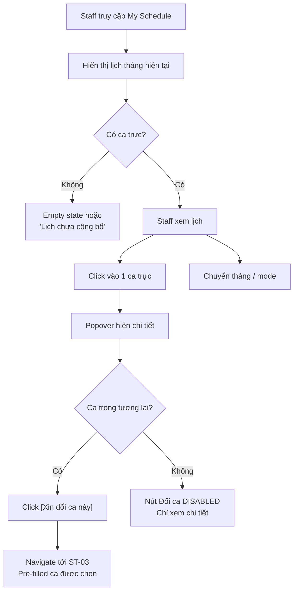

# ST-02 Lịch của tôi (My Schedule)

> [!abstract] Tổng quan
> Lịch tháng cá nhân chỉ hiển thị ca trực của bản thân Y Bác sĩ. Sử dụng **FullCalendar** library để render lịch dạng tháng/tuần/danh sách. Staff có thể click vào 1 ca trực để xem chi tiết (đồng nghiệp cùng ca) và khởi tạo yêu cầu Đổi ca từ đây.

> [!info] Rule Engine Reference
> Các ràng buộc đổi ca trên màn hình này tuân theo [[SYS-01 Rule Engine & Policy Definition]].
> - Swap eligibility: [[SYS-01 Rule Engine & Policy Definition#3.1 Hard Rules — Swap|HR-SWP-05, HR-SWP-06, HR-SWP-08]]

---

## 1. Actors & Permissions

| Actor | Quyền truy cập | Ghi chú |
|-------|----------------|---------|
| Staff | Read Only | Chỉ xem lịch PUBLISHED của bản thân; khởi tạo swap request |
| Manager | Không truy cập trực tiếp | Xem lịch toàn khoa qua [[MG-02 Bảng Xếp Lịch (Master Schedule)]] |
| Super Admin | Không truy cập | — |

---

## 2. UI Layout

### 2.1 Cấu trúc bố cục

```
┌──────────────────────────────────────────────────┐
│  Header: "Lịch của tôi" + View Mode Toggle       │
├──────────────────────────────────────────────────┤
│  Month Navigator: ◀  Tháng 6, 2026  ▶  [Today]  │
├──────────────────────────────────────────────────┤
│  ┌────┬────┬────┬────┬────┬────┬────┐            │
│  │ T2 │ T3 │ T4 │ T5 │ T6 │ T7 │ CN │            │
│  ├────┼────┼────┼────┼────┼────┼────┤            │
│  │    │ 🟦 │    │    │ 🟧 │    │    │  ← Ca trực │
│  │    │ S  │    │    │ C  │    │    │             │
│  ├────┼────┼────┼────┼────┼────┼────┤            │
│  │ 🟪 │    │    │ 🟦 │    │    │ 🟧 │            │
│  │ Đ  │    │    │ S  │    │    │ C  │            │
│  └────┴────┴────┴────┴────┴────┴────┘            │
├──────────────────────────────────────────────────┤
│  Legend: 🟦 Ca sáng  🟧 Ca chiều  🟪 Ca đêm      │
└──────────────────────────────────────────────────┘
```

### 2.2 Responsive Behavior

| Breakpoint | Thay đổi |
|------------|----------|
| Desktop (≥1024px) | Month view đầy đủ, ô lịch rộng |
| Tablet (768-1023px) | Month view thu gọn, text nhỏ hơn |
| Mobile (<768px) | Mặc định List view (danh sách), toggle sang Week |

---

## 3. UI Components & States

### 3.1 Calendar View

**Mô tả:** Lịch tháng sử dụng **FullCalendar** library. Mỗi ô ngày hiển thị ca trực (nếu có): tên ca, giờ bắt đầu-kết thúc, màu sắc theo loại ca (sáng = xanh dương, chiều = cam, đêm = tím). Click vào ô → hiện Shift Detail Popover.

**Props:**

| Prop | Type | Required | Mô tả |
|------|------|----------|-------|
| `month` | `string (YYYY-MM)` | yes | Tháng hiển thị |
| `schedules` | `Schedule[]` | yes | Danh sách ca trực (chỉ của user hiện tại, chỉ PUBLISHED) |
| `shiftDictionary` | `Shift_Dictionary[]` | yes | Danh mục ca để render màu/giờ |

**UI States:**

| State | Điều kiện | Hiển thị | Hành vi |
|-------|-----------|----------|---------|
| 🔄 Loading | Đang fetch schedules | Calendar skeleton (grid shimmer) | — |
| ✅ Default | Có ca trực trong tháng | Calendar với event blocks có màu | Click ô → Popover |
| 📭 Empty | Tháng không có ca nào | Calendar trống + banner "Bạn chưa có ca trực trong tháng này" | — |
| ⏳ Not Published | Lịch tháng chưa được Manager publish | Calendar trống + banner vàng "Lịch tháng X chưa được công bố" | — |
| ❌ Error | API lỗi | Error overlay + Retry | — |
| 🔔 New | Lịch vừa published trong 24h | Badge "Mới" trên header + pulse animation nhẹ trên các ô mới | Auto-dismiss sau 24h |

### 3.2 Month Navigator

**Mô tả:** Điều hướng giữa các tháng + nút Today quay về hiện tại.

**UI States:**

| State | Điều kiện | Hiển thị | Hành vi |
|-------|-----------|----------|---------|
| ✅ Default | Tháng hiện tại | ◀ "Tháng X, YYYY" ▶ [Today (disabled)] | Chuyển tháng |
| ✅ Past/Future | Tháng khác hiện tại | ◀ "Tháng X, YYYY" ▶ [Today (enabled)] | Today → quay về |
| 🚫 Disabled (Far Past) | > 12 tháng trước | Nút ◀ greyed out | Giới hạn lịch sử |

### 3.3 Shift Detail Popover

**Mô tả:** Popover hiện khi click vào 1 ca trực trên lịch. Hiện chi tiết ca + đồng nghiệp cùng ca.

**Nội dung Popover:**

| Field | Mô tả |
|-------|-------|
| Tên ca | VD: "Ca sáng" |
| Giờ chi tiết | VD: "07:00 - 15:00" |
| Ngày | VD: "Thứ Hai, 15/06/2026" |
| Đồng nghiệp cùng ca | Danh sách avatar + tên (max 5, "+N khác") |
| Nút [Xin đổi ca này] | Navigate tới [[ST-03 Yêu cầu Đổi ca (Smart Shift Swap)]] với pre-filled ca |

**UI States:**

| State | Điều kiện | Hiển thị | Hành vi |
|-------|-----------|----------|---------|
| 🔄 Loading | Đang fetch chi tiết + đồng nghiệp | Skeleton popover | — |
| ✅ Default | Ca trong tương lai | Full info + nút [Xin đổi ca] enabled | Click → ST-03 |
| ⏰ Past | Ca đã qua | Full info, nút [Xin đổi ca] **DISABLED** + tooltip "Ca đã qua" | Chỉ xem |
| 🔄 Pending Swap | Đã có swap request cho ca này | Badge "Đang chờ đổi ca" thay nút | Disable tạo request mới |
| ❌ Error | API lỗi | "Không thể tải chi tiết" + Retry | — |

### 3.4 View Mode Toggle

**Mô tả:** Toggle chuyển đổi cách hiển thị lịch.

| Mode | Icon | Mô tả |
|------|------|-------|
| Tháng | 📅 | Grid tháng (default on desktop) |
| Tuần | 📋 | Grid tuần chi tiết |
| Danh sách | 📃 | List upcoming shifts (default on mobile) |

**UI States:**

| State | Điều kiện | Hiển thị | Hành vi |
|-------|-----------|----------|---------|
| ✅ Default | Mode active | Button group, active highlighted | Switch view |

### 3.5 Legend

**Mô tả:** Chú giải màu sắc cho các loại ca.

| Loại ca | Màu | Time range mẫu |
|---------|-----|----------------|
| Ca sáng (S) | 🟦 Xanh dương (`#2196F3`) | 07:00 - 15:00 |
| Ca chiều (C) | 🟧 Cam (`#FF9800`) | 15:00 - 23:00 |
| Ca đêm (Đ) | 🟪 Tím (`#9C27B0`) | 23:00 - 07:00 |

---

## 4. User Flow



### 4.1 Luồng chính (Happy Path)

1. Staff truy cập My Schedule → Lịch tháng hiện tại được hiển thị
2. Các ô có ca trực hiện màu sắc theo loại ca
3. Click vào 1 ô → Popover hiện chi tiết ca + đồng nghiệp cùng ca
4. Click **[Xin đổi ca này]** → Navigate tới [[ST-03 Yêu cầu Đổi ca (Smart Shift Swap)]] với ca đã pre-filled

### 4.2 Luồng phụ (Alternative Flows)

- **Xem tháng tới:** Chuyển tháng → nếu chưa publish → banner "Lịch chưa công bố"
- **View mode change:** Toggle sang Tuần/Danh sách cho mobile hoặc preference
- **Ca vừa cập nhật:** Sau swap approved, ô highlight + badge "Cập nhật"

---

## 5. Business Rules

> [!warning] Hard Rules (Bắt buộc) → Định nghĩa tại [[SYS-01 Rule Engine & Policy Definition]]

| ID | Rule | Điều kiện | Hành vi khi vi phạm |
|----|------|-----------|---------------------|
| HR-SC-01 | Chỉ hiển thị lịch PUBLISHED | Schedule.status = DRAFT | Không hiển thị, hiện banner "Chưa công bố" |
| HR-SC-02 | Chỉ đổi ca tương lai | Ngày ca trực < today | Nút [Xin đổi ca] disabled + tooltip |
| HR-SC-03 | 1 swap request / 1 ca | Đã tồn tại Swap_Request PENDING cho ca này | Hiện badge "Đang chờ đổi", disable nút tạo mới |

> [!tip] Soft Rules (Gợi ý)

| ID | Rule | Logic | Hiển thị UI |
|----|------|-------|-------------|
| SR-SC-01 | Highlight lịch mới | Lịch published trong 24h qua | Badge "Mới" + pulse animation |
| SR-SC-02 | Highlight ca cập nhật | Ca thay đổi do swap approved | Badge "Cập nhật" + highlight ô |

---

## 6. API Endpoints

| Method | Endpoint | Request Body | Response | Mô tả |
|--------|----------|-------------|----------|-------|
| GET | `/api/v1/staff/schedules` | query: `month` | `{schedules: Schedule[], published_at: datetime}` | Lấy ca trực của user hiện tại (chỉ PUBLISHED) |
| GET | `/api/v1/staff/schedules/{id}/detail` | — | `{schedule: Schedule, shift: Shift_Dictionary, colleagues: User[]}` | Chi tiết ca + đồng nghiệp cùng ca |

### 6.1 Error Responses

| HTTP Code | Error Code | Mô tả | UI Handling |
|-----------|-----------|-------|-------------|
| 401 | `UNAUTHORIZED` | Chưa đăng nhập | Redirect Login |
| 403 | `FORBIDDEN` | User không thuộc tenant | Error page |
| 404 | `SCHEDULE_NOT_FOUND` | Ca không tồn tại | Toast + refresh |
| 404 | `MONTH_NOT_PUBLISHED` | Tháng chưa publish | Banner "Lịch chưa công bố" |

---

## 7. Data Model liên quan

| Entity | Các trường sử dụng | Mối quan hệ |
|--------|-------------------|-------------|
| [[Schedule]] | `id`, `user_id`, `shift_id`, `date`, `status` | belongs_to User, belongs_to Shift_Dictionary |
| [[Shift_Dictionary]] | `id`, `name`, `start_time`, `end_time` | defines Schedule shift |
| [[User]] | `id`, `name`, `specialty` | Đồng nghiệp cùng ca |
| [[Swap_Request]] | `source_schedule_id`, `status` | Kiểm tra đã có pending swap chưa |

---

## 8. Edge Cases & Error Handling

| # | Tình huống | Hành vi mong đợi | Ghi chú |
|---|-----------|-------------------|---------|
| 1 | Tháng không có ca nào (Staff mới) | Empty state: "Bạn chưa có ca trực trong tháng này" | — |
| 2 | Lịch chưa publish cho tháng tới | Banner vàng: "Lịch tháng X chưa được công bố" | — |
| 3 | Ca bị thay đổi sau publish (swap approved) | Ô highlight + badge "Cập nhật" | Auto-refresh khi nhận notification |
| 4 | Staff xem tháng rất xa trong tương lai | Calendar trống, không banner lỗi | Bình thường |
| 5 | Nhiều ca trong 1 ngày | Ô hiện stacked (ca 1, ca 2...) hoặc "+1 ca khác" | Click → expand |
| 6 | Đồng nghiệp cùng ca quá nhiều (>10) | Popover hiện 5 + "+N khác" | Collapse |

---

## 9. Liên kết màn hình

- **Navigated from:** [[ST-01 Dashboard Cá nhân]] (sidebar + "Xem lịch đầy đủ")
- **Navigates to:** [[ST-03 Yêu cầu Đổi ca (Smart Shift Swap)]] (qua nút [Xin đổi ca này] trong Popover)
- **Data source:** [[MG-02 Bảng Xếp Lịch (Master Schedule)]] (Manager publish lịch → Staff xem)
- **Rule definitions:** [[SYS-01 Rule Engine & Policy Definition]] (HR-SWP-05, HR-SWP-06, HR-SWP-08)

---

> [!todo] Checklist triển khai
> - [ ] FullCalendar integration (month/week/list views)
> - [ ] Shift event rendering (màu sắc theo loại ca)
> - [ ] Shift Detail Popover + đồng nghiệp cùng ca
> - [ ] Month Navigator + Today button
> - [ ] View Mode Toggle (responsive default)
> - [ ] Legend component
> - [ ] Badge "Mới" / "Cập nhật"
> - [ ] Pre-fill ca khi navigate tới ST-03
> - [ ] Responsive: List view default on mobile
> - [ ] Edge cases đã cover
> - [ ] Rule Engine integration cho swap eligibility → [[SYS-01 Rule Engine & Policy Definition]]
