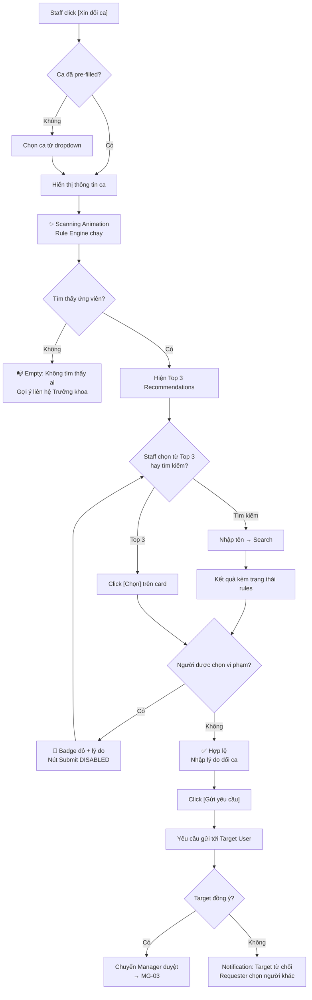
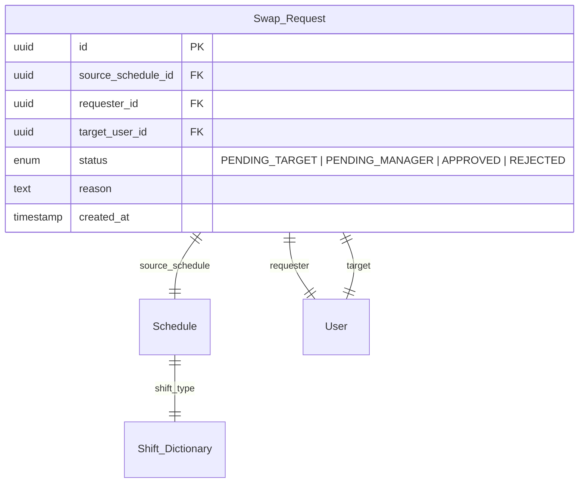

# ST-03 Yêu cầu Đổi ca (Smart Shift Swap)

> [!abstract] Tổng quan
> ==Nghiệp vụ cốt lõi 1==: Modal/Drawer cho phép Staff yêu cầu đổi ca trực với đồng nghiệp. Hệ thống sử dụng **Rule Engine** để chủ động gợi ý (Top 3 Recommendations) và giám sát ràng buộc (Hard Rules), thay vì chỉ tiếp nhận yêu cầu thụ động. Đây là tính năng trọng tâm để trình bày trước hội đồng.

> [!info] Rule Engine Reference
> Rule Engine là core của tính năng này. Chi tiết tại [[SYS-01 Rule Engine & Policy Definition]].
> - Swap Hard Rules: [[SYS-01 Rule Engine & Policy Definition#3.1 Hard Rules — Swap|Section 3.1]]
> - Swap Soft Rules & Scoring: [[SYS-01 Rule Engine & Policy Definition#3.2 Soft Rules — Swap (Scoring Algorithm)|Section 3.2]]
> - Eligibility Pipeline: [[SYS-01 Rule Engine & Policy Definition#Eligibility Pipeline|Pipeline diagram]]
> - Configurable Parameters: [[SYS-01 Rule Engine & Policy Definition#9.1 Configurable Parameters|Section 9.1]]

---

## 1. Actors & Permissions

| Actor | Quyền truy cập | Ghi chú |
|-------|----------------|---------|
| Staff (Requester) | Tạo yêu cầu đổi ca | Chọn ca, chọn người, submit |
| Staff (Target) | Đồng ý / Từ chối | Nhận notification, quyết định |
| Manager | Duyệt / Từ chối (sau khi Target đồng ý) | Xem qua [[MG-03 Luồng Duyệt (Approval Workflow)]] |

---

## 2. UI Layout

### 2.1 Cấu trúc bố cục

```
┌─────────────────────────────────────────────────────────┐
│  Modal/Drawer Header: "Yêu cầu Đổi ca"          [✕]    │
├─────────────────────────────────────────────────────────┤
│  ┌───────────────────────────────────────────────────┐  │
│  │  📋 Ca trực muốn đổi: Ca sáng - 15/06/2026       │  │
│  │     07:00 - 15:00                                 │  │
│  └───────────────────────────────────────────────────┘  │
├─────────────────────────────────────────────────────────┤
│  ✨ Đang quét dữ liệu...  (Scanning Animation)         │
├─────────────────────────────────────────────────────────┤
│  ⭐ Top 3 Đề xuất                                       │
│  ┌──────────┐ ┌──────────┐ ┌──────────┐                │
│  │ 🧑‍⚕️ BS. A  │ │ 🧑‍⚕️ BS. B  │ │ 🧑‍⚕️ BS. C  │                │
│  │ Nội khoa  │ │ Nội khoa  │ │ Nội khoa  │                │
│  │ 🟢 Ít giờ │ │ 🟢 Cân   │ │ 🟢 Cùng  │                │
│  │ [Chọn]   │ │ [Chọn]   │ │ [Chọn]   │                │
│  └──────────┘ └──────────┘ └──────────┘                │
├─────────────────────────────────────────────────────────┤
│  🔍 Tìm đồng nghiệp khác: [_______________]           │
│  ┌─────────────────────────────────────────┐           │
│  │ BS. D - Ngoại khoa  🔴 Khác chuyên khoa │ DISABLED │
│  │ BS. E - Nội khoa    ✅ Hợp lệ           │ [Chọn]  │
│  │ BS. F - Nội khoa    🔴 Đang nghỉ phép   │ DISABLED │
│  └─────────────────────────────────────────┘           │
├─────────────────────────────────────────────────────────┤
│  📝 Lý do đổi ca: [________________________]           │
│                                                         │
│  [Gửi yêu cầu]                                         │
└─────────────────────────────────────────────────────────┘
```

### 2.2 Responsive Behavior

| Breakpoint | Thay đổi |
|------------|----------|
| Desktop (≥1024px) | Drawer bên phải (50% width) |
| Tablet (768-1023px) | Drawer full-width |
| Mobile (<768px) | Full-screen modal |

---

## 3. UI Components & States

### 3.1 Source Shift Info

**Mô tả:** Hiển thị thông tin ca trực mà Staff muốn đổi. Có thể được pre-filled (từ [[ST-02 Lịch của tôi (My Schedule)]]) hoặc chọn từ dropdown.

**Props:**

| Prop | Type | Required | Mô tả |
|------|------|----------|-------|
| `schedule_id` | `string (UUID)` | no | ID ca trực pre-filled (từ navigation) |
| `available_schedules` | `Schedule[]` | yes | Danh sách ca trong tương lai của Staff |

**UI States:**

| State | Điều kiện | Hiển thị | Hành vi |
|-------|-----------|----------|---------|
| ✅ Pre-filled | Navigate từ ST-02 với schedule_id | Card hiện thông tin ca, có nút "Chọn ca khác" | Sẵn sàng quét |
| ✅ Selection | Mở trực tiếp (không pre-fill) | Dropdown chọn ca từ danh sách upcoming | Chọn xong → trigger scan |
| 📭 Empty | Staff không có ca nào trong tương lai | "Bạn không có ca trực sắp tới để đổi" | Disable toàn bộ form |
| ❌ Error | API lỗi load danh sách ca | Error + Retry | — |

### 3.2 Scanning Animation

**Mô tả:** Hiệu ứng "Đang quét dữ liệu..." khi hệ thống chạy Rule Engine để tìm đồng nghiệp phù hợp. Tạo trải nghiệm "hệ thống đang phân tích thông minh".

**Animation specs:**

| Property | Value |
|----------|-------|
| Duration | 1.5 - 3 giây (tùy response time) |
| Type | Shimmer/pulse animation trên khu vực kết quả |
| Text | "✨ Đang quét dữ liệu và phân tích ràng buộc..." |
| Progress | Optional: progress dots animation |

**UI States:**

| State | Điều kiện | Hiển thị | Hành vi |
|-------|-----------|----------|---------|
| 🔄 Scanning | Đang gọi API recommendations | Shimmer + text "Đang quét..." | Disable tương tác |
| ✅ Complete | API trả về kết quả | Fade out animation → hiện kết quả | — |
| ❌ Error | API timeout/lỗi | "Không thể phân tích. Thử lại?" + Retry | — |

### 3.3 Top 3 Recommendations

**Mô tả:** 3 thẻ (cards) đồng nghiệp được hệ thống gợi ý dựa trên **Soft Rules**. Đây là điểm nhấn UX: hệ thống chủ động đề xuất, không bắt Staff tự tìm.

**Card content:**

| Field | Mô tả |
|-------|-------|
| Avatar | Ảnh đại diện đồng nghiệp |
| Tên | Tên đầy đủ |
| Specialty | Chuyên khoa |
| Recommendation Badge | Lý do đề xuất (VD: "Ít giờ trực nhất tháng", "Cân bằng ca đêm") |
| Tổng giờ trực hiện tại | Số giờ trực trong tháng |
| Nút [Chọn] | Chọn người này làm target |

**UI States:**

| State | Điều kiện | Hiển thị | Hành vi |
|-------|-----------|----------|---------|
| 🔄 Loading | Đang chờ API | 3 skeleton cards | — |
| ✅ Default | Có ≥3 ứng viên | 3 cards với badges gợi ý | Click [Chọn] → populate target |
| ⚠️ Partial | Có 1-2 ứng viên | 1-2 cards + message "Chỉ tìm thấy N ứng viên phù hợp" | — |
| 📭 Empty | Không ai eligible | Banner warning "Không tìm thấy đồng nghiệp phù hợp" + gợi ý liên hệ Trưởng khoa | Disable submit |
| ❌ Error | API lỗi | Error + Retry | — |

### 3.4 Search Other Colleagues

**Mô tả:** Thanh tìm kiếm để Staff tìm đồng nghiệp không nằm trong Top 3. Kết quả kiểm tra **Hard Rules real-time** cho từng người.

**Props:**

| Prop | Type | Required | Mô tả |
|------|------|----------|-------|
| `search_query` | `string` | no | Tên đồng nghiệp |
| `schedule_id` | `string` | yes | Ca trực đang muốn đổi (để check rules) |

**UI States:**

| State | Điều kiện | Hiển thị | Hành vi |
|-------|-----------|----------|---------|
| ✅ Default | Thanh tìm kiếm trống | Placeholder: "Tìm đồng nghiệp theo tên..." | — |
| 🔄 Searching | Đang gọi API | Spinner trong search bar | Debounce 300ms |
| ✅ Results | Có kết quả | Danh sách + mỗi người kèm trạng thái rules (✅ hợp lệ / 🔴 vi phạm) | — |
| 📭 No Results | Không tìm thấy | "Không tìm thấy đồng nghiệp nào" | — |
| ❌ Error | API lỗi | Error inline | — |

### 3.5 Hard Rule Violation Display

**Mô tả:** Khi Staff chọn hoặc tìm thấy 1 người **vi phạm Hard Rules**, hệ thống hiển thị cảnh báo trực quan rõ ràng. Đây là core UX của tính năng Smart Swap.

**Violation types:**

| Violation | Badge | Icon | Tooltip |
|-----------|-------|------|---------|
| Khác chuyên khoa (HR-SW-01) | 🔴 "Khác chuyên khoa" | ⛔ | "Bác sĩ A thuộc chuyên khoa X, không khớp với bạn (chuyên khoa Y)" |
| Vi phạm giờ nghỉ (HR-SW-02) | 🔴 "Vi phạm giờ nghỉ 12h" | ⏰ | "Khoảng cách giữa ca cũ và ca mới chỉ có Nh, nhỏ hơn 12h tối thiểu" |
| Đang nghỉ phép (HR-SW-03) | 🔴 "Đang nghỉ phép" | 🏖️ | "Bác sĩ A đang nghỉ phép từ ngày X đến ngày Y" |

**UI States:**

| State | Điều kiện | Hiển thị | Hành vi |
|-------|-----------|----------|---------|
| ✅ Valid | Không vi phạm rule nào | Border xanh + ✅ "Hợp lệ" | Nút [Chọn] enabled |
| 🔴 Single Violation | Vi phạm 1 Hard Rule | Nút [Chọn] **DISABLED** + badge đỏ + lý do | — |
| 🔴 Multiple Violations | Vi phạm 2+ Hard Rules | Nút [Chọn] **DISABLED** + nhiều badges đỏ stacked | — |

### 3.6 Reason Input

**Mô tả:** Textarea để Staff nhập lý do đổi ca. Bắt buộc (required).

**UI States:**

| State | Điều kiện | Hiển thị | Hành vi |
|-------|-----------|----------|---------|
| ✅ Default | Textarea trống | Placeholder: "Nhập lý do bạn muốn đổi ca..." | — |
| ✅ Filled | Có nội dung | Text hiển thị + character count | — |
| ❌ Validation Error | Submit mà chưa nhập | Border đỏ + "Vui lòng nhập lý do" | Focus vào textarea |
| 🚫 Disabled | Chưa chọn target hoặc target vi phạm | Greyed out | — |

### 3.7 Submit Button

**Mô tả:** Nút **[Gửi yêu cầu]** — gửi swap request. Yêu cầu sẽ gửi tới Target User trước (đồng ý/từ chối), sau đó mới chuyển Manager duyệt.

**UI States:**

| State | Điều kiện | Hiển thị | Hành vi |
|-------|-----------|----------|---------|
| ✅ Ready | Target hợp lệ + lý do đã nhập | Nút xanh [Gửi yêu cầu] | Click → submit |
| 🚫 Disabled (No Target) | Chưa chọn target | Greyed out + tooltip "Vui lòng chọn đồng nghiệp" | — |
| 🚫 Disabled (Violation) | Target vi phạm Hard Rules | Greyed out + tooltip "Người được chọn vi phạm ràng buộc" | — |
| 🚫 Disabled (No Reason) | Chưa nhập lý do | Greyed out + tooltip "Vui lòng nhập lý do" | — |
| 🔄 Loading | Đang submit | Spinner + "Đang gửi..." | Disable tất cả form |
| ✅ Success | Submit thành công | Toast "Yêu cầu đã gửi cho BS. X" + close modal | Navigate back |
| ❌ Error | API lỗi | Toast lỗi + Retry | Giữ form data |

---

## 4. User Flow



### 4.1 Luồng chính (Happy Path)

1. Staff click **[Xin đổi ca]** từ Dashboard hoặc My Schedule
2. Ca trực được hiển thị (pre-filled hoặc chọn từ dropdown)
3. Hệ thống chạy Rule Engine → hiệu ứng Scanning Animation (1.5-3s)
4. Hiện **Top 3 Recommendations** với badges lý do gợi ý
5. Staff chọn 1 người → hệ thống xác nhận hợp lệ (✅)
6. Staff nhập lý do → click **[Gửi yêu cầu]**
7. Yêu cầu gửi tới Target User → Target đồng ý → chuyển Manager duyệt

### 4.2 Luồng phụ (Alternative Flows)

- **Tìm kiếm thủ công:** Staff không chọn Top 3, tìm kiếm đồng nghiệp → kiểm tra rules real-time
- **Vi phạm Hard Rules:** Staff chọn người vi phạm → badge đỏ + submit disabled → phải chọn lại
- **Target từ chối:** Notification cho requester → mở lại modal để chọn người khác
- **Yêu cầu gấp (<24h):** Badge "Gấp" → notification ưu tiên cho target

---

## 5. Business Rules

> [!warning] Hard Rules — Giai đoạn 1: Loại trừ (Bắt buộc) → Chi tiết [[SYS-01 Rule Engine & Policy Definition#3.1 Hard Rules — Swap]]
> Bác sĩ được chọn để thay ca **BẮT BUỘC** phải thỏa mãn tất cả điều kiện dưới đây. Vi phạm bất kỳ → **DISABLED** nút chọn + badge đỏ.

| ID | Rule | Điều kiện kiểm tra | Hành vi khi vi phạm |
|----|------|-----------|---------------------|
| HR-SW-01 | Cùng chuyên khoa | `target.specialty == requester.specialty` | Disable + 🔴 "Khác chuyên khoa" |
| HR-SW-02 | Khoảng cách giờ nghỉ ≥ 12h | `abs(target.nearest_shift - source_shift) >= 12h` | Disable + 🔴 "Vi phạm giờ nghỉ tối thiểu 12h" |
| HR-SW-03 | Không đang nghỉ phép | `target NOT IN approved_leaves ON source_date` | Disable + 🔴 "Đang nghỉ phép" |

> [!tip] Soft Rules — Giai đoạn 2: Chấm điểm gợi ý → Chi tiết [[SYS-01 Rule Engine & Policy Definition#3.2 Soft Rules — Swap (Scoring Algorithm)]]
> Trong số những người vượt qua Giai đoạn 1, hệ thống chấm điểm ưu tiên để tạo Top 3.

| ID | Rule | Logic tính điểm | Hiển thị UI |
|----|------|-----------------|-------------|
| SR-SW-01 | Ưu tiên ít giờ trực | `score += (max_hours - user.total_hours) / max_hours * 100` | 🟢 Badge "Ít giờ trực nhất tháng" |
| SR-SW-02 | Cân bằng ca đêm | `score += 50 if user.night_shifts_this_week < 2` | 🟢 Badge "Cân bằng ca đêm" |

**Scoring formula:**
$$
\text{Priority Score} = w_1 \cdot \frac{\max(H) - H_i}{\max(H)} + w_2 \cdot \mathbb{1}[\text{night\_shifts} < 2]
$$
Với $H_i$ = tổng giờ trực của ứng viên $i$, $w_1 = 0.7$, $w_2 = 0.3$.

> [!info] Configurable Parameters
> Scoring weights (`w₁ = 0.7`, `w₂ = 0.3`) và các tham số rules (12h rest, max pending requests...) có thể cấu hình per-tenant.
> Manager thiết lập qua [[SYS-01 Rule Engine & Policy Definition#9.1 Configurable Parameters|Rule Configuration Panel]] trên MG-02.
> API: `GET/PUT /api/v1/rules/config` — xem [[SYS-01 Rule Engine & Policy Definition#11. API Endpoints — Rule Engine]]

---

## 6. API Endpoints

| Method | Endpoint | Request Body | Response | Mô tả |
|--------|----------|-------------|----------|-------|
| GET | `/api/v1/staff/swap/recommendations` | query: `schedule_id` | `{top3: Recommendation[], eligible_count: number}` | Top 3 gợi ý + số lượng eligible |
| GET | `/api/v1/staff/swap/check-rules` | query: `schedule_id`, `target_user_id` | `{valid: boolean, violations: Violation[]}` | Kiểm tra Hard Rules cho 1 cặp |
| POST | `/api/v1/staff/swap/request` | `{source_schedule_id, target_user_id, reason}` | `{request_id, status: "PENDING_TARGET"}` | Tạo swap request |
| GET | `/api/v1/staff/colleagues` | query: `search`, `specialty` | `{colleagues: User[]}` | Tìm đồng nghiệp |

**Recommendation response schema:**

```json
{
  "top3": [
    {
      "user_id": "uuid",
      "name": "BS. Nguyễn Văn A",
      "specialty": "Nội khoa",
      "avatar_url": "...",
      "total_hours_this_month": 120,
      "night_shifts_this_week": 1,
      "priority_score": 85.5,
      "badges": ["Ít giờ trực nhất tháng", "Cân bằng ca đêm"]
    }
  ],
  "eligible_count": 12
}
```

### 6.1 Error Responses

| HTTP Code | Error Code | Mô tả | UI Handling |
|-----------|-----------|-------|-------------|
| 400 | `INVALID_SCHEDULE` | Ca trực không tồn tại hoặc đã qua | Toast + close modal |
| 400 | `RULE_VIOLATION` | Backend validate phát hiện vi phạm (bypass UI) | Toast + disable submit |
| 400 | `REASON_REQUIRED` | Lý do trống | Focus textarea + error |
| 404 | `TARGET_NOT_FOUND` | Target user không tồn tại | Toast + clear selection |
| 409 | `DUPLICATE_REQUEST` | Đã có pending request cho ca này | Toast "Bạn đã gửi yêu cầu cho ca này" |
| 409 | `SCHEDULE_CHANGED` | Ca trực đã bị thay đổi kể từ khi mở modal | Banner "Ca trực đã thay đổi" + refresh |

---

## 7. Data Model liên quan

| Entity | Các trường sử dụng | Mối quan hệ |
|--------|-------------------|-------------|
| [[Schedule]] | `id`, `user_id`, `shift_id`, `date` | Source shift to swap |
| [[Swap_Request]] | `id`, `source_schedule_id`, `requester_id`, `target_user_id`, `status`, `reason` | Created by this screen |
| [[User]] | `id`, `name`, `specialty`, `level`, `total_hours` | Target candidates |
| [[Shift_Dictionary]] | `id`, `name`, `start_time`, `end_time` | Để tính khoảng cách 12h |



> [!info] Swap Request Lifecycle
> `PENDING_TARGET` → Target đồng ý → `PENDING_MANAGER` → Manager duyệt → `APPROVED`
> `PENDING_TARGET` → Target từ chối → `REJECTED`
> `PENDING_MANAGER` → Manager từ chối → `REJECTED`

---

## 8. Edge Cases & Error Handling

| # | Tình huống | Hành vi mong đợi | Ghi chú |
|---|-----------|-------------------|---------|
| 1 | Không tìm được ai eligible (tất cả vi phạm Hard Rules) | Banner: "Không tìm thấy đồng nghiệp phù hợp. Liên hệ Trưởng khoa để được hỗ trợ." | Link tới chat/email Trưởng khoa |
| 2 | Target user từ chối | Notification cho requester: "BS. X đã từ chối. Bạn có thể chọn người khác." | Mở lại modal |
| 3 | Ca trực bị thay đổi trong lúc tạo request | Backend validate lại → 409 SCHEDULE_CHANGED → banner + refresh | Race condition |
| 4 | Staff cố bypass UI (submit khi target vi phạm) | Backend validate → 400 RULE_VIOLATION | Double validation: FE + BE |
| 5 | Đổi ca cho ngày mai (<24h) | Badge đỏ "Yêu cầu gấp" + notification ưu tiên cho target | Urgent flag |
| 6 | Staff tạo 2 request cho cùng 1 ca | 409 DUPLICATE_REQUEST → toast "Đã gửi yêu cầu cho ca này" | Unique constraint |
| 7 | Đồng nghiệp cùng ca (stacking) muốn swap | Cho phép, vì swap chỉ hoán đổi assignment | Không ảnh hưởng stacking |
| 8 | Target user bị deactivate giữa chừng | Validate → 404 TARGET_NOT_FOUND → clear selection | — |

---

## 9. Liên kết màn hình

- **Navigated from:** [[ST-01 Dashboard Cá nhân]] (nút [Xin đổi ca]), [[ST-02 Lịch của tôi (My Schedule)]] (Popover → [Xin đổi ca này])
- **Creates data for:** [[MG-03 Luồng Duyệt (Approval Workflow)]] (Manager duyệt swap request)
- **Impacts:** [[ST-02 Lịch của tôi (My Schedule)]] (lịch cập nhật sau khi approved), [[MG-02 Bảng Xếp Lịch (Master Schedule)]] (grid cập nhật)
- **Rule definitions:** [[SYS-01 Rule Engine & Policy Definition]] (HR-SWP-xx, SR-SWP-xx rules + Rule Engine architecture)

---

> [!todo] Checklist triển khai
> - [ ] Source Shift Info component (pre-fill + dropdown)
> - [ ] Scanning Animation (shimmer/pulse)
> - [ ] Top 3 Recommendation cards + badges
> - [ ] Rule Engine API: Hard Rules check
> - [ ] Rule Engine API: Soft Rules scoring + ranking
> - [ ] Search Colleagues + real-time rule validation
> - [ ] Hard Rule Violation Display (badges đỏ + disable)
> - [ ] Reason Input (required validation)
> - [ ] Submit workflow: FE validate → API → notification
> - [ ] Swap Request lifecycle: PENDING_TARGET → PENDING_MANAGER → APPROVED/REJECTED
> - [ ] Edge cases: no eligible, duplicate request, expired schedule
> - [ ] Backend double-validation (prevent UI bypass)
> - [ ] Responsive: full-screen modal on mobile
> - [ ] Configurable rule params integration → [[SYS-01 Rule Engine & Policy Definition]]
