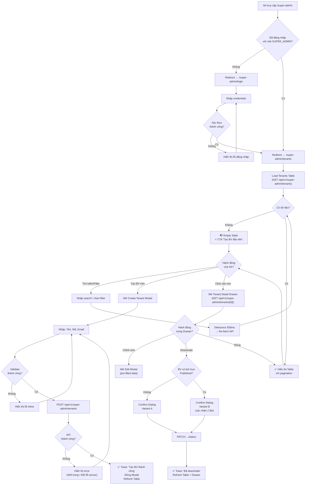
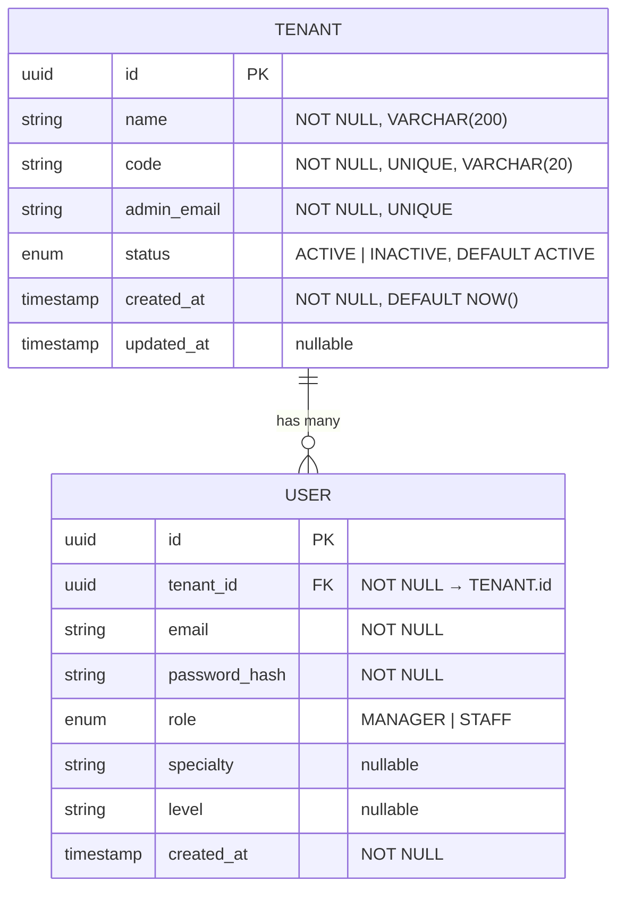
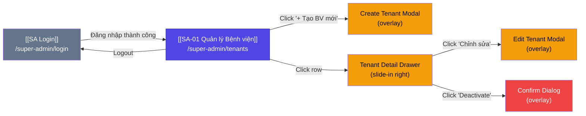

# SA-01 Quản lý Bệnh viện (Tenants)

> [!abstract] Tổng quan
> Màn hình chính và **duy nhất** của phân hệ **Super Admin** (Hidden Portal), truy cập qua URL `/super-admin/tenants`. Cho phép Super Admin (đại diện Công ty phần mềm) quản lý toàn bộ vòng đời của các Bệnh viện (Tenant) đang sử dụng hệ thống — bao gồm tạo mới, xem chi tiết, tìm kiếm, và thay đổi trạng thái (Activate/Deactivate). Đây là điểm vào chính của kiến trúc **SaaS-Ready Multi-tenant**.

> [!note] Phạm vi Portal
> Super Admin Portal là một portal **ẩn, riêng biệt**, hoàn toàn tách biệt khỏi giao diện Manager và Staff. Không có cross-navigation giữa các phân hệ. URL gốc: `/super-admin`.

---

## 1. Actors & Permissions

| Actor | Quyền truy cập | Các hành động được phép | Ghi chú |
|-------|----------------|------------------------|---------|
| **Super Admin** | Full CRUD | Xem danh sách, Tạo mới, Xem chi tiết, Cập nhật, Activate/Deactivate Tenant | Duy nhất role có quyền truy cập portal này |
| Manager | ⛔ Không có quyền | — | Redirect về `/login` nếu cố truy cập `/super-admin` |
| Staff | ⛔ Không có quyền | — | Redirect về `/login` nếu cố truy cập `/super-admin` |

> [!caution] Bảo mật
> URL `/super-admin` **không hiển thị** trên bất kỳ giao diện nào của Manager/Staff. Xác thực bằng role-based access control (RBAC). Mọi request tới `/api/v1/super-admin/**` yêu cầu JWT token với `role = SUPER_ADMIN`.

---

## 2. UI Layout

> [!info] Wireframe Reference
> Chưa có bản thiết kế Figma. Layout được mô tả dưới đây là functional wireframe.

### 2.1 Cấu trúc bố cục (Layout Structure)

Portal Super Admin sử dụng layout **đơn giản, tối giản** — không có sidebar phức tạp vì chỉ có 1 màn hình chính.

```
┌──────────────────────────────────────────────────────────────────┐
│  🔒 Super Admin Portal              [SA Name]  [Logout Button]  │
│  Header: Logo + Branding + User Info                             │
├──────────────────────────────────────────────────────────────────┤
│                                                                  │
│  ┌────────────────────────────────────────────────────────────┐  │
│  │  Search & Filter Bar                                       │  │
│  │  [🔍 Tìm kiếm tên/mã BV...] [Filter: Trạng thái ▼]      │  │
│  │                                          [+ Tạo BV mới]   │  │
│  └────────────────────────────────────────────────────────────┘  │
│                                                                  │
│  ┌────────────────────────────────────────────────────────────┐  │
│  │  Tenants Table                                             │  │
│  │  ┌─────┬──────────┬────────┬───────────┬────────┬───────┐ │  │
│  │  │ STT │ Tên BV   │ Mã BV  │Email Admin│Ngày tạo│T.Thái │ │  │
│  │  ├─────┼──────────┼────────┼───────────┼────────┼───────┤ │  │
│  │  │  1  │ BV A     │ BVA001 │ a@bv.com  │ 01/01  │🟢 Act │ │  │
│  │  │  2  │ BV B     │ BVB002 │ b@bv.com  │ 02/01  │🔴 Ina │ │  │
│  │  │ ... │ ...      │ ...    │ ...       │ ...    │ ...   │ │  │
│  │  └─────┴──────────┴────────┴───────────┴────────┴───────┘ │  │
│  │                                                             │  │
│  │  Pagination: [< 1  2  3  ... 10 >]    Showing 1-10 of 42  │  │
│  └────────────────────────────────────────────────────────────┘  │
│                                                                  │
├──────────────────────────────────────────────────────────────────┤
│  Footer: © 2026 Hospital Management System — v1.0               │
└──────────────────────────────────────────────────────────────────┘

                    ┌── Overlay Components ──┐
                    │                        │
                    │  📋 Create Tenant      │
                    │     Modal (center)     │
                    │                        │
                    │  📂 Tenant Detail      │
                    │     Drawer (right)     │
                    │                        │
                    │  ⚠️ Confirm Dialog     │
                    │     (center, small)    │
                    └────────────────────────┘
```

### 2.2 Responsive Behavior

| Breakpoint | Thay đổi |
|------------|----------|
| Desktop (≥1280px) | Layout đầy đủ, Table hiển thị tất cả columns, Drawer width = 480px |
| Laptop (1024-1279px) | Table ẩn column STT, Drawer width = 400px |
| Tablet (768-1023px) | Search bar và Filter xếp dọc, Table scroll ngang, Drawer chiếm 80% width |
| Mobile (<768px) | Table chuyển sang Card view, Modal/Drawer chiếm full screen |

---

## 3. UI Components & States

### 3.1 Tenants Table

**Mô tả:** Bảng dữ liệu chính hiển thị danh sách tất cả Bệnh viện (Tenant) trong hệ thống. Hỗ trợ phân trang server-side, sắp xếp theo cột, và click vào row để mở chi tiết.

**Columns:**

| # | Column | Field | Type | Sortable | Width |
|---|--------|-------|------|----------|-------|
| 1 | STT | — (auto-index) | `number` | Không | 60px |
| 2 | Tên Bệnh viện | `name` | `string` | Có ▲▼ | 250px |
| 3 | Mã BV | `code` | `string` | Có ▲▼ | 120px |
| 4 | Email Admin | `admin_email` | `string` | Không | 200px |
| 5 | Ngày tạo | `created_at` | `datetime` | Có ▲▼ | 130px |
| 6 | Trạng thái | `status` | `enum` | Có ▲▼ | 110px |
| 7 | Actions | — | `actions` | Không | 80px |

**Chi tiết column Trạng thái:**

| Giá trị | Badge | Màu sắc |
|---------|-------|---------|
| `ACTIVE` | 🟢 Active | `green` / `#22c55e` |
| `INACTIVE` | 🔴 Inactive | `red` / `#ef4444` |

**Chi tiết column Actions:**

| Action | Icon | Tooltip | Hành vi |
|--------|------|---------|---------|
| Xem chi tiết | 👁️ `eye` | "Xem chi tiết" | Mở [[#3.4 Tenant Detail Drawer]] |
| Chỉnh sửa | ✏️ `edit` | "Chỉnh sửa" | Mở Modal Edit (reuse [[#3.2 Create Tenant Modal/Form]]) |

**Pagination:**

| Prop | Type | Default | Mô tả |
|------|------|---------|-------|
| `page` | `number` | `1` | Trang hiện tại |
| `size` | `number` | `10` | Số bản ghi mỗi trang |
| `total` | `number` | — | Tổng số bản ghi |
| `totalPages` | `number` | — | Tổng số trang |

**UI States:**

| State | Điều kiện | Hiển thị | Hành vi |
|-------|-----------|----------|---------|
| 🔄 Loading | API `GET /tenants` đang pending | Skeleton rows (10 rows × 7 cols), shimmer animation. Header và Search bar vẫn hiển thị bình thường. | Disable click row, disable sort, disable pagination |
| ✅ Default | API trả về `data.length > 0` | Table render đầy đủ dữ liệu với pagination. Row hover highlight `bg-gray-50`. Cursor pointer trên mỗi row. | Click row → mở Drawer. Click sort header → re-fetch với `sortBy` & `sortDirection`. Click pagination → re-fetch với `page` mới. |
| 📭 Empty | API trả về `data.length === 0` **và** không có filter/search active | Illustration (empty box icon) + Text: **"Chưa có bệnh viện nào"** + Sub-text: "Hãy tạo bệnh viện đầu tiên để bắt đầu sử dụng hệ thống" + CTA Button: `[+ Tạo BV đầu tiên]` (primary, large) | CTA click → mở [[#3.2 Create Tenant Modal/Form]] |
| 📭 Empty (filtered) | API trả về `data.length === 0` **và** có filter/search active | Text: **"Không tìm thấy kết quả"** + Sub-text: "Thử thay đổi từ khóa hoặc bộ lọc" + Link: `[Xóa bộ lọc]` | Link click → reset search & filter → re-fetch |
| ❌ Error | API trả về lỗi (500, network error, timeout) | Error banner phía trên table: icon ⚠️ + "Không thể tải danh sách bệnh viện. Vui lòng thử lại." + `[Thử lại]` button | Button click → re-fetch API. Retry tối đa 3 lần tự động trước khi hiện error state cố định. |
| 🚫 Disabled | User không có role `SUPER_ADMIN` | Redirect về `/login` với toast: "Bạn không có quyền truy cập trang này" | Không render table |

---

### 3.2 Create Tenant Modal/Form

**Mô tả:** Modal dialog hiển thị form tạo mới hoặc chỉnh sửa thông tin Bệnh viện (Tenant). Validate inline trên từng field. Submit gọi API `POST /tenants` (tạo mới) hoặc `PUT /tenants/{id}` (chỉnh sửa).

**Form Fields:**

| # | Field | Name | Type | Required | Validation Rules | Placeholder |
|---|-------|------|------|----------|-----------------|-------------|
| 1 | Tên Bệnh viện | `name` | `text` | ✅ Có | Min 3 ký tự, Max 200 ký tự, không chỉ khoảng trắng | "VD: Bệnh viện Đa khoa Trung ương" |
| 2 | Mã định danh | `code` | `text` | ✅ Có | Regex: `^[A-Z0-9_]{3,20}$`, unique toàn hệ thống ([[#HR-SA-01]]) | "VD: BVDKTW_01" |
| 3 | Email Admin | `admin_email` | `email` | ✅ Có | Email format RFC 5322, unique toàn hệ thống ([[#HR-SA-02]]) | "VD: admin@benhvien.vn" |

**Validation inline messages:**

| Field | Rule vi phạm | Message hiển thị |
|-------|-------------|-----------------|
| `name` | Bỏ trống | "Vui lòng nhập tên bệnh viện" |
| `name` | < 3 ký tự | "Tên bệnh viện phải có ít nhất 3 ký tự" |
| `name` | > 200 ký tự | "Tên bệnh viện không được vượt quá 200 ký tự" |
| `code` | Bỏ trống | "Vui lòng nhập mã định danh" |
| `code` | Sai format | "Mã định danh chỉ gồm chữ IN HOA, số và dấu gạch dưới (3-20 ký tự)" |
| `code` | Trùng (API 409) | "Mã định danh đã tồn tại trong hệ thống. Vui lòng chọn mã khác." |
| `admin_email` | Bỏ trống | "Vui lòng nhập email admin" |
| `admin_email` | Sai format | "Email không đúng định dạng" |
| `admin_email` | Trùng (API 409) | "Email đã được sử dụng bởi bệnh viện khác" |

**Action Buttons:**

| Button | Variant | Vị trí | Hành vi |
|--------|---------|--------|---------|
| Hủy | `outlined` / `secondary` | Footer trái | Đóng modal, reset form, không gọi API |
| Tạo Bệnh viện / Lưu thay đổi | `filled` / `primary` | Footer phải | Validate all → nếu pass → gọi API → xử lý response |

**UI States:**

| State | Điều kiện | Hiển thị | Hành vi |
|-------|-----------|----------|---------|
| 🔄 Loading | Đang submit form (API pending) | Button "Tạo BV" hiển thị spinner + text "Đang xử lý...". Tất cả fields chuyển sang `readonly`. Nút "Hủy" bị disable. Backdrop modal không dismiss được. | Chặn double-submit. Không cho đóng modal. |
| ✅ Default | Modal vừa mở (create mode) | Form trống, tất cả fields enabled, focus vào field "Tên BV" đầu tiên. Title: "Tạo Bệnh viện mới". | User nhập liệu → validate on blur & on change (debounce 300ms cho `code` uniqueness check). |
| ✅ Default (edit) | Modal mở với data có sẵn (edit mode) | Form pre-filled với data hiện tại. Field `code` bị **readonly** (không cho sửa mã định danh). Title: "Chỉnh sửa Bệnh viện". | Chỉ cho phép sửa `name` và `admin_email`. |
| 📭 Empty | N/A — modal luôn có form | — | — |
| ❌ Error | API trả lỗi khi submit (400, 409, 500) | Toast notification phía trên modal: đỏ, icon ⚠️. Nếu 409 → highlight field bị trùng với border đỏ + inline message. Nếu 500 / network → "Đã xảy ra lỗi. Vui lòng thử lại." + `[Thử lại]` button. | Form fields giữ nguyên data user đã nhập. Cho phép sửa và re-submit. |
| 🚫 Disabled | Không áp dụng (chỉ Super Admin mới thấy portal) | — | — |

---

### 3.3 Search & Filter Bar

**Mô tả:** Thanh tìm kiếm và bộ lọc nằm phía trên [[#3.1 Tenants Table]]. Cho phép Super Admin tìm kiếm BV theo tên/mã và filter theo trạng thái.

**Sub-components:**

| # | Component | Type | Mô tả |
|---|-----------|------|-------|
| 1 | Search Input | `text input` + icon 🔍 | Tìm kiếm theo `name` hoặc `code`. Debounce 500ms. |
| 2 | Status Filter | `select / dropdown` | Options: `Tất cả` (default), `Active`, `Inactive` |
| 3 | Nút "Tạo BV mới" | `button primary` | Nằm góc phải, mở [[#3.2 Create Tenant Modal/Form]] |

**Search Input Props:**

| Prop | Type | Default | Mô tả |
|------|------|---------|-------|
| `searchQuery` | `string` | `""` | Giá trị tìm kiếm hiện tại |
| `debounceMs` | `number` | `500` | Thời gian debounce trước khi trigger API |

**API Query mapping:**

| UI Control | Query Param | Example |
|------------|-------------|---------|
| Search Input | `search` | `?search=bach+mai` |
| Status Filter | `status` | `?status=ACTIVE` |
| Kết hợp | — | `?search=BV&status=ACTIVE&page=1&size=10` |

**UI States:**

| State | Điều kiện | Hiển thị | Hành vi |
|-------|-----------|----------|---------|
| 🔄 Loading | Table đang fetch (kết quả search/filter) | Search input hiển thị spinner nhỏ bên phải thay icon 🔍. Filter dropdown vẫn hiển thị nhưng disable. | Cho phép tiếp tục gõ (debounce sẽ cancel request cũ). |
| ✅ Default | Page loaded, sẵn sàng tương tác | Search input trống với placeholder "Tìm kiếm theo tên hoặc mã bệnh viện...". Filter hiển thị "Tất cả". Button "Tạo BV mới" enabled. | Gõ search → debounce 500ms → gọi API với `search` param. Chọn filter → gọi API ngay. |
| 📭 Empty | N/A — Search bar luôn hiển thị | — | — |
| ❌ Error | N/A — Search bar không trực tiếp lỗi | — | Lỗi API được handle ở [[#3.1 Tenants Table]] Error state |
| 🚫 Disabled | Đang trong quá trình submit form khác | Search input và filter có `opacity: 0.5`, `pointer-events: none` | Khi modal hoặc dialog đang mở (tùy UX quyết định) |

---

### 3.4 Tenant Detail Drawer

**Mô tả:** Panel trượt từ bên phải, hiển thị thông tin chi tiết của 1 Bệnh viện cụ thể. Bao gồm thông tin cơ bản, thống kê, và các hành động quản lý.

**Drawer Layout:**

```
┌──────────────────────────────────┐
│  ← Đóng        Chi tiết BV      │
├──────────────────────────────────┤
│                                  │
│  Tên BV: Bệnh viện Bạch Mai     │
│  Mã BV: BACH_MAI_01              │
│  Email Admin: admin@bachmai.vn   │
│  Ngày tạo: 15/01/2026           │
│  Trạng thái: 🟢 Active          │
│                                  │
│  ── Thống kê ──────────────────  │
│  👥 Tổng Users: 45              │
│     ├── Manager: 3               │
│     └── Staff: 42                │
│  📅 Lịch trực: 12 (Published)   │
│                                  │
│  ── Hành động ─────────────────  │
│  [✏️ Chỉnh sửa]                 │
│  [🔴 Deactivate Bệnh viện]      │
│                                  │
└──────────────────────────────────┘
```

**Dữ liệu hiển thị:**

| # | Field | Source | Format |
|---|-------|--------|--------|
| 1 | Tên Bệnh viện | `tenant.name` | Text |
| 2 | Mã định danh | `tenant.code` | Mono/code style |
| 3 | Email Admin | `tenant.admin_email` | Link `mailto:` |
| 4 | Ngày tạo | `tenant.created_at` | `DD/MM/YYYY HH:mm` |
| 5 | Trạng thái | `tenant.status` | Badge (xem [[#3.1 Tenants Table]]) |
| 6 | Tổng Users | `tenant.stats.total_users` | Number |
| 7 | Số Manager | `tenant.stats.manager_count` | Number |
| 8 | Số Staff | `tenant.stats.staff_count` | Number |
| 9 | Số lịch trực Published | `tenant.stats.published_schedules` | Number |

**Action Buttons trong Drawer:**

| Button | Variant | Điều kiện hiển thị | Hành vi |
|--------|---------|-------------------|---------|
| Chỉnh sửa | `outlined` | Luôn hiển thị | Mở [[#3.2 Create Tenant Modal/Form]] ở edit mode |
| Deactivate BV | `danger outlined` | `status === ACTIVE` | Mở [[#3.5 Confirm Dialog]] |
| Activate BV | `success outlined` | `status === INACTIVE` | Gọi API `PATCH .../status` với `status: ACTIVE` |

**UI States:**

| State | Điều kiện | Hiển thị | Hành vi |
|-------|-----------|----------|---------|
| 🔄 Loading | API `GET /tenants/{id}` đang pending | Drawer mở ra với skeleton placeholders cho tất cả fields. Header hiển thị ngay (title "Chi tiết Bệnh viện"). | Buttons action bị disable. Nút đóng vẫn hoạt động. |
| ✅ Default | API trả về data thành công | Tất cả fields hiển thị dữ liệu. Action buttons enabled theo logic trạng thái. | Cho phép tương tác: Chỉnh sửa, Deactivate/Activate. |
| 📭 Empty | N/A — Drawer luôn mở cho 1 tenant cụ thể | — | — |
| ❌ Error | API `GET /tenants/{id}` lỗi (404, 500) | Drawer hiển thị error state: icon ⚠️ + "Không thể tải thông tin bệnh viện" + `[Thử lại]` + `[Đóng]` | Retry → gọi lại API. Đóng → close drawer. |
| 🚫 Disabled | Đang xử lý action (Deactivate đang pending) | Tất cả buttons bị disable, hiển thị spinner trên button đang xử lý. | Chờ API response trước khi enable lại. |

---

### 3.5 Confirm Dialog

**Mô tả:** Dialog xác nhận hiển thị khi Super Admin thực hiện hành động nguy hiểm: **Deactivate** hoặc **Delete** một Tenant. Có 2 cấp độ xác nhận tùy tình huống.

**Dialog Variants:**

#### Variant A: Deactivate thường (BV không có lịch trực Published)

| Thuộc tính | Giá trị |
|------------|---------|
| Title | "Xác nhận Deactivate Bệnh viện" |
| Icon | ⚠️ Warning (amber) |
| Body | "Bạn có chắc chắn muốn deactivate **{tenant.name}**? Bệnh viện này sẽ không thể đăng nhập và sử dụng hệ thống cho đến khi được activate lại." |
| Button Hủy | "Hủy" (`secondary`) |
| Button Xác nhận | "Deactivate" (`danger`) |

#### Variant B: Deactivate có cảnh báo (BV đang có lịch trực Published)

| Thuộc tính | Giá trị |
|------------|---------|
| Title | "⚠️ Cảnh báo: Bệnh viện đang có lịch trực" |
| Icon | 🔴 Danger (red) |
| Body | "**{tenant.name}** hiện đang có **{count}** lịch trực ở trạng thái Published. Deactivate sẽ khiến các lịch trực này không thể truy cập." |
| Xác nhận lần 1 | Checkbox: `☐ Tôi hiểu rằng các lịch trực Published sẽ bị ảnh hưởng` |
| Button Xác nhận | "Xác nhận Deactivate" (`danger`, disabled cho đến khi checkbox được tick ☑️) |

> [!warning] Xác nhận 2 lần
> Khi BV có lịch trực Published ([[#Edge Case 2]]), hệ thống yêu cầu xác nhận 2 lần: checkbox + click button. Đây là thiết kế cố ý để ngăn deactivate nhầm.

**UI States:**

| State | Điều kiện | Hiển thị | Hành vi |
|-------|-----------|----------|---------|
| 🔄 Loading | API `PATCH .../status` đang pending | Button xác nhận hiển thị spinner + "Đang xử lý...". Button Hủy disabled. Dialog không dismiss được (click backdrop bị chặn). | Chờ API response. |
| ✅ Default | Dialog vừa mở | Hiển thị nội dung theo Variant A hoặc B. Focus vào button "Hủy" (safe default). | User chọn Hủy → đóng dialog. User chọn Xác nhận → gọi API. |
| 📭 Empty | N/A | — | — |
| ❌ Error | API deactivate lỗi | Dialog vẫn mở. Hiển thị inline error: "Không thể deactivate bệnh viện. Vui lòng thử lại." + `[Thử lại]` | Thử lại → re-call API. |
| 🚫 Disabled | Variant B: checkbox chưa tick | Button "Xác nhận Deactivate" có `opacity: 0.5`, `cursor: not-allowed` | Tooltip: "Vui lòng xác nhận bạn đã hiểu ảnh hưởng" |

---

## 4. User Flow

### 4.0 Sơ đồ tổng quan (Overview Flowchart)



### 4.1 Luồng chính (Happy Path) — Xem danh sách & Tạo BV mới

1. **Super Admin** đăng nhập tại `/super-admin/login` với credentials
2. Hệ thống xác thực → redirect tới `/super-admin/tenants`
3. Page load → gọi `GET /api/v1/super-admin/tenants?page=1&size=10`
4. Table hiển thị danh sách BV với pagination
5. SA click **[+ Tạo BV mới]** → Modal hiển thị
6. SA nhập: Tên BV, Mã định danh, Email Admin
7. Hệ thống validate inline (on blur cho mỗi field)
8. SA click **[Tạo Bệnh viện]** → validate all fields
9. API `POST /api/v1/super-admin/tenants` được gọi
10. Thành công → Toast "Tạo bệnh viện thành công!" → Modal đóng → Table refresh
11. Hệ thống tự động tạo 1 [[User]] với `role = MANAGER` cho BV mới ([[#HR-SA-04]])

### 4.2 Luồng phụ (Alternative Flows)

- **Flow A — Tìm kiếm BV:**
  1. SA gõ keyword vào Search Input
  2. Debounce 500ms → API `GET /tenants?search={keyword}&page=1`
  3. Table cập nhật kết quả. Nếu không có kết quả → Empty filtered state

- **Flow B — Filter theo trạng thái:**
  1. SA chọn "Active" hoặc "Inactive" từ dropdown
  2. API `GET /tenants?status=ACTIVE&page=1` được gọi ngay
  3. Table cập nhật. Search query được giữ nguyên nếu có.

- **Flow C — Xem chi tiết & Deactivate:**
  1. SA click vào 1 row trong table
  2. Drawer mở ra → `GET /api/v1/super-admin/tenants/{id}`
  3. Hiển thị thông tin chi tiết + thống kê
  4. SA click **[Deactivate]**
  5. Kiểm tra BV có lịch trực Published → hiện Confirm Dialog tương ứng
  6. SA xác nhận → `PATCH /api/v1/super-admin/tenants/{id}/status`
  7. Thành công → Toast + refresh

- **Flow D — Chỉnh sửa BV:**
  1. Từ Drawer, SA click **[Chỉnh sửa]**
  2. Modal mở ở edit mode → pre-filled data, `code` readonly
  3. SA sửa `name` và/hoặc `admin_email` → submit
  4. `PUT /api/v1/super-admin/tenants/{id}` → thành công → refresh

---

## 5. Business Rules

> [!warning] Hard Rules (Bắt buộc)
> Các ràng buộc **không được vi phạm** — hệ thống phải enforce ở cả client-side và server-side.

| ID | Rule | Điều kiện | Hành vi khi vi phạm |
|----|------|-----------|---------------------|
| <a id="HR-SA-01"></a>HR-SA-01 | Mã định danh BV phải **unique** trong toàn hệ thống | `code` trùng với tenant khác (bất kể status) | Client: inline error dưới field `code` — "Mã định danh đã tồn tại". Server: HTTP `409 Conflict` với `error_code: DUPLICATE_TENANT_CODE` |
| <a id="HR-SA-02"></a>HR-SA-02 | Email Admin phải đúng **format** và **unique** | `admin_email` sai RFC 5322 hoặc trùng user ở tenant khác | Client: inline error — "Email không đúng định dạng" hoặc "Email đã được sử dụng". Server: HTTP `409 Conflict` với `error_code: DUPLICATE_ADMIN_EMAIL` |
| <a id="HR-SA-03"></a>HR-SA-03 | Không thể **xóa** BV đang có dữ liệu | BV đã có Users, Schedules, hoặc bất kỳ data nào | Không có nút "Xóa" trên UI. Chỉ cho phép **Deactivate**. API `DELETE` không expose trên endpoint. |
| <a id="HR-SA-04"></a>HR-SA-04 | Khi tạo BV mới → tự động tạo 1 **User Admin** đầu tiên | Sau khi `POST /tenants` thành công | Server tự động tạo record [[User]] với `tenant_id = {new_tenant.id}`, `role = MANAGER`, `email = {admin_email}`. Gửi email welcome kèm link đặt mật khẩu. |

> [!tip] Soft Rules (Gợi ý)
> Các ràng buộc mang tính khuyến nghị — hệ thống cảnh báo nhưng không ngăn chặn.

| ID | Rule | Logic | Hiển thị UI |
|----|------|-------|-------------|
| SR-SA-01 | Nên kiểm tra mã BV trước khi submit | Gọi API check uniqueness khi user blur khỏi field `code` (debounce 300ms) | Icon ✅ hoặc ❌ bên phải field `code` |
| SR-SA-02 | Cảnh báo khi Deactivate BV có nhiều user | `total_users > 20` | Hiển thị thêm dòng cảnh báo trong Confirm Dialog: "BV này có {n} người dùng sẽ bị ảnh hưởng" |

---

## 6. API Endpoints

### 6.1 Endpoints Overview

| Method | Endpoint | Auth | Request Body | Response | Mô tả |
|--------|----------|------|-------------|----------|-------|
| `GET` | `/api/v1/super-admin/tenants` | Bearer JWT (`SUPER_ADMIN`) | — | `PaginatedResponse<TenantSummary>` | Lấy danh sách BV (paginated, searchable, filterable) |
| `POST` | `/api/v1/super-admin/tenants` | Bearer JWT (`SUPER_ADMIN`) | `CreateTenantRequest` | `TenantDetail` | Tạo BV mới + auto-create Admin User |
| `GET` | `/api/v1/super-admin/tenants/{id}` | Bearer JWT (`SUPER_ADMIN`) | — | `TenantDetail` | Lấy chi tiết 1 BV (bao gồm stats) |
| `PUT` | `/api/v1/super-admin/tenants/{id}` | Bearer JWT (`SUPER_ADMIN`) | `UpdateTenantRequest` | `TenantDetail` | Cập nhật thông tin BV (name, admin_email) |
| `PATCH` | `/api/v1/super-admin/tenants/{id}/status` | Bearer JWT (`SUPER_ADMIN`) | `ChangeStatusRequest` | `TenantDetail` | Thay đổi trạng thái BV (activate/deactivate) |

### 6.2 Request / Response Schemas

#### `GET /api/v1/super-admin/tenants`

**Query Parameters:**

| Param | Type | Required | Default | Mô tả |
|-------|------|----------|---------|-------|
| `page` | `integer` | Không | `1` | Trang hiện tại (1-indexed) |
| `size` | `integer` | Không | `10` | Số bản ghi mỗi trang (max: 50) |
| `search` | `string` | Không | `""` | Tìm theo `name` hoặc `code` (ILIKE) |
| `status` | `string` | Không | `""` | Filter: `ACTIVE`, `INACTIVE`, hoặc trống = tất cả |
| `sortBy` | `string` | Không | `created_at` | Cột sắp xếp: `name`, `code`, `created_at`, `status` |
| `sortDirection` | `string` | Không | `DESC` | `ASC` hoặc `DESC` |

**Response `200 OK`:**

```json
{
  "data": [
    {
      "id": "uuid-001",
      "name": "Bệnh viện Bạch Mai",
      "code": "BACH_MAI",
      "admin_email": "admin@bachmai.vn",
      "status": "ACTIVE",
      "created_at": "2026-01-15T08:30:00Z",
      "stats": {
        "total_users": 45
      }
    }
  ],
  "pagination": {
    "page": 1,
    "size": 10,
    "total": 42,
    "totalPages": 5
  }
}
```

#### `POST /api/v1/super-admin/tenants`

**Request Body (`CreateTenantRequest`):**

```json
{
  "name": "Bệnh viện Đa khoa Trung ương",
  "code": "BVDKTW_01",
  "admin_email": "admin@bvdktw.vn"
}
```

**Response `201 Created`:**

```json
{
  "id": "uuid-new",
  "name": "Bệnh viện Đa khoa Trung ương",
  "code": "BVDKTW_01",
  "admin_email": "admin@bvdktw.vn",
  "status": "ACTIVE",
  "created_at": "2026-05-28T06:00:00Z",
  "auto_created_admin": {
    "user_id": "uuid-admin",
    "email": "admin@bvdktw.vn",
    "role": "MANAGER",
    "password_reset_link_sent": true
  }
}
```

#### `GET /api/v1/super-admin/tenants/{id}`

**Response `200 OK` (`TenantDetail`):**

```json
{
  "id": "uuid-001",
  "name": "Bệnh viện Bạch Mai",
  "code": "BACH_MAI",
  "admin_email": "admin@bachmai.vn",
  "status": "ACTIVE",
  "created_at": "2026-01-15T08:30:00Z",
  "updated_at": "2026-03-10T14:20:00Z",
  "stats": {
    "total_users": 45,
    "manager_count": 3,
    "staff_count": 42,
    "published_schedules": 12
  }
}
```

#### `PUT /api/v1/super-admin/tenants/{id}`

**Request Body (`UpdateTenantRequest`):**

```json
{
  "name": "Bệnh viện Bạch Mai (Cập nhật)",
  "admin_email": "new-admin@bachmai.vn"
}
```

> [!important] Lưu ý
> Field `code` **không** nằm trong request body của `PUT`. Mã định danh không được phép thay đổi sau khi tạo.

#### `PATCH /api/v1/super-admin/tenants/{id}/status`

**Request Body (`ChangeStatusRequest`):**

```json
{
  "status": "INACTIVE",
  "reason": "Hết hợp đồng sử dụng"
}
```

### 6.3 Error Responses

| HTTP Code | Error Code | Điều kiện | Mô tả | UI Handling |
|-----------|-----------|-----------|-------|-------------|
| `400` | `VALIDATION_ERROR` | Request body không hợp lệ | Trả về danh sách field errors | Hiển thị inline error trên từng field |
| `401` | `UNAUTHORIZED` | Token hết hạn / không có | Session expired | Redirect → `/super-admin/login` |
| `403` | `FORBIDDEN` | Token hợp lệ nhưng role ≠ `SUPER_ADMIN` | Không đủ quyền | Toast error + redirect |
| `404` | `TENANT_NOT_FOUND` | `{id}` không tồn tại | Tenant đã bị xóa hoặc ID sai | Drawer: error state. Toast: "Bệnh viện không tồn tại" |
| `409` | `DUPLICATE_TENANT_CODE` | `code` đã tồn tại ([[#HR-SA-01]]) | Trùng mã định danh | Inline error trên field `code` |
| `409` | `DUPLICATE_ADMIN_EMAIL` | `admin_email` đã tồn tại ([[#HR-SA-02]]) | Trùng email admin | Inline error trên field `admin_email` |
| `422` | `TENANT_HAS_DATA` | Cố gắng delete tenant có data ([[#HR-SA-03]]) | BV có dữ liệu | Toast: "Không thể xóa. Hãy deactivate thay vì xóa." |
| `429` | `RATE_LIMITED` | Quá nhiều request trong 1 phút | Rate limit exceeded | Toast: "Quá nhiều yêu cầu. Vui lòng thử lại sau {n} giây" |
| `500` | `INTERNAL_ERROR` | Lỗi server không xác định | Server error | Toast: "Đã xảy ra lỗi hệ thống" + `[Thử lại]` |
| `503` | `SERVICE_UNAVAILABLE` | Database down / maintenance | Service unavailable | Full-page error: "Hệ thống đang bảo trì" |

---

## 7. Data Model liên quan

### 7.1 Entity Relationship



### 7.2 Entities & Fields sử dụng

| Entity | Các trường sử dụng trên màn hình | Mối quan hệ |
|--------|----------------------------------|-------------|
| [[Tenant]] | `id`, `name`, `code`, `admin_email`, `status`, `created_at`, `updated_at` | Root entity. 1 Tenant = 1 Bệnh viện = 1 workspace |
| [[User]] | `id`, `tenant_id`, `role`, `email` | **belongs_to** [[Tenant]] qua `tenant_id`. Auto-created khi tạo Tenant mới ([[#HR-SA-04]]) |

### 7.3 Database Indexes (PostgreSQL)

| Table | Index | Columns | Type | Mục đích |
|-------|-------|---------|------|----------|
| `tenant` | `idx_tenant_code` | `code` | UNIQUE | Đảm bảo [[#HR-SA-01]] |
| `tenant` | `idx_tenant_admin_email` | `admin_email` | UNIQUE | Đảm bảo [[#HR-SA-02]] |
| `tenant` | `idx_tenant_status` | `status` | B-TREE | Tối ưu filter theo trạng thái |
| `tenant` | `idx_tenant_name_search` | `name` | GIN (pg_trgm) | Tối ưu full-text search ILIKE |
| `tenant` | `idx_tenant_created_at` | `created_at` | B-TREE | Tối ưu sort mặc định |

---

## 8. Edge Cases & Error Handling

| # | Tình huống | Hành vi mong đợi | Component ảnh hưởng | Ghi chú |
|---|-----------|-------------------|---------------------|---------|
| <a id="edge-1"></a>1 | Tạo BV trùng mã định danh (`code` đã tồn tại) | API trả `409 DUPLICATE_TENANT_CODE`. Field `code` highlight đỏ + inline message: "Mã định danh đã tồn tại trong hệ thống. Vui lòng chọn mã khác." Form giữ nguyên data đã nhập. | [[#3.2 Create Tenant Modal/Form]] | Server-side check là bắt buộc. Client-side check (on blur) là bổ sung. |
| <a id="edge-2"></a>2 | Deactivate BV đang có lịch trực Published | Hiển thị [[#3.5 Confirm Dialog]] **Variant B** với cảnh báo đỏ. Yêu cầu checkbox xác nhận + click button = **xác nhận 2 lần**. Nếu xác nhận → deactivate thành công, các lịch trực vẫn tồn tại nhưng không truy cập được. | [[#3.5 Confirm Dialog]] | Số lượng published schedules lấy từ `tenant.stats.published_schedules` |
| 3 | Email Admin trùng với user đã tồn tại ở BV khác | API trả `409 DUPLICATE_ADMIN_EMAIL`. Field `admin_email` highlight đỏ + inline: "Email đã được sử dụng bởi bệnh viện khác". | [[#3.2 Create Tenant Modal/Form]] | Áp dụng cho cả `POST` (create) và `PUT` (update) |
| 4 | Network timeout khi tạo BV | Modal giữ nguyên data. Hiển thị error: "Kết nối bị gián đoạn. Vui lòng kiểm tra mạng và thử lại." + `[Thử lại]` button. Button retry → re-submit cùng payload. | [[#3.2 Create Tenant Modal/Form]] | Timeout threshold: 30 giây. Retry tối đa 3 lần manual. |
| 5 | Danh sách BV rỗng (hệ thống mới, lần đầu sử dụng) | Table hiển thị Empty State: illustration + "Chưa có bệnh viện nào" + "Hãy tạo bệnh viện đầu tiên để bắt đầu sử dụng hệ thống" + CTA `[+ Tạo BV đầu tiên]` (primary, large button). | [[#3.1 Tenants Table]] | CTA click → mở Create Modal. Đây là onboarding UX quan trọng. |
| 6 | SA mở Drawer chi tiết → BV bị tenant khác deactivate đồng thời | Drawer hiển thị data cũ. Khi SA thao tác (VD: deactivate) → API trả `409` hoặc data đã thay đổi → Toast: "Dữ liệu đã thay đổi. Đang cập nhật..." → Auto-refresh drawer. | [[#3.4 Tenant Detail Drawer]] | Race condition trong multi-SA environment |
| 7 | SA paste mã BV có ký tự đặc biệt / lowercase | Client-side auto-transform: chuyển lowercase → UPPERCASE, loại bỏ ký tự không hợp lệ (chỉ giữ `A-Z`, `0-9`, `_`). Hiển thị hint: "Mã sẽ được tự động chuyển thành chữ IN HOA". | [[#3.2 Create Tenant Modal/Form]] | UX improvement, giảm validation errors |
| 8 | Browser refresh khi đang mở Modal/Drawer | Modal/Drawer đóng. Table reload lại từ đầu (`page=1`). Không lưu draft data của form. | Tất cả | Không persist form state qua page refresh (acceptable trade-off) |
| 9 | API trả về pagination `totalPages = 0` nhưng có search query | Hiển thị Empty Filtered state: "Không tìm thấy kết quả cho '{searchQuery}'" + link `[Xóa bộ lọc]`. | [[#3.1 Tenants Table]] | Phân biệt Empty (no data) vs Empty (no results) |
| 10 | SA tạo BV mới thành công nhưng email welcome gửi thất bại | BV vẫn được tạo thành công. Toast thêm dòng: "⚠️ Lưu ý: Email chào mừng chưa được gửi. Admin có thể dùng chức năng Quên mật khẩu để truy cập." | [[#3.2 Create Tenant Modal/Form]] | Email sending là async, không block flow chính |

---

## 9. Liên kết màn hình

### 9.1 Navigation Map



### 9.2 Liên kết chi tiết

- **Navigated from:**
  - [[SA Login]] → sau khi đăng nhập thành công (redirect tự động)

- **Navigates to:**
  - Không navigate sang bất kỳ màn hình nào khác (đây là **trang duy nhất** của Super Admin portal)
  - Không có cross-navigation sang [[Manager Portal]] hoặc [[Staff Portal]]

- **Overlays mở từ màn hình này:**
  - [[#3.2 Create Tenant Modal/Form]] — tạo mới BV
  - [[#3.2 Create Tenant Modal/Form]] (edit mode) — chỉnh sửa BV
  - [[#3.4 Tenant Detail Drawer]] — xem chi tiết BV
  - [[#3.5 Confirm Dialog]] — xác nhận deactivate

---

> [!todo] Checklist triển khai
> - [ ] UI Components đã code
>   - [ ] Tenants Table (bao gồm skeleton loading, empty states)
>   - [ ] Create/Edit Tenant Modal với inline validation
>   - [ ] Search & Filter Bar với debounce
>   - [ ] Tenant Detail Drawer với stats
>   - [ ] Confirm Dialog (cả 2 variants)
> - [ ] API Endpoints đã implement (Java Quarkus)
>   - [ ] `GET /api/v1/super-admin/tenants` (pagination, search, filter, sort)
>   - [ ] `POST /api/v1/super-admin/tenants` (create + auto-create admin user)
>   - [ ] `GET /api/v1/super-admin/tenants/{id}` (detail + stats aggregation)
>   - [ ] `PUT /api/v1/super-admin/tenants/{id}` (update, code immutable)
>   - [ ] `PATCH /api/v1/super-admin/tenants/{id}/status` (activate/deactivate)
> - [ ] Business Rules đã kiểm thử
>   - [ ] HR-SA-01: Unique code enforcement (DB unique constraint + API validation)
>   - [ ] HR-SA-02: Unique email enforcement
>   - [ ] HR-SA-03: No delete, only deactivate
>   - [ ] HR-SA-04: Auto-create admin user on tenant creation
> - [ ] Edge Cases đã cover (10 cases)
> - [ ] Responsive đã test (Desktop, Laptop, Tablet, Mobile)
> - [ ] Security: RBAC check trên tất cả endpoints
> - [ ] Database indexes đã tạo (5 indexes)
