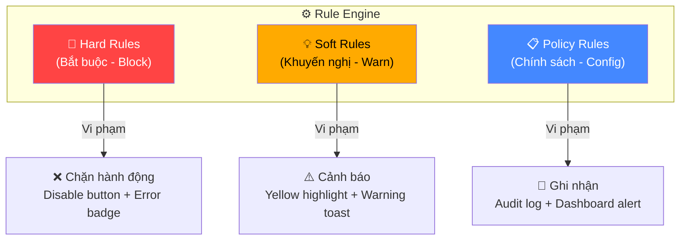
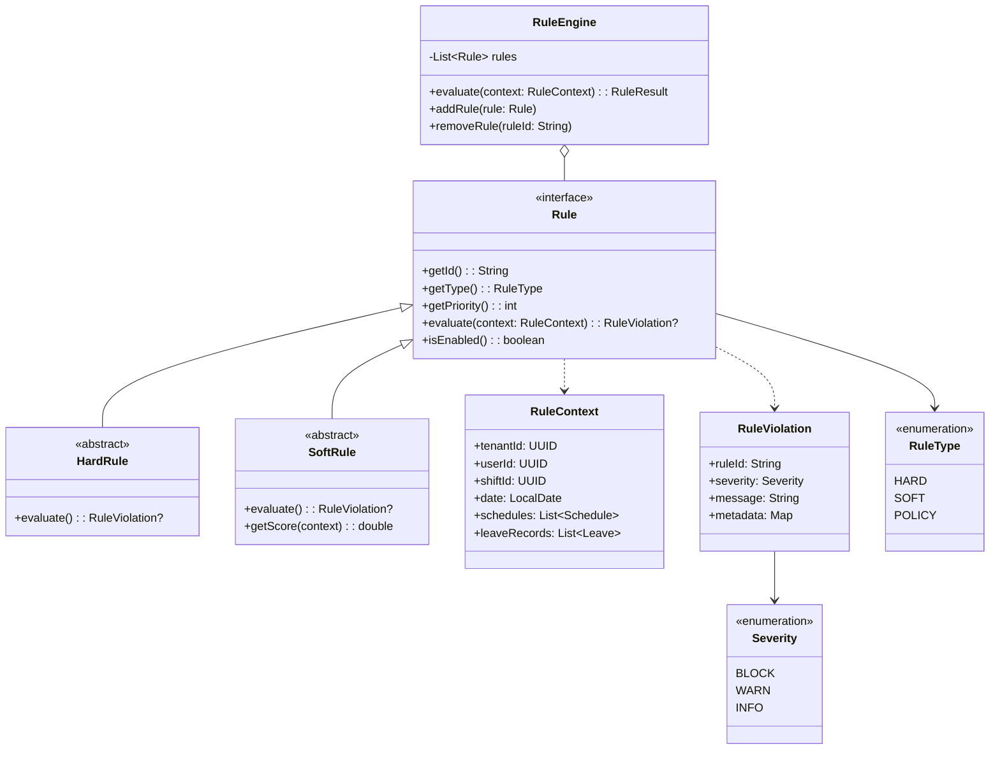
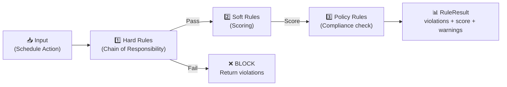
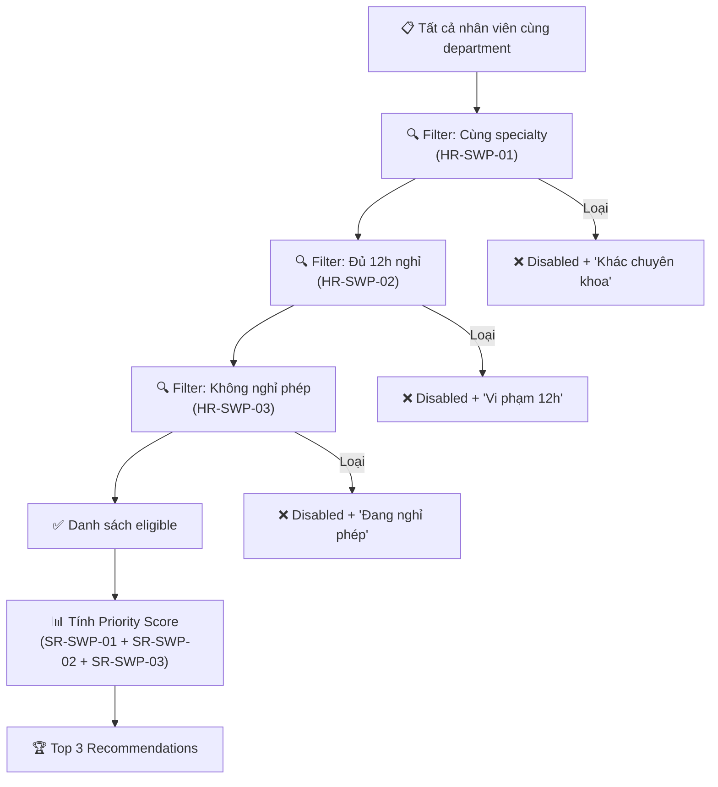
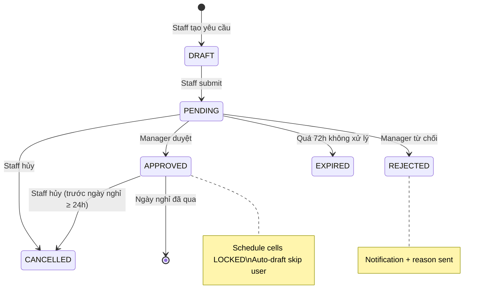
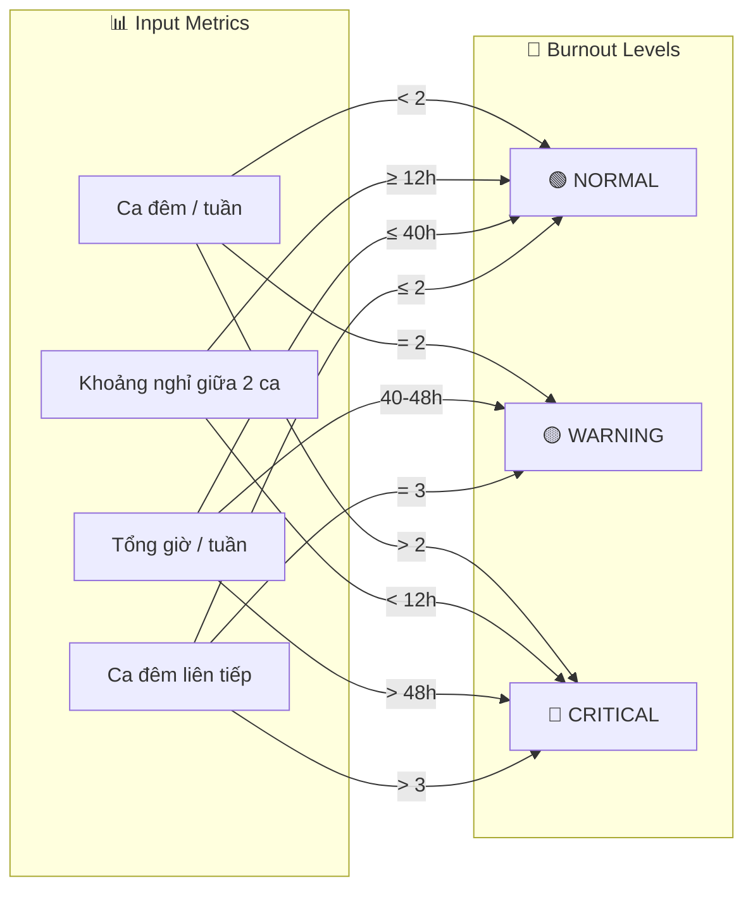

# SYS-01 Rule Engine & Policy Definition

> [!abstract] Tổng quan
> Document này định nghĩa **toàn bộ hệ thống quy tắc nghiệp vụ (Rule Engine)** và **chính sách (Policy)** của hệ thống Quản lý Lịch trực Bệnh viện. Đây là **Single Source of Truth** cho tất cả business rules, được tham chiếu bởi tất cả screen specs.
>
> **Thiết kế kiến trúc**: Rule Engine sử dụng **Chain of Responsibility / Strategy Pattern** để đảm bảo tính mở rộng — khi bệnh viện đổi luật (ví dụ: nghỉ 12h → 24h), chỉ cần thay đổi config, không sửa code.

---

## 1. Tổng quan kiến trúc Rule Engine

### 1.1 Phân loại quy tắc



| Loại | Ký hiệu | Hành vi khi vi phạm | Có thể override? | Ví dụ |
|------|---------|---------------------|-------------------|-------|
| **Hard Rule** | `HR-xxx` | **BLOCK** — Chặn hoàn toàn, disable UI, hiển thị lỗi đỏ | ❌ Không | Nghỉ tối thiểu 12h giữa 2 ca |
| **Soft Rule** | `SR-xxx` | **WARN** — Cảnh báo vàng, cho phép tiếp tục sau xác nhận | ✅ Có (Manager confirm) | Max 2 ca đêm/tuần |
| **Policy Rule** | `PR-xxx` | **LOG** — Ghi nhận, hiển thị trên Dashboard/Report | ✅ Có (Tenant config) | Fairness Score target ≥ 85% |

### 1.2 Kiến trúc kỹ thuật (Design Patterns)



**Design Patterns áp dụng:**

| Pattern | Ứng dụng | Lý do |
|---------|----------|-------|
| **Chain of Responsibility** | Chuỗi đánh giá Hard Rules → Soft Rules → Policy Rules | Dừng sớm nếu Hard Rule vi phạm |
| **Strategy** | Mỗi Rule là một Strategy riêng biệt | Dễ thêm/xóa rule mà không ảnh hưởng rule khác |
| **Template Method** | `HardRule.evaluate()` / `SoftRule.evaluate()` | Base class xử lý common logic, subclass chỉ override phần nghiệp vụ |
| **Observer** | RuleEngine emit event khi detect violation | UI reactive cập nhật real-time (heatmap, badge) |

### 1.3 Thứ tự đánh giá (Evaluation Pipeline)



1. **Hard Rules đánh giá trước** — nếu bất kỳ Hard Rule nào vi phạm → **BLOCK ngay**, không cần chạy Soft/Policy
2. **Soft Rules chạy tiếp** — tính điểm ưu tiên, trả về danh sách warnings
3. **Policy Rules cuối cùng** — kiểm tra compliance, ghi audit log

---

## 2. Scheduling Rules (Quy tắc xếp lịch)

> [!info] Context
> Áp dụng khi: Auto-Draft lịch (MG-02), Drag & Drop chỉnh lịch (MG-02), Publish lịch (MG-02).

### 2.1 Hard Rules — Scheduling

| ID | Tên Rule | Điều kiện | Hành vi khi vi phạm | Tham chiếu |
|----|----------|-----------|---------------------|------------|
| **HR-SCH-01** | **Minimum Rest Period** | Khoảng cách giữa 2 ca liên tiếp của 1 nhân viên **≥ 12 giờ** | 🚫 Cell lịch đổ **MÀU ĐỎ** + icon cảnh báo. **BLOCK publish** (nút Publish disabled khi còn cell đỏ) | [[MG-02 Bảng Xếp Lịch (Master Schedule)\|MG-02]] HR-MS-02 |
| **HR-SCH-02** | **Max Consecutive Night Shifts** | Tối đa **3 ca đêm liên tiếp** cho 1 nhân viên | 🚫 BLOCK — không cho kéo thả thêm ca đêm thứ 4 liên tiếp. Toast error: "Vi phạm giới hạn ca đêm liên tiếp" | [[MG-02 Bảng Xếp Lịch (Master Schedule)\|MG-02]] |
| **HR-SCH-03** | **No Shift Overlap** | 1 nhân viên **không thể** được xếp 2 ca trùng thời gian | 🚫 BLOCK — Drag & Drop bị reject, hiển thị conflict indicator | [[MG-02 Bảng Xếp Lịch (Master Schedule)\|MG-02]] HR-MS-12 |
| **HR-SCH-04** | **Specialty Match** | Ca trực yêu cầu chuyên khoa cụ thể → phải phân cho đúng `specialty` | 🚫 Warning trên cell nếu thiếu. Auto-draft PHẢI đảm bảo rule này | [[MG-02 Bảng Xếp Lịch (Master Schedule)\|MG-02]] HR-MS-04 |
| **HR-SCH-05** | **Minimum Coverage** | Mỗi ca phải có ≥ `min_staff` nhân viên (cấu hình theo `Shift_Dictionary`) | ⚠️ Alert trên Dashboard "Thiếu nhân sự ca [X]". Cho phép publish nhưng cảnh báo | [[MG-01 Dashboard\|MG-01]] |
| **HR-SCH-06** | **Protect Approved Leave** | Nhân viên có leave APPROVED → cell LOCKED, không cho assign | 🚫 Cell disabled + tooltip "Đang nghỉ phép" | [[MG-02 Bảng Xếp Lịch (Master Schedule)\|MG-02]] HR-MS-05 |
| **HR-SCH-07** | **Senior Per Shift** | Mỗi ca phải có tối thiểu **1 Bác sĩ Trưởng ca** (User.level = SENIOR) | ⚠️ Warning khi publish nếu ca thiếu senior. Auto-draft đảm bảo rule | NotebookLM source |

### 2.2 Soft Rules — Scheduling

| ID | Tên Rule | Logic | Hiển thị UI | Tham chiếu |
|----|----------|-------|-------------|------------|
| **SR-SCH-01** | **Max 2 Night Shifts / Week** | `count(night_shifts_this_week) ≤ 2` | Cell viền **VÀNG** trên Burnout Heatmap khi = 2. Cho phép publish sau Manager confirm | [[MG-02 Bảng Xếp Lịch (Master Schedule)\|MG-02]] HR-MS-01 |
| **SR-SCH-02** | **Max 48h / Week** | `total_hours_this_week ≤ 48` | Cảnh báo vàng trên Dashboard khi tiệm cận. Tuân thủ Bộ luật Lao động VN 2019 | [[MG-02 Bảng Xếp Lịch (Master Schedule)\|MG-02]] SR-MS-08 |
| **SR-SCH-03** | **Balance Night Shifts** | Phân bổ ca đêm đều giữa các nhân viên (minimize stddev) | Reflected trong Fairness Score bar | [[MG-02 Bảng Xếp Lịch (Master Schedule)\|MG-02]] SR-MS-01 |
| **SR-SCH-04** | **Balance Total Hours** | Minimize `stddev(total_hours)` across all staff | Fairness Score = `(1 - σ/μ) × 100%`. Progress bar real-time khi Drag & Drop | [[MG-02 Bảng Xếp Lịch (Master Schedule)\|MG-02]] SR-MS-02 |
| **SR-SCH-05** | **Balance Weekend Distribution** | Số ca weekend được phân bổ đều | Badge cảnh báo nếu ai đó nhận quá 2 weekend/tháng so với trung bình | [[MG-02 Bảng Xếp Lịch (Master Schedule)\|MG-02]] |
| **SR-SCH-06** | **Respect Staff Preference** | Xét sở thích ca trực của nhân viên khi auto-draft | Ưu tiên trong scoring algorithm, không guarantee | [[MG-02 Bảng Xếp Lịch (Master Schedule)\|MG-02]] |
| **SR-SCH-07** | **Avoid Holiday Repetition** | Né xếp người trực trùng ngày lễ quá nhiều lần liên tiếp | Dựa trên lịch sử trực lễ từ các tháng trước | NotebookLM source |

---

## 3. Swap Rules (Quy tắc đổi ca)

> [!info] Context
> Áp dụng khi: Nhân viên tạo yêu cầu đổi ca (ST-03), Rule Engine tìm ứng viên phù hợp (ST-03), Manager duyệt đổi ca (MG-03).

### 3.1 Hard Rules — Swap

| ID | Tên Rule | Điều kiện kiểm tra | Hành vi khi vi phạm | Tham chiếu |
|----|----------|--------------------|---------------------|------------|
| **HR-SWP-01** | **Same Specialty** | `target.specialty == requester.specialty` | Nút chọn người **DISABLED** + badge đỏ "Khác chuyên khoa" | [[ST-03 Yêu cầu Đổi ca (Smart Shift Swap)\|ST-03]] HR-SW-01 |
| **HR-SWP-02** | **Rest Time Gap ≥ 12h** | `abs(target.nearest_shift - source_shift) ≥ 12h` | Nút chọn **DISABLED** + badge đỏ "Vi phạm giờ nghỉ 12h" | [[ST-03 Yêu cầu Đổi ca (Smart Shift Swap)\|ST-03]] HR-SW-02 |
| **HR-SWP-03** | **Target Not On Leave** | `target` KHÔNG có approved leave vào ngày ca cần đổi | Nút chọn **DISABLED** + badge đỏ "Đang nghỉ phép" | [[ST-03 Yêu cầu Đổi ca (Smart Shift Swap)\|ST-03]] HR-SW-03 |
| **HR-SWP-04** | **Same Tenant** | `target.tenant_id == requester.tenant_id` | Ứng viên từ tenant khác không hiển thị trong danh sách | Implicit (multi-tenancy) |
| **HR-SWP-05** | **Published Shift Only** | `source_schedule.status == PUBLISHED` | Nút "Đổi ca" **DISABLED** trên ca DRAFT | [[ST-02 Lịch của tôi (My Schedule)\|ST-02]] HR-SC-01 |
| **HR-SWP-06** | **Future Shift Only** | `source_schedule.date > now()` | Nút "Đổi ca" **DISABLED** + tooltip "Ca đã qua" trên ca trong quá khứ | [[ST-02 Lịch của tôi (My Schedule)\|ST-02]] HR-SC-02 |
| **HR-SWP-07** | **Max Pending Requests** | `count(user.pending_requests) ≤ 3` | Nút "Tạo yêu cầu" **DISABLED** + toast "Bạn đã có 3 yêu cầu đang chờ" | [[ST-03 Yêu cầu Đổi ca (Smart Shift Swap)\|ST-03]] |
| **HR-SWP-08** | **One Request Per Shift** | Mỗi shift chỉ có 1 swap request PENDING | Badge "Đang chờ đổi" trên shift, disable tạo request mới | [[ST-02 Lịch của tôi (My Schedule)\|ST-02]] HR-SC-03 |

### 3.2 Soft Rules — Swap (Scoring Algorithm)

> [!important] Công thức tính điểm gợi ý Top 3
> ```
> Priority Score = 0.7 × FairnessScore + 0.3 × NightBalanceScore
> ```
> Trong đó:
> - `FairnessScore = (max(H) - Hi) / max(H)` — ưu tiên người có ít giờ trực nhất
> - `NightBalanceScore = 𝟙[night_shifts_this_week < 2]` — cộng điểm nếu ít ca đêm

| ID | Tên Rule | Logic tính điểm | Weight | Hiển thị UI |
|----|----------|-----------------|--------|-------------|
| **SR-SWP-01** | **Prefer Fewer Hours** | `score += (max_hours - user.total_hours) / max_hours × 100` | **0.7** | Hiển thị stat "Đã trực Xh/tháng" trên Recommendation card | [[ST-03 Yêu cầu Đổi ca (Smart Shift Swap)\|ST-03]] SR-SW-01 |
| **SR-SWP-02** | **Balance Night Shifts** | `score += 50 if night_shifts_this_week < 2` | **0.3** | Badge "Ít ca đêm" nếu đủ điều kiện | [[ST-03 Yêu cầu Đổi ca (Smart Shift Swap)\|ST-03]] SR-SW-02 |
| **SR-SWP-03** | **Distance Score** | Cộng điểm cho người có lịch trực gần nhất cách xa hơn (đã nghỉ nhiều ngày) | Bonus | Badge "Đã nghỉ ngơi X ngày" | NotebookLM source |

**Eligibility Pipeline:**



---

## 4. Approval Rules (Quy tắc phê duyệt)

> [!info] Context
> Áp dụng khi: Manager xem và duyệt yêu cầu đổi ca/nghỉ phép (MG-03), Quick Approve từ Dashboard (MG-01).

### 4.1 Hard Rules — Approval

| ID | Tên Rule | Điều kiện | Hành vi khi vi phạm | Tham chiếu |
|----|----------|-----------|---------------------|------------|
| **HR-APR-01** | **Same Department** | Manager chỉ duyệt request của staff trong department mình quản lý | Request từ department khác không hiển thị | [[MG-03 Luồng Duyệt (Approval Workflow)\|MG-03]] HR-AP-01 |
| **HR-APR-02** | **View Impact Analysis Before Approve** | Manager PHẢI mở Impact Analysis Drawer trước khi approve | Nút Approve **DISABLED** cho đến khi Drawer đã mở | [[MG-03 Luồng Duyệt (Approval Workflow)\|MG-03]] HR-AP-01 |
| **HR-APR-03** | **Block If Hard Rules Violated** | Nếu Impact Analysis phát hiện HR-SWP-01/02/03 vi phạm → không cho approve | Nút Approve **DISABLED** + lý do vi phạm hiển thị đỏ | [[MG-03 Luồng Duyệt (Approval Workflow)\|MG-03]] HR-AP-02 |
| **HR-APR-04** | **Auto Update Schedule** | Khi swap được approve → hệ thống tự động hoán đổi 2 Schedule records | Transactional — nếu update fail → rollback approval | [[MG-03 Luồng Duyệt (Approval Workflow)\|MG-03]] HR-AP-03 |
| **HR-APR-05** | **Full Notification** | Approve/Reject → gửi notification cho CẢ requester VÀ target user | Push notification + in-app notification | [[MG-03 Luồng Duyệt (Approval Workflow)\|MG-03]] HR-AP-04 |
| **HR-APR-06** | **Pending Only** | Chỉ có thể approve/reject request ở trạng thái PENDING | Nút Approve/Reject hidden cho request đã xử lý | [[MG-03 Luồng Duyệt (Approval Workflow)\|MG-03]] |
| **HR-APR-07** | **Rejection Requires Reason** | Reject BẮT BUỘC phải nhập lý do (10-500 ký tự) | Textarea validation: required, min 10 chars | [[MG-03 Luồng Duyệt (Approval Workflow)\|MG-03]] |
| **HR-APR-08** | **Auto Expire** | Swap request tự động **EXPIRED** sau **72 giờ** nếu không được xử lý | Scheduled job chạy mỗi giờ. Notification cho requester khi expire | [[MG-03 Luồng Duyệt (Approval Workflow)\|MG-03]] HR-AP-15 |
| **HR-APR-09** | **No Self Approval** | Manager không thể duyệt request của chính mình | Request của Manager → escalate lên cấp trên hoặc Manager khác | Best practice |

### 4.2 Soft Rules — Approval

| ID | Tên Rule | Logic | Hiển thị UI | Tham chiếu |
|----|----------|-------|-------------|------------|
| **SR-APR-01** | **Prioritize Urgent** | Ca trực trong < 24h → flag "Gấp" | Badge đỏ "Gấp" + sort lên đầu danh sách | [[MG-03 Luồng Duyệt (Approval Workflow)\|MG-03]] SR-AP-01 |
| **SR-APR-02** | **Highlight Fairness Improvement** | Nếu swap cải thiện Fairness Score → highlight | Badge xanh "Cải thiện công bằng" | [[MG-03 Luồng Duyệt (Approval Workflow)\|MG-03]] SR-AP-02 |

### 4.3 Impact Analysis

Trước khi Manager ra quyết định, hệ thống hiển thị **Impact Analysis** gồm:

| Metric | Mô tả | Hiển thị |
|--------|-------|----------|
| **Fairness Score Change** | `Before → After` (ví dụ: 87% → 91%) | Progress bar so sánh |
| **Coverage Impact** | Có đảm bảo `min_staff` sau swap không? | ✅ Đủ / ⚠️ Thiếu |
| **Burnout Risk** | Đánh giá burnout risk cho CẢ 2 bên (requester + target) | 🟢 Normal / 🟡 Warning / 🔴 Critical |
| **Schedule Conflict** | Kiểm tra overlap/rest time cho target | ✅ Không conflict / ❌ Conflict detected |
| **Hard Rule Violations** | Danh sách Hard Rules vi phạm (nếu có) | Hiển thị đỏ + block approve |

---

## 5. Leave/Absence Rules (Quy tắc nghỉ phép)

> [!info] Context
> Áp dụng khi: Staff xin nghỉ phép (ST-01 Quick Action), Manager duyệt nghỉ phép (MG-03), Auto-draft lịch (MG-02).

### 5.1 Loại nghỉ phép (Leave Types)

| Code | Tên | Mô tả | Quota/Năm | Approval Required | Ghi chú |
|------|-----|-------|-----------|-------------------|---------|
| `ANNUAL` | Nghỉ phép năm | Phép năm theo quy định | 12-15 ngày (theo thâm niên) | ✅ Manager | Theo Bộ luật Lao động 2019 Điều 113 |
| `SICK` | Nghỉ ốm | Nghỉ bệnh có giấy xác nhận | Theo BHXH | ✅ Manager | Cần giấy khám bệnh |
| `EMERGENCY` | Nghỉ đột xuất | Việc gia đình khẩn cấp | 3 ngày/năm | ✅ Manager (sau) | Được phép nghỉ trước, xin phép sau |
| `MATERNITY` | Thai sản | Nghỉ thai sản theo luật | 6 tháng | ✅ HR + Manager | Theo Bộ luật Lao động 2019 Điều 139 |
| `COMPENSATORY` | Nghỉ bù | Nghỉ bù sau ca trực dài (24/24h) | Theo ca trực | Auto-approve | Quyết định 73/2011/QĐ-TTg |
| `TRAINING` | Đi học/Hội nghị | Tham gia đào tạo, hội nghị y khoa | Theo quyết định | ✅ Manager | Giữ vị trí trong lịch trực |

### 5.2 Hard Rules — Leave

| ID | Tên Rule | Điều kiện | Hành vi khi vi phạm |
|----|----------|-----------|---------------------|
| **HR-LEA-01** | **Leave Quota Check** | `remaining_quota(type) > 0` | Không cho tạo yêu cầu nghỉ phép khi hết quota. Toast: "Bạn đã hết phép năm" |
| **HR-LEA-02** | **No Overlap** | Không tạo leave request trùng ngày với leave đã APPROVED | Hiển thị lỗi "Ngày này đã có lịch nghỉ" |
| **HR-LEA-03** | **Advance Notice** | Nghỉ phép năm phải đăng ký trước ≥ **3 ngày làm việc** (trừ EMERGENCY) | Warning: "Yêu cầu đăng ký trước 3 ngày". EMERGENCY được miễn |
| **HR-LEA-04** | **Coverage Guarantee** | Không duyệt nghỉ nếu khoa sẽ thiếu `min_staff` | Impact Analysis hiển thị: "Thiếu X nhân sự ca [Y] ngày [Z]" |
| **HR-LEA-05** | **Blackout Period** | Trong thời gian Blackout → Leave request bị BLOCK (trừ SICK/EMERGENCY) | Toast: "Hiện đang trong thời gian hạn chế nghỉ phép" |

### 5.3 Soft Rules — Leave

| ID | Tên Rule | Logic | Hiển thị |
|----|----------|-------|----------|
| **SR-LEA-01** | **Max Concurrent Absence** | Khuyến nghị không quá **10% quân số khoa** nghỉ cùng lúc | Warning badge khi tỷ lệ vắng > 10% |
| **SR-LEA-02** | **Holiday Rotation** | Ưu tiên người chưa nghỉ lễ năm ngoái | Scoring trong approval priority |
| **SR-LEA-03** | **Early Request Priority** | Yêu cầu nghỉ sớm hơn được ưu tiên hơn | Sort by `created_at` ascending |

### 5.4 Blackout Periods (Giai đoạn hạn chế nghỉ)

| Loại | Trigger | Hành vi | Configurable? |
|------|---------|---------|---------------|
| **Holiday Blackout** | Lễ/Tết lớn (Tết Nguyên đán, 30/4-1/5, 2/9) | Block ANNUAL leave. SICK/EMERGENCY vẫn được | ✅ Tenant config |
| **Emergency Blackout** | Dịch bệnh / Thiên tai / Sự cố y tế | Block tất cả leave trừ SICK | ✅ Manager activate |
| **Staffing Blackout** | Khi quân số thực tế < 80% yêu cầu | Warning + Manager manual approve required | Auto-detect |

### 5.5 Leave Request Lifecycle



---

## 6. Burnout Prevention Rules (Phòng chống kiệt sức)

> [!info] Context
> Áp dụng khi: Hiển thị Burnout Heatmap trên Master Schedule (MG-02), Alert trên Dashboard (MG-01, ST-01), đánh giá Impact Analysis (MG-03).

### 6.1 Burnout Detection Thresholds



| Level | Điều kiện (bất kỳ) | Visual (Heatmap) | Hành động |
|-------|---------------------|------------------|-----------|
| 🟢 **NORMAL** | `night_shifts/week < 2` AND `rest ≥ 12h` AND `hours/week ≤ 40h` AND `consecutive_nights ≤ 2` | Cell bình thường (không highlight) | Không có action |
| 🟡 **WARNING** | `night_shifts/week = 2` OR `40h < hours/week ≤ 48h` OR `consecutive_nights = 3` | Cell viền **VÀNG** + ⚠️ icon | Dashboard Alert cho Manager. Cho phép publish sau confirm |
| 🔴 **CRITICAL** | `night_shifts/week > 2` OR `rest < 12h` OR `hours/week > 48h` OR `consecutive_nights > 3` | Cell **ĐỎ** + 🚫 icon | **BLOCK thêm ca**. BLOCK publish. Báo động trên Dashboard |

### 6.2 Burnout Metrics

| Metric | Công thức | Mục đích | Hiển thị |
|--------|-----------|----------|----------|
| **Night Shift Density** | `count(night_shifts) / 7 days` | Đo mật độ ca đêm | Heatmap color intensity |
| **Rest Period Score** | `min(rest_gaps) / 12h` | < 1.0 là vi phạm | Red cell nếu < 1.0 |
| **Weekly Load** | `sum(shift_hours) / 48h` | > 1.0 là quá tải | Progress bar trên Staff Dashboard |
| **Consecutive Night Count** | `max_consecutive(night_shifts)` | > 3 là nguy hiểm | Counter trên heatmap tooltip |

### 6.3 Burnout Alert Escalation

| Trigger | Kênh thông báo | Người nhận |
|---------|---------------|------------|
| 🟡 WARNING detected | In-app notification | Manager |
| 🔴 CRITICAL detected | In-app notification + Dashboard banner | Manager + Staff bị ảnh hưởng |
| CRITICAL kéo dài > 1 tuần | Email alert | Manager + HR (nếu có) |

---

## 7. Fairness Rules (Quy tắc công bằng)

> [!info] Context
> Áp dụng khi: Auto-Draft lịch (MG-02), Real-time Drag & Drop (MG-02), Swap scoring (ST-03), Impact Analysis (MG-03).

### 7.1 Fairness Score Formula

> [!important] Core Formula
> ```
> Fairness Score = (1 - σ/μ) × 100%
> ```
> Trong đó:
> - `σ` = Standard deviation của total hours giữa tất cả staff trong department
> - `μ` = Mean (trung bình) total hours
>
> **Ví dụ:** 5 bác sĩ có giờ trực [40, 42, 38, 44, 36]h → μ=40, σ=2.83 → Score = `(1 - 2.83/40) × 100% = 92.9%`

### 7.2 Fairness Thresholds

| Score | Level | Visual | Ý nghĩa |
|-------|-------|--------|----------|
| ≥ 90% | 🟢 **Excellent** | Green progress bar | Phân bổ rất đều |
| 70% — 89% | 🟡 **Fair** | Yellow progress bar | Chấp nhận được, nên cải thiện |
| < 70% | 🔴 **Poor** | Red progress bar | Mất cân bằng nghiêm trọng, cần điều chỉnh |

### 7.3 Policy Rules — Fairness

| ID | Tên Rule | Điều kiện | Hành vi |
|----|----------|-----------|---------|
| **PR-FAR-01** | **Fairness Target** | Target Fairness Score ≥ **85%** | Auto-draft tối ưu hóa để đạt target. Warning nếu publish với score < 70% |
| **PR-FAR-02** | **Real-time Feedback** | Fairness Score cập nhật real-time khi Drag & Drop | Score bar animate tăng/giảm ngay lập tức |
| **PR-FAR-03** | **Monthly Tracking** | Fairness Score được track theo tháng | Dashboard hiển thị trend chart (MG-01) |
| **PR-FAR-04** | **Deviation Alert** | Nếu 1 nhân viên có giờ trực > 20% trên trung bình | Badge đỏ + cảnh báo trên ST-01 Staff Dashboard |

### 7.4 Các chiều đánh giá công bằng

| Dimension | Metric | Weight trong Auto-Draft |
|-----------|--------|------------------------|
| **Total Hours** | Tổng giờ trực / tháng | Primary (0.4) |
| **Night Shifts** | Số ca đêm / tháng | Secondary (0.3) |
| **Weekend Shifts** | Số ca cuối tuần / tháng | Secondary (0.2) |
| **Holiday Shifts** | Số ca lễ/tết / năm | Tertiary (0.1) |

---

## 8. Compliance Rules (Quy tắc tuân thủ pháp luật)

> [!warning] Lưu ý pháp lý
> Các quy tắc trong section này dựa trên Bộ luật Lao động Việt Nam 2019 và các quyết định/thông tư liên quan. Tenant PHẢI review và customize theo quy định nội bộ của bệnh viện.

### 8.1 Bộ luật Lao động 2019

| ID | Điều luật | Quy định | Rule Type | Áp dụng trong hệ thống |
|----|-----------|----------|-----------|------------------------|
| **PR-CMP-01** | Điều 105 | Thời gian làm việc bình thường không quá **8h/ngày** và **48h/tuần** | Soft Rule | SR-SCH-02: Warning khi > 48h/tuần |
| **PR-CMP-02** | Điều 107 | Tổng giờ làm thêm không quá **40h/tháng** và **200h/năm** (trường hợp đặc biệt: 300h/năm) | Policy Rule | Tracking trên Dashboard, alert khi tiệm cận |
| **PR-CMP-03** | Điều 109 | Người lao động làm thêm giờ được nghỉ bù hoặc trả lương làm thêm | Policy Rule | Auto-create COMPENSATORY leave sau ca trực dài |
| **PR-CMP-04** | Điều 113 | Nghỉ phép năm: 12 ngày (tăng 1 ngày mỗi 5 năm thâm niên) | Policy Rule | Leave quota calculation |
| **PR-CMP-05** | Điều 139 | Nghỉ thai sản: 6 tháng | Policy Rule | MATERNITY leave type |

### 8.2 Quy định Bộ Y tế

| ID | Văn bản | Quy định | Rule Type | Áp dụng trong hệ thống |
|----|---------|----------|-----------|------------------------|
| **PR-CMP-06** | QĐ 73/2011/QĐ-TTg | Chế độ phụ cấp thường trực: Trực 24/24h phải được nghỉ bù | Hard Rule | HR-SCH-01 (12h minimum rest). Auto-create nghỉ bù |
| **PR-CMP-07** | TT 08/2007/TT-BYT | Quy định biên chế nhân lực tại bệnh viện | Policy Rule | Tham chiếu cho `min_staff` configuration |

### 8.3 Audit Trail

Mọi hành động liên quan đến scheduling và approval đều được ghi audit log:

| Event | Dữ liệu ghi lại | Retention |
|-------|-----------------|-----------|
| Schedule Published | `who`, `when`, `schedule_ids`, `violations_overridden` | 5 năm |
| Swap Approved/Rejected | `who`, `when`, `request_id`, `reason`, `impact_analysis_snapshot` | 5 năm |
| Leave Approved/Rejected | `who`, `when`, `leave_id`, `reason` | 5 năm |
| Rule Override (Soft Rule) | `who`, `when`, `rule_id`, `justification` | 5 năm |
| Burnout Critical Alert | `when`, `user_id`, `metrics_snapshot` | 3 năm |

---

## 9. Tenant-level Rule Configuration

> [!info] Tính năng Multi-tenant
> Mỗi tenant (bệnh viện) có thể tùy chỉnh **giá trị tham số** của rules, nhưng KHÔNG thể tắt Hard Rules.

### 9.1 Configurable Parameters

| Parameter | Default | Range | Rule ảnh hưởng | Ai config? |
|-----------|---------|-------|----------------|------------|
| `min_rest_hours` | 12 | 8 — 24 | HR-SCH-01, HR-SWP-02 | Super Admin / Manager |
| `max_consecutive_night_shifts` | 3 | 2 — 5 | HR-SCH-02 | Manager |
| `max_weekly_hours` | 48 | 40 — 60 | SR-SCH-02 | Manager |
| `max_pending_swap_requests` | 3 | 1 — 5 | HR-SWP-07 | Manager |
| `swap_expire_hours` | 72 | 24 — 168 | HR-APR-08 | Manager |
| `fairness_target_pct` | 85 | 70 — 100 | PR-FAR-01 | Manager |
| `max_absence_pct` | 10 | 5 — 20 | SR-LEA-01 | Manager |
| `advance_notice_days` | 3 | 1 — 7 | HR-LEA-03 | Manager |
| `burnout_night_threshold` | 2 | 1 — 4 | SR-SCH-01, Burnout Heatmap | Manager |
| `soft_rule_weights` | `{fairness: 0.7, night: 0.3}` | 0.0 — 1.0 (sum = 1) | SR-SWP-01, SR-SWP-02 | Manager |

### 9.2 Data Model — Rule Configuration

```sql
CREATE TABLE rule_config (
    id              UUID PRIMARY KEY DEFAULT gen_random_uuid(),
    tenant_id       UUID NOT NULL REFERENCES tenant(id),
    rule_id         VARCHAR(20) NOT NULL,        -- e.g., 'HR-SCH-01'
    param_key       VARCHAR(50) NOT NULL,         -- e.g., 'min_rest_hours'
    param_value     VARCHAR(100) NOT NULL,         -- e.g., '12'
    param_type      VARCHAR(20) NOT NULL,          -- 'INTEGER' | 'DECIMAL' | 'BOOLEAN' | 'JSON'
    updated_by      UUID REFERENCES users(id),
    updated_at      TIMESTAMP DEFAULT NOW(),
    
    UNIQUE(tenant_id, rule_id, param_key)
);

-- Example data:
INSERT INTO rule_config (tenant_id, rule_id, param_key, param_value, param_type)
VALUES
    ('tenant-001', 'HR-SCH-01', 'min_rest_hours', '12', 'INTEGER'),
    ('tenant-001', 'SR-SCH-02', 'max_weekly_hours', '48', 'INTEGER'),
    ('tenant-001', 'PR-FAR-01', 'fairness_target_pct', '85', 'INTEGER'),
    ('tenant-001', 'HR-APR-08', 'swap_expire_hours', '72', 'INTEGER');
```

---

## 10. Role-Based Rule Access

| Rule Category | Super Admin | Manager | Staff |
|---------------|-------------|---------|-------|
| View all rules | ✅ | ✅ (own tenant) | ❌ |
| Configure rule parameters | ✅ (all tenants) | ✅ (own tenant, soft/policy only) | ❌ |
| Override Soft Rules | ❌ | ✅ (with justification) | ❌ |
| Override Hard Rules | ❌ | ❌ | ❌ |
| View audit log | ✅ | ✅ (own tenant) | ❌ |
| Activate Blackout Period | ❌ | ✅ (own department) | ❌ |
| View own burnout metrics | ❌ | ✅ (all staff) | ✅ (self only) |

---

## 11. API Endpoints — Rule Engine

| Method | Endpoint | Mô tả | Response |
|--------|----------|-------|----------|
| `POST` | `/api/v1/rules/evaluate` | Đánh giá tập rules cho 1 hành động (schedule/swap/leave) | `{ violations: [], score: number, warnings: [] }` |
| `GET` | `/api/v1/rules/config` | Lấy cấu hình rules hiện tại của tenant | `{ configs: RuleConfig[] }` |
| `PUT` | `/api/v1/rules/config/{rule_id}` | Cập nhật tham số rule (Manager+) | `{ config: RuleConfig }` |
| `GET` | `/api/v1/rules/audit` | Lấy audit log | `{ entries: AuditEntry[], pagination }` |
| `POST` | `/api/v1/swap/evaluate` | Đánh giá eligibility cho swap (dùng bởi ST-03) | `{ eligible: User[], disqualified: [{user, violations}] }` |
| `POST` | `/api/v1/schedule/validate` | Validate toàn bộ schedule trước khi publish (dùng bởi MG-02) | `{ valid: boolean, hard_violations: [], soft_warnings: [] }` |
| `GET` | `/api/v1/burnout/heatmap` | Lấy burnout data cho heatmap (dùng bởi MG-02) | `{ users: [{id, level, metrics}] }` |
| `GET` | `/api/v1/fairness/score` | Lấy fairness score hiện tại (dùng bởi MG-01, MG-02) | `{ score: number, breakdown: {} }` |
| `GET` | `/api/v1/leave/quota/{user_id}` | Lấy quota nghỉ phép còn lại | `{ quotas: [{type, total, used, remaining}] }` |
| `POST` | `/api/v1/leave/request` | Tạo yêu cầu nghỉ phép | `{ request: LeaveRequest }` |
| `GET` | `/api/v1/blackout/active` | Lấy danh sách blackout periods đang active | `{ periods: BlackoutPeriod[] }` |

### 11.1 Request/Response Examples

**POST `/api/v1/rules/evaluate`**

```json
// Request
{
  "action": "ASSIGN_SHIFT",
  "context": {
    "user_id": "usr-001",
    "shift_id": "shift-night-01",
    "date": "2026-06-15",
    "department_id": "dept-icu"
  }
}

// Response — Violations detected
{
  "valid": false,
  "hard_violations": [
    {
      "rule_id": "HR-SCH-01",
      "message": "Vi phạm thời gian nghỉ tối thiểu: chỉ cách ca trước 8h (yêu cầu ≥ 12h)",
      "severity": "BLOCK",
      "metadata": {
        "previous_shift_end": "2026-06-15T06:00",
        "new_shift_start": "2026-06-15T14:00",
        "gap_hours": 8,
        "required_hours": 12
      }
    }
  ],
  "soft_warnings": [
    {
      "rule_id": "SR-SCH-01",
      "message": "Nhân viên đã có 2 ca đêm trong tuần này",
      "severity": "WARN",
      "metadata": { "night_shifts_this_week": 2, "threshold": 2 }
    }
  ],
  "burnout_level": "WARNING",
  "fairness_impact": { "before": 87.5, "after": 82.1 }
}
```

### 11.2 Error Responses

| HTTP Code | Error Code | Mô tả | UI Handling |
|-----------|-----------|-------|-------------|
| 400 | `INVALID_RULE_CONTEXT` | Context thiếu thông tin bắt buộc | Hiển thị field errors |
| 403 | `RULE_CONFIG_FORBIDDEN` | Không đủ quyền cấu hình rule | Toast: "Bạn không có quyền thay đổi cấu hình" |
| 404 | `RULE_NOT_FOUND` | Rule ID không tồn tại | - |
| 409 | `RULE_CONFIG_CONFLICT` | Tham số config mâu thuẫn | Hiển thị chi tiết conflict |
| 422 | `RULE_PARAM_OUT_OF_RANGE` | Giá trị tham số ngoài phạm vi cho phép | Hiển thị range cho phép |

---

## 12. Tổng hợp cross-reference Rules ↔ Screens

| Rule ID | Tên Rule | Áp dụng tại | Loại |
|---------|----------|-------------|------|
| HR-SCH-01 | Min Rest 12h | MG-02, ST-03, MG-03 | Hard |
| HR-SCH-02 | Max 3 Night Consecutive | MG-02 | Hard |
| HR-SCH-03 | No Shift Overlap | MG-02 | Hard |
| HR-SCH-04 | Specialty Match | MG-02, ST-03 | Hard |
| HR-SCH-05 | Min Coverage | MG-02, MG-01 | Hard |
| HR-SCH-06 | Protect Leave | MG-02 | Hard |
| HR-SCH-07 | Senior Per Shift | MG-02 | Hard |
| HR-SWP-01 | Same Specialty | ST-03, MG-03 | Hard |
| HR-SWP-02 | Rest Gap 12h | ST-03, MG-03 | Hard |
| HR-SWP-03 | Not On Leave | ST-03, MG-03 | Hard |
| HR-SWP-04 | Same Tenant | ST-03 | Hard |
| HR-SWP-05 | Published Only | ST-02, ST-03 | Hard |
| HR-SWP-06 | Future Only | ST-02, ST-03 | Hard |
| HR-SWP-07 | Max Pending | ST-03 | Hard |
| HR-SWP-08 | One Per Shift | ST-02, ST-03 | Hard |
| HR-APR-01 | Same Department | MG-03 | Hard |
| HR-APR-02 | View Impact First | MG-03 | Hard |
| HR-APR-03 | Block If Violated | MG-03 | Hard |
| HR-APR-04 | Auto Update Schedule | MG-03 | Hard |
| HR-APR-05 | Full Notification | MG-03 | Hard |
| HR-APR-06 | Pending Only | MG-03 | Hard |
| HR-APR-07 | Rejection Reason | MG-03 | Hard |
| HR-APR-08 | Auto Expire 72h | MG-03 | Hard |
| HR-APR-09 | No Self Approval | MG-03 | Hard |
| HR-LEA-01 | Quota Check | ST-01, MG-03 | Hard |
| HR-LEA-02 | No Overlap | ST-01 | Hard |
| HR-LEA-03 | Advance Notice | ST-01 | Hard |
| HR-LEA-04 | Coverage Guarantee | MG-03 | Hard |
| HR-LEA-05 | Blackout Period | ST-01, MG-03 | Hard |
| SR-SCH-01 | Max 2 Night/Week | MG-02 | Soft |
| SR-SCH-02 | Max 48h/Week | MG-02, MG-01 | Soft |
| SR-SCH-03 | Balance Night | MG-02 | Soft |
| SR-SCH-04 | Balance Hours | MG-02 | Soft |
| SR-SCH-05 | Balance Weekend | MG-02 | Soft |
| SR-SCH-06 | Respect Preference | MG-02 | Soft |
| SR-SCH-07 | Avoid Holiday Repeat | MG-02 | Soft |
| SR-SWP-01 | Prefer Fewer Hours | ST-03 | Soft |
| SR-SWP-02 | Balance Night Shifts | ST-03 | Soft |
| SR-SWP-03 | Distance Score | ST-03 | Soft |
| SR-APR-01 | Prioritize Urgent | MG-03 | Soft |
| SR-APR-02 | Highlight Fairness | MG-03 | Soft |
| SR-LEA-01 | Max Concurrent | MG-03 | Soft |
| SR-LEA-02 | Holiday Rotation | MG-03 | Soft |
| SR-LEA-03 | Early Priority | MG-03 | Soft |
| PR-FAR-01 | Fairness Target 85% | MG-02, MG-01 | Policy |
| PR-FAR-02 | Real-time Feedback | MG-02 | Policy |
| PR-FAR-03 | Monthly Tracking | MG-01 | Policy |
| PR-FAR-04 | Deviation Alert | ST-01 | Policy |
| PR-CMP-01 | 48h/Week (Luật LĐ) | MG-02 | Policy |
| PR-CMP-02 | 40h OT/Month | MG-01 | Policy |
| PR-CMP-03 | Nghỉ bù | Auto | Policy |
| PR-CMP-04 | Phép năm 12 ngày | Leave module | Policy |
| PR-CMP-05 | Thai sản 6 tháng | Leave module | Policy |
| PR-CMP-06 | Phụ cấp 24/24 | Leave module | Policy |
| PR-CMP-07 | Biên chế nhân lực | Config | Policy |

---

## 13. Known Gaps & Future Considerations

> [!todo] Các vấn đề cần giải quyết trong tương lai

| # | Gap | Mô tả | Priority |
|---|-----|-------|----------|
| 1 | **Concurrent Swap Conflict** | Nhiều người cùng request swap với 1 target cho cùng ngày → cần locking mechanism | P1 |
| 2 | **Rule Versioning** | Khi tenant thay đổi rule params → cần track version history để audit | P2 |
| 3 | **Timezone Support** | Multi-timezone cho bệnh viện có nhiều cơ sở → ảnh hưởng tính toán 12h rest | P2 |
| 4 | **Notification Channels** | Cần spec riêng cho Email/Push/SMS notification system | P1 |
| 5 | **User Management** | CRUD user trong tenant (ngoài auto-create admin) chưa có spec | P1 |
| 6 | **Shift Dictionary CRUD** | Quản lý danh mục ca trực chưa có spec | P1 |
| 7 | **Optimistic Locking** | Concurrent editing trên MG-02 (2 manager drag-drop cùng lúc) | P2 |
| 8 | **Role Enum Unification** | Cần thống nhất `MANAGER|STAFF` vs `DOCTOR|NURSE` vs `ADMIN` across specs | P0 |

---

> [!todo] Checklist triển khai
> - [ ] Rule Engine core (Chain of Responsibility)
> - [ ] Hard Rules implementation (all HR-xxx)
> - [ ] Soft Rules scoring algorithm
> - [ ] Rule Configuration API (CRUD)
> - [ ] Burnout Heatmap integration
> - [ ] Fairness Score real-time calculation
> - [ ] Leave module (types, quota, request lifecycle)
> - [ ] Blackout Period management
> - [ ] Audit Trail logging
> - [ ] Compliance tracking dashboard
> - [ ] Unit tests cho mỗi Rule
> - [ ] Integration tests cho Rule Engine pipeline
