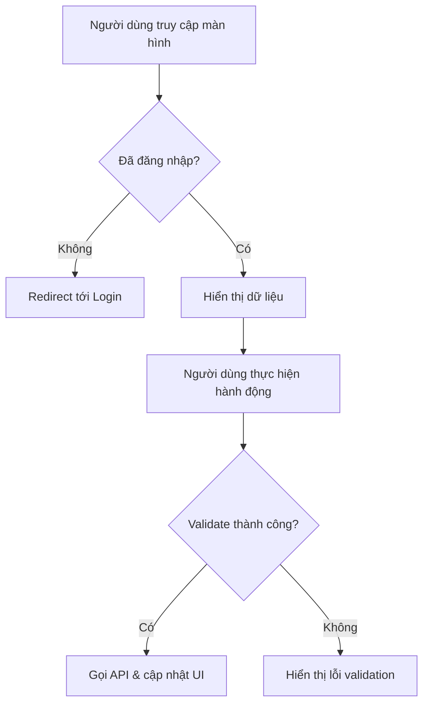

# {{screen_name}}

> [!abstract] Tổng quan
> Mô tả ngắn gọn mục đích chính của màn hình này, nằm trong phân hệ nào, ai là người dùng chính.

## 1. Actors & Permissions

| Actor | Quyền truy cập | Ghi chú |
|-------|----------------|---------|
| {{role}} | {{read/write/admin}} | {{ghi chú}} |

## 2. UI Layout

> [!info] Wireframe Reference
> Liên kết tới bản thiết kế Figma hoặc wireframe nếu có.

### 2.1 Cấu trúc bố cục (Layout Structure)

Mô tả cách bố trí tổng thể: Sidebar, Header, Main Content Area, Footer...

```
┌──────────────────────────────────────────┐
│                 Header                   │
├──────────┬───────────────────────────────┤
│          │                               │
│ Sidebar  │         Main Content          │
│          │                               │
├──────────┴───────────────────────────────┤
│                 Footer                   │
└──────────────────────────────────────────┘
```

### 2.2 Responsive Behavior

| Breakpoint | Thay đổi |
|------------|----------|
| Desktop (≥1024px) | Layout đầy đủ |
| Tablet (768-1023px) | Sidebar thu gọn |
| Mobile (<768px) | Sidebar ẩn, hiện qua hamburger menu |

## 3. UI Components & States

### 3.1 {{Component Name}}

**Mô tả:** Chức năng chính của component.

**Props / Dữ liệu đầu vào:**

| Prop | Type | Required | Mô tả |
|------|------|----------|-------|
| {{prop}} | {{type}} | {{yes/no}} | {{mô tả}} |

**UI States:**

| State | Điều kiện | Hiển thị | Hành vi |
|-------|-----------|----------|---------|
| 🔄 Loading | Đang fetch dữ liệu | Skeleton / Spinner | Disable tương tác |
| ✅ Default | Dữ liệu sẵn sàng | Render bình thường | Cho phép tương tác |
| 📭 Empty | Không có dữ liệu | Empty state illustration + CTA | Gợi ý hành động |
| ❌ Error | API lỗi | Error message + Retry button | Cho phép retry |
| 🚫 Disabled | Không đủ quyền | Greyed out | Hiển thị tooltip giải thích |

%%
Lặp lại section 3.x cho mỗi component chính của màn hình
%%

## 4. User Flow



### 4.1 Luồng chính (Happy Path)

1. Bước 1
2. Bước 2
3. ...

### 4.2 Luồng phụ (Alternative Flows)

- **Trường hợp A:** Mô tả...
- **Trường hợp B:** Mô tả...

## 5. Business Rules

> [!warning] Hard Rules (Bắt buộc)
> Các ràng buộc không được vi phạm.

| ID | Rule | Điều kiện | Hành vi khi vi phạm |
|----|------|-----------|---------------------|
| HR-{{xx}} | {{mô tả rule}} | {{điều kiện}} | {{disable / cảnh báo đỏ}} |

> [!tip] Soft Rules (Gợi ý)
> Các ràng buộc mang tính khuyến nghị, hệ thống sẽ cảnh báo nhưng không ngăn chặn.

| ID | Rule | Logic tính điểm | Hiển thị UI |
|----|------|-----------------|-------------|
| SR-{{xx}} | {{mô tả rule}} | {{công thức}} | {{badge / highlight}} |

## 6. API Endpoints

| Method | Endpoint | Request Body | Response | Mô tả |
|--------|----------|-------------|----------|-------|
| {{GET/POST/PUT/DELETE}} | `/api/v1/{{resource}}` | {{body}} | {{response schema}} | {{mô tả}} |

### 6.1 Error Responses

| HTTP Code | Error Code | Mô tả | UI Handling |
|-----------|-----------|-------|-------------|
| 400 | `VALIDATION_ERROR` | Dữ liệu không hợp lệ | Hiển thị field errors |
| 403 | `FORBIDDEN` | Không đủ quyền | Redirect hoặc toast |
| 404 | `NOT_FOUND` | Resource không tồn tại | Empty state |
| 429 | `RATE_LIMITED` | Quá nhiều request | Toast + retry sau N giây |

## 7. Data Model liên quan

Liệt kê các Entity chính mà màn hình này sử dụng, kèm link tới spec riêng nếu có.

| Entity | Các trường sử dụng | Mối quan hệ |
|--------|-------------------|-------------|
| [[{{Entity}}]] | `field_1`, `field_2` | {{FK / belongs_to / has_many}} |

## 8. Edge Cases & Error Handling

| # | Tình huống | Hành vi mong đợi | Ghi chú |
|---|-----------|-------------------|---------|
| 1 | {{tình huống}} | {{hành vi}} | {{ghi chú}} |

## 9. Liên kết màn hình

- **Navigates to:** [[{{màn hình đích}}]]
- **Navigated from:** [[{{màn hình nguồn}}]]
- **Modal/Drawer mở ra:** [[{{component}}]]

---

> [!todo] Checklist triển khai
> - [ ] UI Component đã code
> - [ ] API Endpoint đã implement
> - [ ] Business Rules đã kiểm thử
> - [ ] Edge Cases đã cover
> - [ ] Responsive đã test
